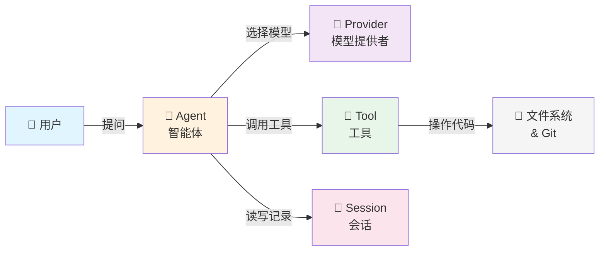
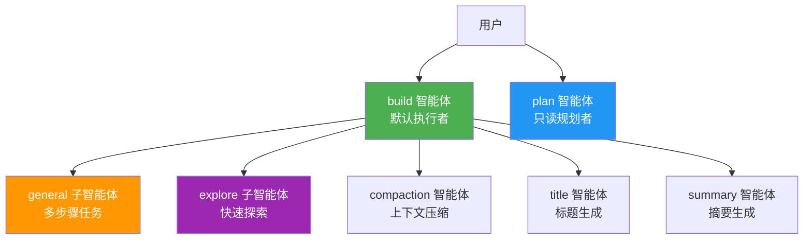
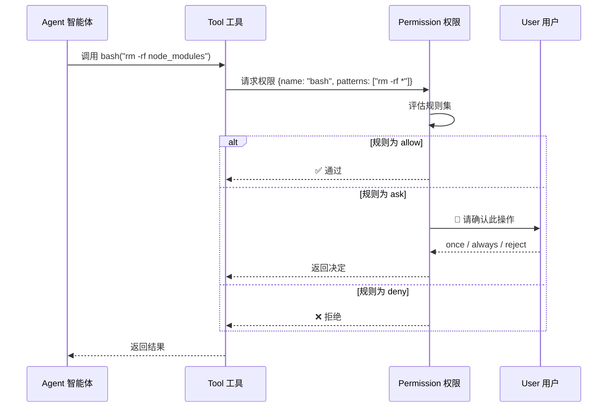
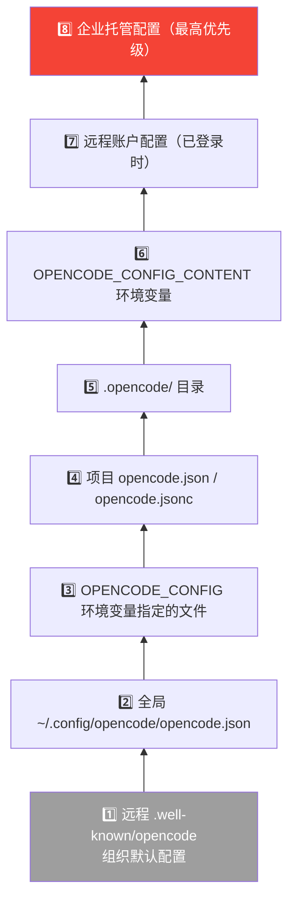

# 一图看懂 OpenCode

> 📌 一句话总结：OpenCode 是一个六层架构的 AI 编程助手——从用户界面到基础设施，每一层都可插拔、可替换。
> 🗺️ 本节在全景中的位置：这是全书的**导航地图**，后续所有章节都会回到这张图上标注"你在这里"。

---

## 全景架构图

我们先来看 OpenCode 的完整架构。这张图从上到下分为六层，每一层解决一类问题：

```mermaid
graph TB
    subgraph User["👤 用户层（User）"]
        CLI["命令行<br/>CLI Entry"]
        WebUI["网页界面<br/>Web UI"]
        Desktop["桌面应用<br/>Desktop App"]
        VSCode["VS Code 插件<br/>Extension"]
        Slack["Slack Bot"]
        GHAction["GitHub Action"]
    end

    subgraph Interface["🖥️ 接口层（Interface）"]
        TUI["终端界面<br/>packages/opencode/src/tui/"]
        Server["HTTP 服务<br/>packages/opencode/src/server/server.ts"]
        Hono["Hono 路由<br/>REST API + OpenAPI"]
        Event["事件流<br/>SSE /event"]
    end

    subgraph Engine["⚙️ 引擎层（Engine）"]
        Agent["智能体<br/>packages/opencode/src/agent/agent.ts"]
        Session["会话<br/>packages/opencode/src/session/index.ts"]
        Provider["模型提供者<br/>packages/opencode/src/provider/provider.ts"]
        Message["消息<br/>packages/opencode/src/session/message-v2.ts"]
        Permission["权限<br/>packages/opencode/src/permission/"]
    end

    subgraph Capability["🔧 能力层（Capability）"]
        Tool["工具<br/>packages/opencode/src/tool/"]
        Skill["技能<br/>packages/opencode/src/skill/index.ts"]
        MCP["MCP 协议<br/>packages/opencode/src/mcp/index.ts"]
        LSP["语言服务<br/>packages/opencode/src/lsp/"]
        Command["命令<br/>packages/opencode/src/command/index.ts"]
        Plugin["插件<br/>packages/opencode/src/plugin/"]
    end

    subgraph Infra["🏗️ 基础设施层（Infrastructure）"]
        Storage["存储<br/>packages/opencode/src/storage/"]
        Git["Git 操作<br/>packages/opencode/src/git/"]
        Snapshot["快照<br/>packages/opencode/src/snapshot/"]
        FileOps["文件操作<br/>packages/opencode/src/file/"]
        Auth["认证<br/>packages/opencode/src/auth/"]
        Config["配置<br/>packages/opencode/src/config/config.ts"]
    end

    subgraph External["☁️ 外部服务层（External）"]
        LLM["大语言模型<br/>OpenAI / Anthropic / Google ..."]
        MCPServer["MCP 服务器<br/>外部工具服务"]
        GitRemote["Git 远程仓库<br/>GitHub / GitLab"]
    end

    CLI --> TUI
    WebUI --> Server
    Desktop --> Server
    VSCode --> Server
    Slack --> Server
    GHAction --> Server

    TUI --> Agent
    Server --> Hono
    Hono --> Agent
    Hono --> Session
    Hono --> Provider
    Event --> Session

    Agent --> Session
    Agent --> Provider
    Agent --> Permission
    Session --> Message
    Provider --> LLM

    Agent --> Tool
    Agent --> Skill
    Agent --> Command
    Tool --> MCP
    Tool --> LSP
    Tool --> Plugin

    Tool --> FileOps
    Tool --> Git
    Tool --> Snapshot
    Session --> Storage
    Agent --> Config
    Provider --> Auth

    MCP --> MCPServer
    Git --> GitRemote
```



---

## 餐巾纸架构图

如果只用 5 个概念解释 OpenCode，那就是这张"餐巾纸图（Napkin Diagram）"：



**用一句话串起来**：用户向**智能体（Agent）**提问，智能体通过**模型提供者（Provider）**调用大语言模型生成回答，过程中使用**工具（Tool）**来读写文件、执行命令，所有对话记录保存在**会话（Session）**中。

---

## 每个模块一句话

下表按架构分层列出 OpenCode 的核心模块，用一句话 + 一个生活类比帮助理解：

| 层级 | 模块 | 一句话描述 | 生活类比 |
|------|------|-----------|---------|
| 接口层 | **Server 服务器** | 基于 Hono 框架的 HTTP 服务，暴露 REST API 和 SSE 事件流 | 餐厅的前台接待 |
| 接口层 | **TUI 终端界面** | 基于 Ink（React）的终端交互界面 | 餐厅的点餐屏幕 |
| 引擎层 | **Agent 智能体** | 编排模型调用和工具使用的核心决策单元，内置 `build`、`plan`、`explore` 等角色 | 项目经理 |
| 引擎层 | **Session 会话** | 管理对话历史、消息和上下文窗口 | 会议纪要 |
| 引擎层 | **Provider 模型提供者** | 统一封装 18+ 家大模型服务商（OpenAI、Anthropic、Google 等） | 翻译中介 |
| 引擎层 | **Message 消息** | 结构化的对话消息，包含文本（Text）、推理（Reasoning）、工具调用（ToolCall）等多种部件（Part） | 信封里的多页信件 |
| 引擎层 | **Permission 权限** | 细粒度的操作权限控制：允许（allow）/ 询问（ask）/ 拒绝（deny） | 公司审批流 |
| 能力层 | **Tool 工具** | 40+ 个内置工具：bash、read、edit、write、grep、glob 等 | 工人的工具箱 |
| 能力层 | **Skill 技能** | 以 `SKILL.md` 文件定义的可复用提示词模板 | 操作手册 |
| 能力层 | **MCP 协议** | 模型上下文协议（Model Context Protocol）客户端，连接外部工具服务 | USB 接口 |
| 能力层 | **LSP 语言服务** | 集成语言服务器提供代码智能：悬停（hover）、跳转定义（definition）、引用（references） | 代码的 GPS 导航 |
| 能力层 | **Command 命令** | 可绑定快捷键的预定义操作模板，来源于配置（Config）、技能（Skill）或 MCP | 快捷指令 |
| 能力层 | **Plugin 插件** | 外部扩展包，可注册新工具和新功能 | 浏览器扩展 |
| 基础设施 | **Storage 存储** | 基于 SQLite + Drizzle ORM 的持久化层，支持 Bun 和 Node.js 两种运行时 | 档案室 |
| 基础设施 | **Config 配置** | 8 级优先级的配置系统：远程默认 → 全局 → 项目 → 环境变量 → 企业托管 | 公司规章制度 |
| 基础设施 | **Git 版本控制** | 封装 Git 命令行操作：分支、状态、差异、合并基准 | 时间机器 |
| 基础设施 | **Snapshot 快照** | 用独立的 Git 仓库追踪工作区文件变更，支持回滚 | 游戏存档 |
| 基础设施 | **File 文件操作** | 文件读写、二进制检测、gitignore 过滤、模糊搜索 | 文件管理器 |
| 基础设施 | **Auth 认证** | 管理 API 密钥（API Key）、OAuth 令牌（Token）和 Well-Known 凭证 | 钥匙串 |

---

## 关键设计决策

### 1. Effect 架构：函数式依赖注入

OpenCode 使用 [Effect](https://effect.website/) 库进行依赖注入和错误处理。每个模块都定义为 Effect 的 `Service`，通过 `Layer` 组合。

```
// packages/opencode/src/agent/agent.ts 中的典型模式
Agent.Service = Effect.Tag<Agent.Interface>()
```

**为什么这样设计？** Effect 让每个服务都可测试、可替换，且所有错误路径都在类型系统中显式表达——不会有"忘记 catch"的情况。

### 2. 多智能体系统：专业分工

OpenCode 不是单一 Agent，而是一个多智能体系统（Multi-Agent System）：



- **`build`**（构建者）：默认智能体，拥有完整工具权限，可以读写文件、执行命令
- **`plan`**（规划者）：只读智能体，只能查看代码不能修改，用于分析和规划
- **`general`**（通用者）：子智能体，用于复杂多步骤任务的委派
- **`explore`**（探索者）：子智能体，擅长快速搜索代码库（grep、glob、bash）

### 3. 消息的"零件化"设计

消息（Message）不是一个单一文本，而是由多个**部件（Part）**组成的结构体：

| 部件类型 | 用途 |
|---------|------|
| `TextPart` | 文本输出 |
| `ReasoningPart` | LLM 的推理过程（如 Claude 的 thinking） |
| `ToolPart` | 工具调用及其结果，含状态机（pending → running → completed/error） |
| `FilePart` | 文件附件 |
| `SnapshotPart` | 工作区快照 |
| `PatchPart` | 代码差异补丁 |
| `SubtaskPart` | 委派给子智能体的任务 |
| `StepStartPart` / `StepFinishPart` | 多步骤执行的开始和结束 |

这种设计让前端可以**流式渲染**每个部件，而不需要等整条消息完成。

### 4. 工具的权限网关

每个工具调用都经过权限系统（Permission）的网关：



### 5. 配置的 8 级优先级

配置系统（`packages/opencode/src/config/config.ts`）支持 8 级层叠覆盖，优先级从低到高：



### 6. 统一的提供者抽象

`Provider`（`packages/opencode/src/provider/provider.ts`）为 18+ 家大模型服务商提供统一接口：

| 提供者 | 说明 |
|--------|------|
| OpenAI | GPT 系列 |
| Anthropic | Claude 系列 |
| Google | Gemini / Vertex AI |
| Azure | Azure OpenAI |
| AWS Bedrock | Amazon 托管模型 |
| xAI | Grok 系列 |
| Groq / Mistral / Cohere / Cerebras | 其他云端模型 |
| GitHub Copilot | GitHub 模型服务 |
| OpenRouter / Together AI / DeepInfra | 模型聚合平台 |
| Gateway | 自定义网关 |

每个模型都声明自己的**能力（Capabilities）**——推理（reasoning）、结构化输出（structuredOutput）、视觉（vision）——Agent 据此选择合适的模型。

---

## 图解说明

让我们回到全景图，理解数据是如何流动的：

1. **用户请求进入**：通过 CLI/Web/Desktop 等界面到达接口层
2. **路由分发**：Hono 服务器将请求路由到对应的引擎模块
3. **智能体编排**：Agent 创建或恢复 Session，选择 Provider 和模型
4. **模型调用**：Provider 将请求发送到外部 LLM 服务
5. **工具执行**：LLM 返回的工具调用请求经权限检查后执行
6. **结果回写**：工具执行结果作为新的消息部件追加到会话中
7. **持久化**：所有状态通过 Storage 持久化到 SQLite 数据库

---

## 与下一节的衔接

这张全景图告诉了我们"有什么"，但还没回答"它们之间是什么关系"。在下一节 [02-核心概念关系图谱](./02-核心概念关系图谱.md) 中，我们将深入每个核心概念之间的实体关系（Entity Relationship），弄清楚一个 Session 里有多少个 Message，一个 Message 里有多少种 Part，以及 Agent、Tool、Skill、Command 这四个容易混淆的概念到底有什么区别。
