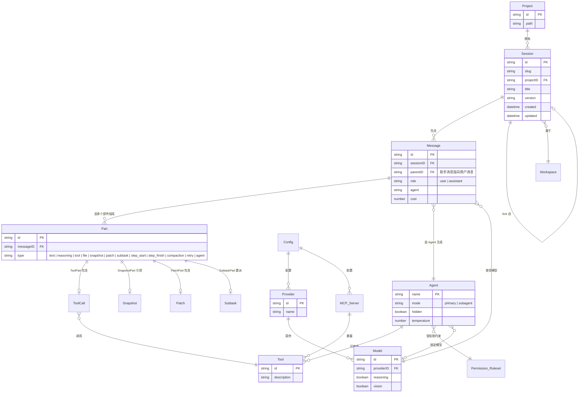
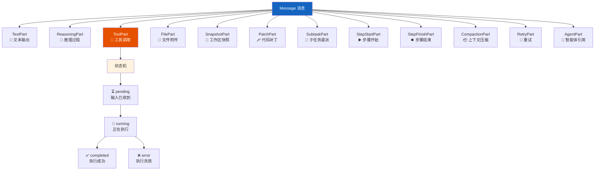
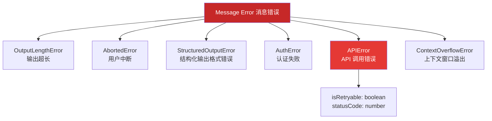
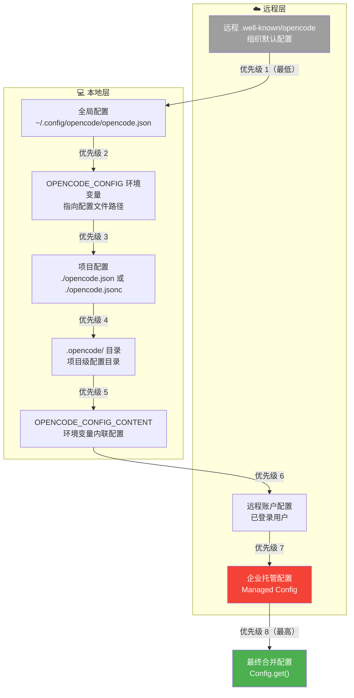
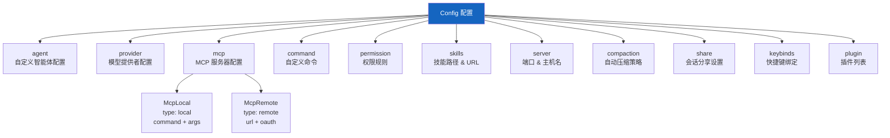
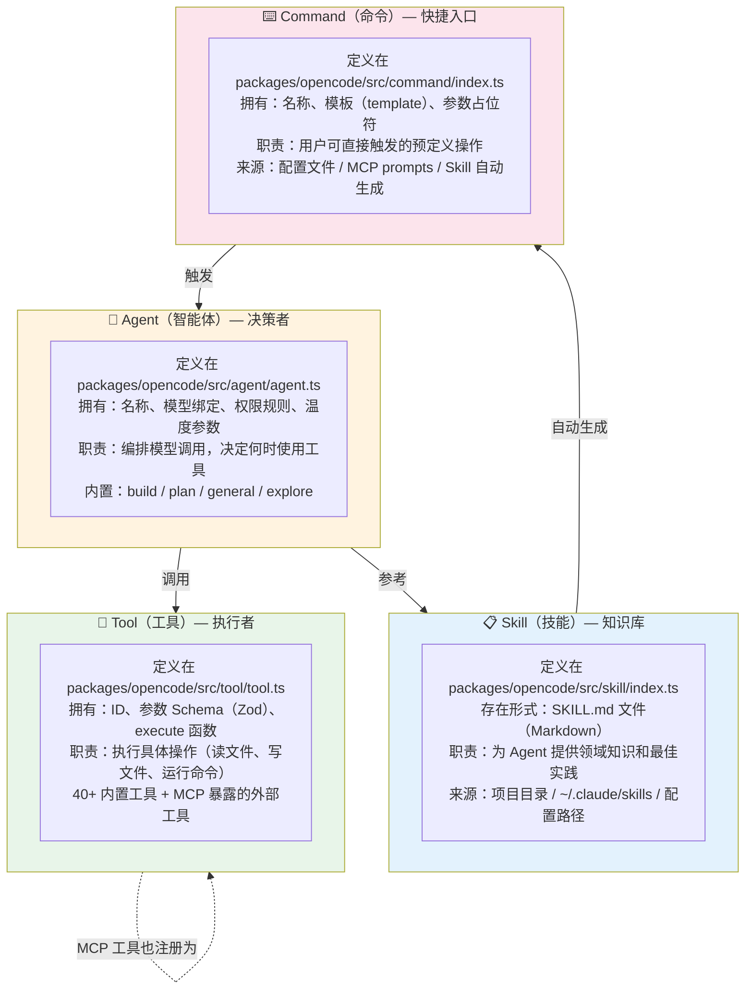
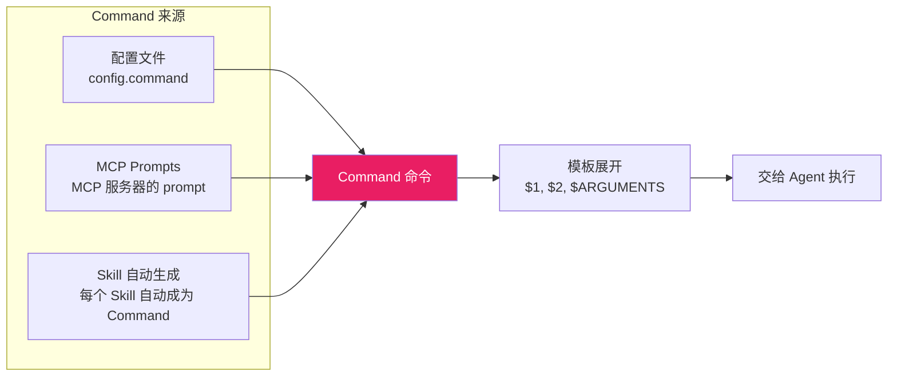
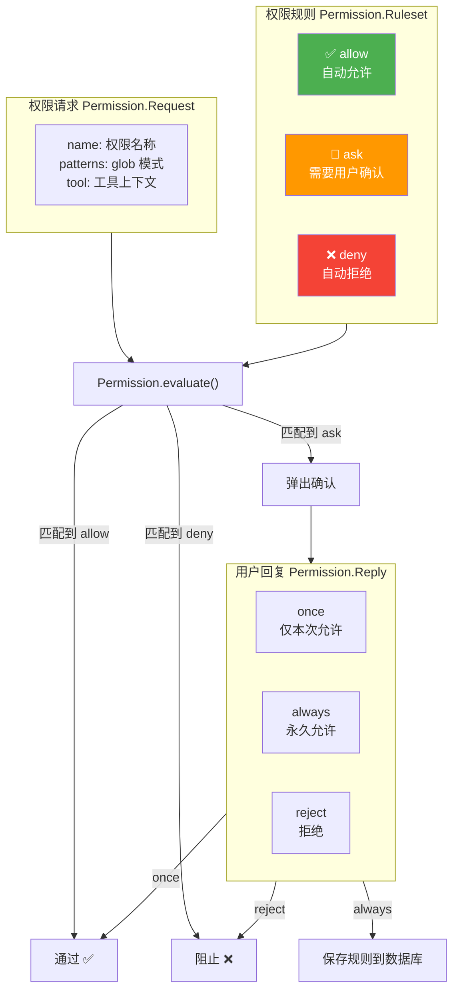
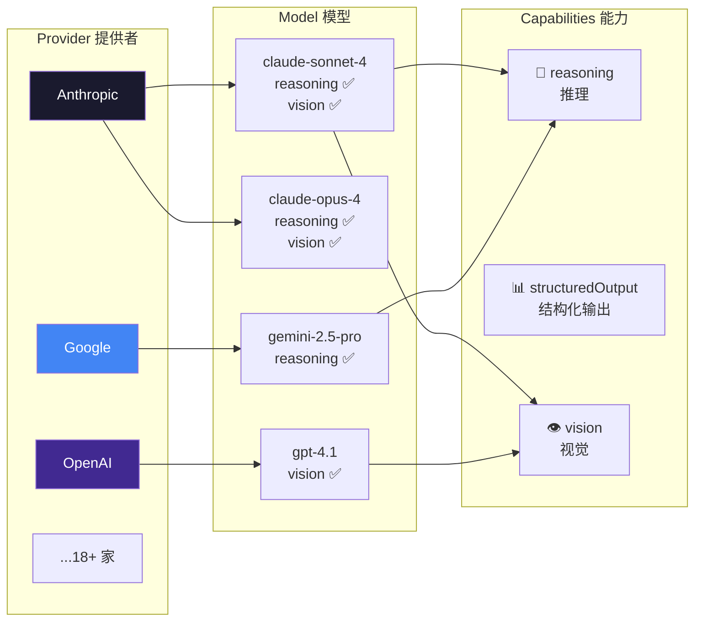

# 核心概念关系图谱

> 📌 一句话总结：OpenCode 的核心概念之间存在精确的一对多、多对多关系——理解这些关系，就理解了整个系统的骨架。
> 🗺️ 本节在全景中的位置：上一节展示了六层架构的"全景图"，本节深入到**概念层**，弄清楚每个核心实体的内部结构和相互关系。

---

## 实体关系图

我们先用 ER 图展示 OpenCode 中最重要的数据实体及其关系。这些类型定义在 `packages/opencode/src/session/message-v2.ts` 和 `packages/opencode/src/session/index.ts` 中。

### 关键关系解读

| 关系 | 基数 | 说明 |
|------|------|------|
| Project → Session | 1:N | 一个项目下可以有多个会话 |
| Session → Message | 1:N | 一个会话包含多条消息（用户消息和助手消息交替） |
| Message → Part | 1:N | 一条消息由多个部件组成——这是 OpenCode 的核心设计 |
| Agent → Tool | 1:N | 每个智能体根据权限规则集可使用不同的工具子集 |
| Provider → Model | 1:N | 一个提供者（如 Anthropic）包含多个模型（如 claude-sonnet-4、claude-opus-4） |
| Session → Session | 0:1 | 会话可以 fork 自另一个会话（`parentID`） |
| ToolPart → Tool | N:1 | 一个工具部件对应一次工具调用 |

---

## 消息部件（Part）类型体系

`Part` 是 OpenCode 消息系统中最精巧的设计。每种 Part 都是一个带有 `type` 判别字段的联合类型（Discriminated Union）：

ToolPart 内部包含一个**状态机（State Machine）**，定义在 `packages/opencode/src/session/message-v2.ts` 中：

| 状态 | 包含的数据 | 说明 |
|------|-----------|------|
| `pending` | `input`（工具参数） | LLM 发出工具调用请求，但还未执行 |
| `running` | `title`、`metadata` | 工具正在执行中，可实时更新元数据 |
| `completed` | `output`、`attachments` | 执行成功，返回文本输出和可选的文件附件 |
| `error` | `error`（错误信息） | 执行失败，包含错误原因 |

---

## 消息错误类型体系

助手消息可以携带错误信息，OpenCode 定义了丰富的错误类型层次结构：

---

## 配置层级图

配置系统（`packages/opencode/src/config/config.ts`）采用多层叠覆盖策略。理解这个层级对于调试配置问题至关重要：

### 配置内容结构

配置文件中可以配置的核心内容（`Config.Info` 类型）：

---

## Agent / Tool / Skill / Command 关系辨析

这四个概念是初学者最容易混淆的。我们用一张图来厘清它们的边界：

### 四者对比表

| 维度 | Agent 智能体 | Tool 工具 | Skill 技能 | Command 命令 |
|------|-------------|----------|-----------|-------------|
| **是什么** | 决策编排者 | 具体执行者 | 知识文档 | 用户快捷方式 |
| **定义方式** | 代码 + 配置 | `Tool.define()` | `SKILL.md` 文件 | 配置 / MCP / Skill |
| **包含什么** | 模型绑定、权限、提示词 | Zod 参数、execute 函数 | Markdown 正文 | 模板字符串（`$1`, `$ARGUMENTS`） |
| **谁调用它** | 用户 / 命令 | Agent | Agent（注入 system prompt） | 用户（快捷键 / 斜杠命令） |
| **运行时行为** | 多轮循环调用模型 | 单次执行返回结果 | 注入到提示词中 | 展开模板后交给 Agent |
| **可扩展性** | 配置自定义 Agent | 插件注册新工具 | 添加 SKILL.md 文件 | 配置 `command` 字段 |
| **源码位置** | `src/agent/agent.ts` | `src/tool/*.ts` | `src/skill/index.ts` | `src/command/index.ts` |

### Command 的三种来源

内置命令（`packages/opencode/src/command/index.ts`）：
- **`init`**：初始化或更新项目的 `AGENTS.md` 文件
- **`review`**：审查代码变更（支持 commit / branch / PR）

---

## Permission 权限模型

权限系统（`packages/opencode/src/permission/`）控制着工具能做什么、不能做什么：

每个 Agent 都绑定一个权限规则集。例如 `plan` 智能体的规则集只允许只读操作，而 `build` 智能体允许读写但某些危险操作需要确认。

---

## Provider-Model 关系

每个模型都声明自己支持的能力（`capabilities`），Agent 可以据此选择合适的模型。例如需要"推理"能力时会优先选择支持 `reasoning` 的模型。

---

## 图解说明

回顾本节的核心要点：

1. **Session → Message → Part** 是三级嵌套结构，Part 的多态设计是 OpenCode 消息系统的灵魂
2. **ToolPart** 内部是一个状态机（pending → running → completed/error），支持流式更新
3. **Agent / Tool / Skill / Command** 四个概念职责分明：Agent 决策、Tool 执行、Skill 提供知识、Command 提供快捷入口
4. **Permission** 是横切关注点，贯穿 Agent 和 Tool 之间的每一次交互
5. **Config** 的 8 级优先级确保了从组织到个人的灵活配置

---

## 与下一节的衔接

理解了核心概念之间的关系后，我们需要"退后一步"看看这些代码是如何组织在一起的。OpenCode 是一个包含 19 个包的 Monorepo（单体仓库），每个包承担不同的职责。在下一节 [03-Monorepo 全景：19 个包的关系](./03-Monorepo全景-19个包的关系.md) 中，我们将展开整个仓库的包依赖拓扑图。
