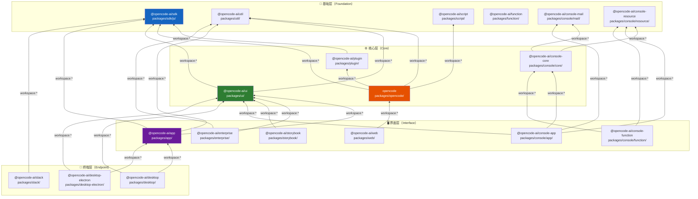
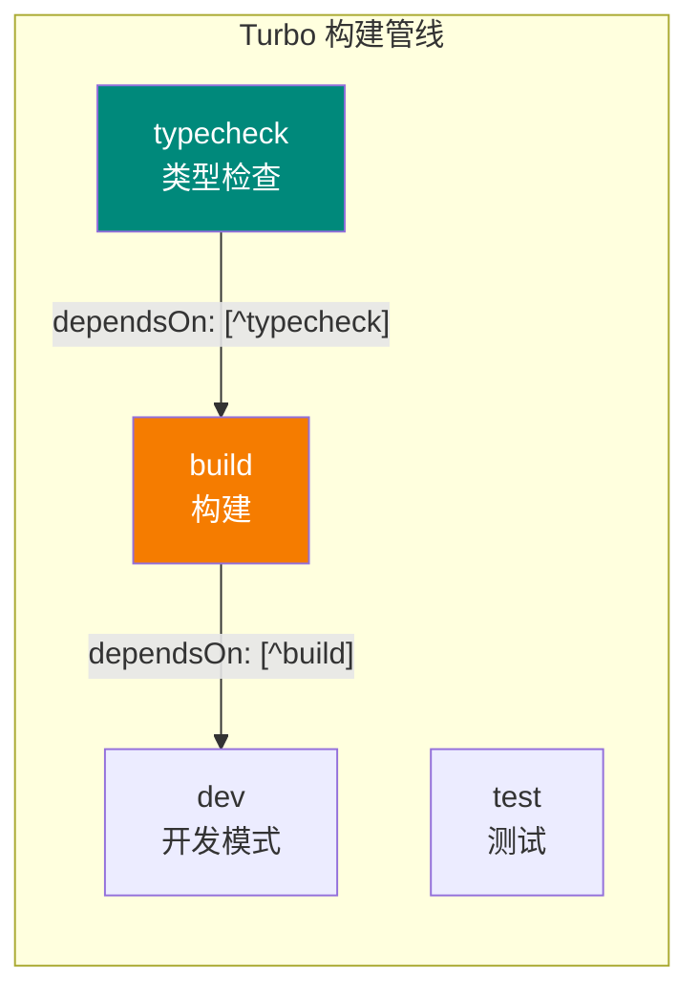
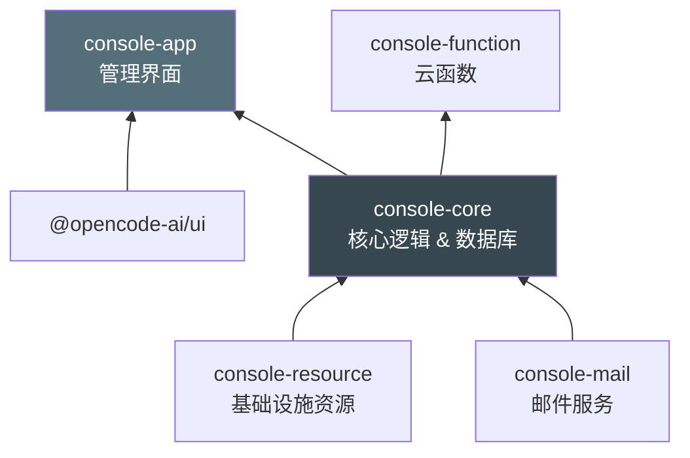
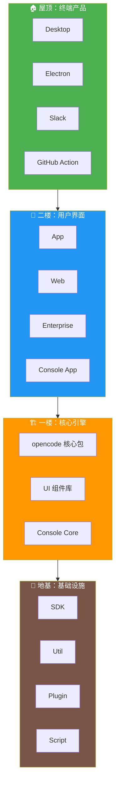

# Monorepo 全景：19 个包的关系

> 📌 一句话总结：OpenCode 采用 Monorepo（单体仓库）架构，19 个包按"基础层 → 核心层 → 界面层 → 集成层"自下而上依赖，使用 Turborepo 编排构建。
> 🗺️ 本节在全景中的位置：前两节分别展示了架构分层和概念关系，本节聚焦于**代码组织**——这些模块是如何被拆分为独立的包并通过依赖关系连接在一起的。

---

## 全景图：包依赖拓扑

下图展示了 OpenCode 全部 19 个包之间的 `workspace:*` 依赖关系。箭头方向为"依赖于"：



> 💡 **阅读技巧**：图中越靠下的包越"基础"，被依赖的次数越多。`@opencode-ai/sdk` 是被依赖最多的包——它是整个生态的"通用语言"。

---

## 仓库构建工具

OpenCode 使用 [Turborepo](https://turbo.build/)（`turbo.json` 配置）来编排多包构建：



- **包管理器（Package Manager）**：Bun 1.3.11
- **工作区协议（Workspace Protocol）**：`workspace:*` 链接内部依赖
- **构建编排**：Turborepo 自动推导构建顺序，只重建变更的包

---

## 包分类矩阵

我们按**角色**和**面向的用户**对 19 个包进行分类：

| 分类 | 包名 | 路径 | 一句话描述 | 面向 |
|------|------|------|-----------|------|
| **基础/SDK** | `@opencode-ai/sdk` | `packages/sdk/js/` | TypeScript SDK，定义与 OpenCode 服务器交互的客户端类型和方法 | 开发者 |
| **基础/工具** | `@opencode-ai/util` | `packages/util/` | 共享工具函数库 | 内部 |
| **基础/脚本** | `@opencode-ai/script` | `packages/script/` | 构建和发布脚本 | 维护者 |
| **基础/插件** | `@opencode-ai/plugin` | `packages/plugin/` | 插件系统的公共接口，定义插件如何注册工具和扩展功能 | 插件开发者 |
| **基础/函数** | `@opencode-ai/function` | `packages/function/` | 云函数（Serverless Function）定义 | 内部 |
| **核心引擎** | `opencode` | `packages/opencode/` | **核心包**——包含 Agent、Session、Provider、Tool、MCP 等全部核心逻辑 | 终端用户 |
| **界面/组件库** | `@opencode-ai/ui` | `packages/ui/` | 基于 React 的 UI 组件库，使用 Tailwind CSS | 前端开发者 |
| **界面/Web 应用** | `@opencode-ai/app` | `packages/app/` | Web 前端应用，对接 SDK 提供图形化交互界面 | 终端用户 |
| **界面/官网** | `@opencode-ai/web` | `packages/web/` | 基于 Astro 的官方网站 | 访客 |
| **界面/企业版** | `@opencode-ai/enterprise` | `packages/enterprise/` | 企业版管理界面 | 企业管理员 |
| **界面/Storybook** | `@opencode-ai/storybook` | `packages/storybook/` | UI 组件的可视化文档和测试环境 | 前端开发者 |
| **终端/桌面 Tauri** | `@opencode-ai/desktop` | `packages/desktop/` | 基于 Tauri 的桌面应用（轻量级） | 终端用户 |
| **终端/桌面 Electron** | `@opencode-ai/desktop-electron` | `packages/desktop-electron/` | 基于 Electron 的桌面应用（跨平台兼容） | 终端用户 |
| **集成/Slack** | `@opencode-ai/slack` | `packages/slack/` | Slack 机器人集成，在 Slack 中使用 OpenCode | 团队 |
| **控制台/应用** | `@opencode-ai/console-app` | `packages/console/app/` | 管理控制台前端 | 运维 |
| **控制台/核心** | `@opencode-ai/console-core` | `packages/console/core/` | 管理控制台后端逻辑、数据库 | 内部 |
| **控制台/函数** | `@opencode-ai/console-function` | `packages/console/function/` | 管理控制台的无服务器函数 | 内部 |
| **控制台/邮件** | `@opencode-ai/console-mail` | `packages/console/mail/` | 邮件发送服务 | 内部 |
| **控制台/资源** | `@opencode-ai/console-resource` | `packages/console/resource/` | 基础设施资源定义（SST / IaC） | 内部 |

> 📝 另外还有两个仓库内的独立项目（不在 `packages/` 工作区内）：
> - `github/` — GitHub Actions 集成，依赖 `@opencode-ai/sdk`
> - `sdks/vscode/` — VS Code 扩展

---

## 每个包的详细说明

### 🧱 基础层

#### `@opencode-ai/sdk`（SDK）

```
packages/sdk/js/
```

这是整个生态的**通用语言**。它定义了客户端与 OpenCode 服务器之间的类型契约：Session、Message、Part、Agent、Provider 等。所有需要与 OpenCode 交互的包都依赖它。

**被依赖次数**：6 次（最高）

#### `@opencode-ai/util`（工具库）

```
packages/util/
```

共享的工具函数集合，提供跨包复用的通用逻辑。被 `opencode` 核心包、`ui` 组件库和其他界面包使用。

#### `@opencode-ai/plugin`（插件接口）

```
packages/plugin/
```

定义插件的公共 API。插件开发者通过这个包的接口来注册自定义工具、扩展 Agent 能力。依赖 `@opencode-ai/sdk` 获取类型定义。

#### `@opencode-ai/script`（构建脚本）

```
packages/script/
```

内部构建和发布脚本，不对外发布。

#### `@opencode-ai/function`（云函数）

```
packages/function/
```

定义 Serverless 函数的入口和逻辑，无内部依赖。

---

### ⚙️ 核心层

#### `opencode`（核心引擎）

```
packages/opencode/
```

这是整个项目的**心脏**，包含所有核心逻辑：

| 子模块 | 路径 | 职责 |
|--------|------|------|
| Agent | `src/agent/` | 智能体定义与编排 |
| Session | `src/session/` | 会话和消息管理 |
| Provider | `src/provider/` | 模型提供者抽象 |
| Tool | `src/tool/` | 40+ 内置工具 |
| Skill | `src/skill/` | SKILL.md 技能系统 |
| MCP | `src/mcp/` | MCP 协议客户端 |
| LSP | `src/lsp/` | 语言服务器集成 |
| Permission | `src/permission/` | 权限控制 |
| Config | `src/config/` | 配置管理 |
| Storage | `src/storage/` | SQLite 持久化 |
| Server | `src/server/` | Hono HTTP 服务 |
| Git | `src/git/` | Git 操作 |
| Snapshot | `src/snapshot/` | 文件快照 |
| File | `src/file/` | 文件操作 |
| Auth | `src/auth/` | 认证管理 |
| Command | `src/command/` | 命令系统 |
| Plugin | `src/plugin/` | 插件加载 |

依赖：`@opencode-ai/sdk`、`@opencode-ai/util`、`@opencode-ai/plugin`、`@opencode-ai/script`

#### `@opencode-ai/ui`（UI 组件库）

```
packages/ui/
```

基于 React + Tailwind CSS 的 UI 组件库。提供主题、布局、表单、对话框等通用组件，被所有前端应用共享。

依赖：`@opencode-ai/sdk`、`@opencode-ai/util`

---

### 🖥️ 界面层

#### `@opencode-ai/app`（Web 前端应用）

```
packages/app/
```

主要的 Web 前端应用，提供图形化的聊天界面、会话管理、设置等功能。

依赖：`@opencode-ai/sdk`、`@opencode-ai/ui`、`@opencode-ai/util`

#### `@opencode-ai/web`（官方网站）

```
packages/web/
```

基于 [Astro](https://astro.build/) 构建的官方网站和文档。直接依赖 `opencode` 核心包。

#### `@opencode-ai/enterprise`（企业版）

```
packages/enterprise/
```

企业版管理界面，提供团队管理、使用统计等功能。

依赖：`@opencode-ai/ui`、`@opencode-ai/util`

#### `@opencode-ai/storybook`（组件文档）

```
packages/storybook/
```

UI 组件库的可视化展示与测试环境，帮助前端开发者查看和调试组件。

依赖：`@opencode-ai/ui`

---

### 🚀 终端层

#### `@opencode-ai/desktop`（Tauri 桌面应用）

```
packages/desktop/
```

基于 [Tauri](https://tauri.app/) 的轻量级桌面应用，利用系统 WebView 渲染，安装包体积小。

依赖：`@opencode-ai/app`、`@opencode-ai/ui`

#### `@opencode-ai/desktop-electron`（Electron 桌面应用）

```
packages/desktop-electron/
```

基于 [Electron](https://www.electronjs.org/) 的桌面应用，跨平台兼容性更好。

依赖：`@opencode-ai/app`、`@opencode-ai/ui`

#### `@opencode-ai/slack`（Slack 集成）

```
packages/slack/
```

Slack 机器人，让团队可以在 Slack 频道中直接使用 OpenCode。

依赖：`@opencode-ai/sdk`

---

### 🎛️ 控制台子系统

控制台（Console）是 OpenCode 的后台管理平台，自身也是一个小型分层架构：



---

## 依赖被引用排行

哪个包被依赖最多？这反映了它在架构中的**基础程度**：

| 排名 | 包名 | 被依赖次数 | 角色 |
|------|------|-----------|------|
| 1 | `@opencode-ai/sdk` | 6 | 类型契约，生态通用语言 |
| 2 | `@opencode-ai/ui` | 5 | UI 组件库，所有前端共享 |
| 3 | `@opencode-ai/util` | 4 | 工具函数，内部共享 |
| 4 | `@opencode-ai/console-resource` | 3 | 基础设施资源定义 |
| 5 | `@opencode-ai/app` | 2 | Web 前端，桌面应用复用 |
| 5 | `@opencode-ai/console-core` | 2 | 控制台核心逻辑 |
| 5 | `@opencode-ai/console-mail` | 2 | 邮件服务 |
| 5 | `@opencode-ai/plugin` | 1 | 插件接口 |

---

## 图解说明

让我们用一个更直观的视角来理解这 19 个包的关系——把它们想象成一座建筑：



**读图规则**：
- **地基层**的包不依赖其他内部包，它们是"纯基础设施"
- **一楼**是核心逻辑，依赖地基但不关心谁在使用自己
- **二楼**是面向用户的界面，组合核心逻辑和 UI 组件
- **屋顶**是最终交付给用户的产品形态

---

## 关键设计决策

### 1. 为什么用 Monorepo？

- **代码共享**：`sdk`、`util`、`ui` 等包被多个应用复用，Monorepo 确保版本一致性
- **原子提交**：跨包的功能变更可以在一个 PR 中完成
- **统一工具链**：Turborepo + Bun 一套构建工具管理所有包

### 2. 为什么 SDK 是独立包？

`@opencode-ai/sdk` 独立出来而不是放在 `opencode` 核心包中，因为：
- 外部集成（Slack Bot、GitHub Action、VS Code 插件）只需要类型定义和 API 客户端，不需要整个核心引擎
- SDK 可以独立发布到 npm，方便第三方开发者使用

### 3. 为什么有两个桌面应用框架？

- **Tauri**（`packages/desktop/`）：体积小、性能好，但依赖系统 WebView
- **Electron**（`packages/desktop-electron/`）：体积大，但自带 Chromium，跨平台兼容性更稳定

两者共享同一个 `@opencode-ai/app` 前端代码，只是"壳"不同。

### 4. Console 子系统为什么独立分包？

管理控制台（Console）是 SaaS 平台的后台，与核心编程助手功能正交：
- `console-resource`：使用 [SST](https://sst.dev/) 定义云基础设施
- `console-core`：后台业务逻辑和数据库
- `console-app`：管理界面前端
- `console-function`：事件处理的无服务器函数
- `console-mail`：邮件通知服务

---

## 与下一节的衔接

到这里，我们已经从三个维度理解了 OpenCode：

1. **架构分层**（01-一图看懂 OpenCode）：六层架构，从用户到基础设施
2. **概念关系**（02-核心概念关系图谱）：Session、Message、Part 等实体的关系
3. **代码组织**（本节）：19 个包的依赖拓扑和职责划分

接下来，我们将进入 [02-快速上手](../02-快速上手/) 章节，动手安装和运行 OpenCode——亲身体验这张全景图中的每一个部分。
