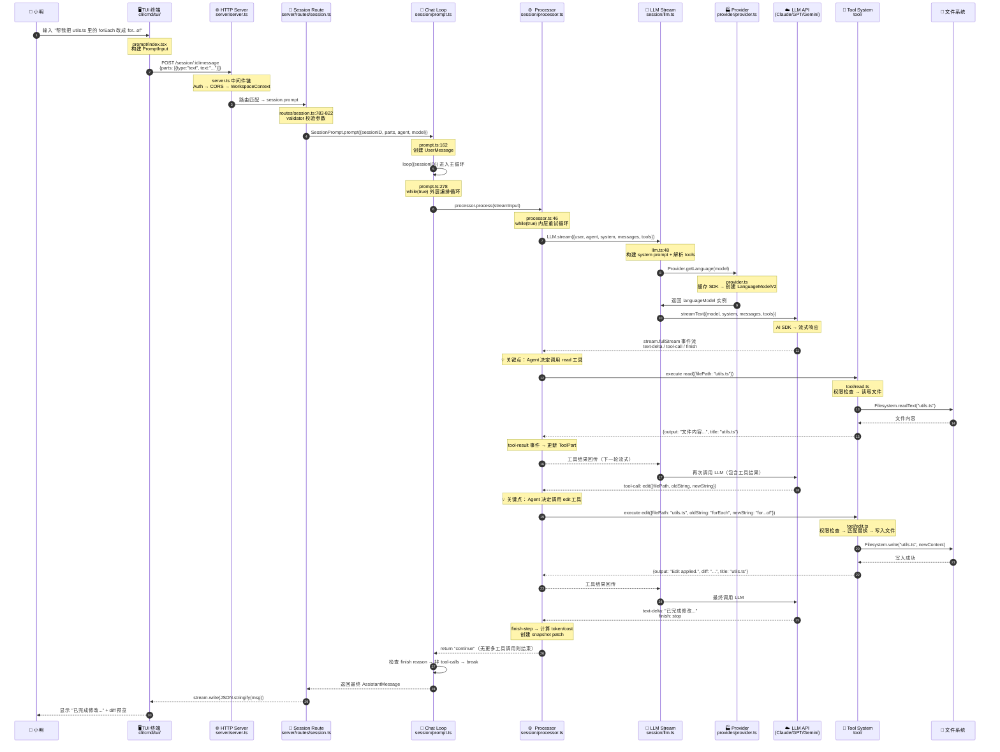
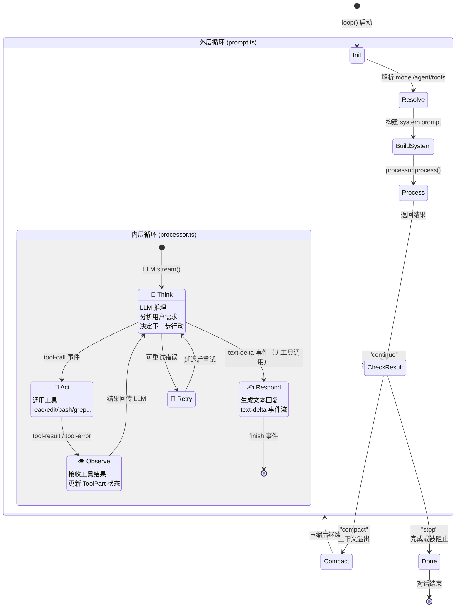

# 一次对话的完整旅程

> 📌 一句话总结：从用户在终端输入一句话，到 AI 读取文件、调用工具、修改代码、返回结果——我们将跟踪每一个字节穿越系统的完整路径。
> 🗺️ 本节在全景中的位置：前三节分别从宏观架构、概念关系、包组织三个维度描绘了 OpenCode 的全貌。本节开始**进入运行时**——用一个真实场景串联所有模块，让你看到代码是如何"活起来"的。

---

## 场景设定

小明打开终端，输入 `opencode`，然后说：

> "帮我把 utils.ts 里的 forEach 改成 for...of"

让我们追踪这句话从键盘到文件系统的完整旅程。

---

## 全景图：完整对话时序



---

## 数据流转图：每个阶段的数据格式

```mermaid
flowchart LR
    subgraph Input["📝 用户输入"]
        A["纯文本字符串<br/>'帮我把 utils.ts 里的<br/>forEach 改成 for...of'"]
    end

    subgraph SDK["📦 SDK 封装"]
        B["PromptInput<br/>{sessionID, agent,<br/>model, variant,<br/>parts: [{type:'text',<br/>text:'...'}]}"]
    end

    subgraph HTTP["🌐 HTTP 请求"]
        C["POST JSON Body<br/>{parts, agent,<br/>model:{providerID,<br/>modelID}}"]
    end

    subgraph UserMsg["💬 UserMessage"]
        D["MessageV2.User<br/>{id, sessionID,<br/>role:'user',<br/>system:[], tools:{}}"]
    end

    subgraph ModelMsg["🔄 模型消息"]
        E["ModelMessage[]<br/>[{role:'system',<br/>content:'...'},<br/>{role:'user',<br/>content:'...'}]"]
    end

    subgraph Stream["⚡ 流式事件"]
        F["StreamEvent<br/>text-delta |<br/>tool-call |<br/>tool-result |<br/>finish"]
    end

    subgraph Parts["🧩 消息部件"]
        G["MessageV2.Part<br/>TextPart |<br/>ToolPart |<br/>ReasoningPart"]
    end

    subgraph Result["✅ 最终结果"]
        H["AssistantMessage<br/>{parts, finish,<br/>cost, tokens,<br/>time}"]
    end

    A --> B --> C --> D --> E --> F --> G --> H

    style Input fill:#e1f5fe
    style SDK fill:#f3e5f5
    style HTTP fill:#fff3e0
    style UserMsg fill:#e8f5e9
    style ModelMsg fill:#fce4ec
    style Stream fill:#fff9c4
    style Parts fill:#f1f8e9
    style Result fill:#e0f2f1
```



### 💡 关键点：数据格式在每一步都在变化

| 阶段 | 数据格式 | 对应文件 |
|------|---------|---------|
| 用户输入 | 纯文本字符串 | `cli/cmd/tui/component/prompt/index.tsx` |
| SDK 封装 | `PromptInput`（含 parts 数组、model 信息） | `server/routes/session.ts` |
| 创建用户消息 | `MessageV2.User`（含 system、tools 覆盖） | `session/prompt.ts` |
| 转换为模型消息 | `ModelMessage[]`（system + user + assistant 历史） | `session/prompt.ts` → `MessageV2.toModelMessages()` |
| Provider 归一化 | 经 `ProviderTransform.message()` 处理的消息 | `provider/transform.ts` |
| 流式事件 | `StreamEvent`（text-delta、tool-call 等） | `session/processor.ts` |
| 持久化部件 | `MessageV2.Part`（TextPart / ToolPart / ReasoningPart） | `session/index.ts` |
| 最终响应 | `AssistantMessage`（含 cost、tokens、finish） | `session/prompt.ts` |

---

## Agent 决策循环：ReAct 模式状态机

OpenCode 的 Agent 采用经典的 ReAct（Reasoning + Acting）模式。整个过程由**两层循环**驱动：



### 💡 关键点：双层循环的设计智慧

**外层循环**（`prompt.ts:278` — `while(true)`）负责**编排**：
- 每轮重新解析可用工具（因为权限可能变化）
- 重新构建 system prompt（因为环境可能变化）
- 处理上下文压缩（`SessionCompaction`）
- 当 Agent 完成推理（finish reason 非 `tool-calls`）时退出

**内层循环**（`processor.ts:46` — `while(true)`）负责**执行**：
- 调用 `LLM.stream()` 获取流式事件
- 处理每个事件（文本、工具调用、推理）
- 处理重试逻辑（`SessionRetry.retryable(error)`）
- 检测死循环（Doom Loop Detection）——连续 3 次相同工具+相同参数

---

## 图解说明：关键步骤详解

### 第 1 步：TUI 捕获输入

```
文件：cli/cmd/tui/component/prompt/index.tsx
```

TUI 使用 Ink（React for CLI）渲染终端界面。当小明按下 Enter，`prompt/index.tsx` 将输入文本封装为 `PromptInput`，通过 SDK client 发送 HTTP 请求到本地 Server：

```typescript
sdk.client.session.prompt({
  sessionID,
  agent: local.agent.current().name,  // "build"
  model: selectedModel,               // {providerID, modelID}
  parts: [{ id, type: "text", text: inputText }],
})
```

### 第 2 步：Server 中间件链

```
文件：server/server.ts
```

HTTP 请求经过中间件链处理：
1. **错误处理** — 捕获 `NamedError` 映射到 HTTP 状态码
2. **Basic Auth** — 如果设置了 `OPENCODE_SERVER_PASSWORD`
3. **请求日志** — 记录所有请求（跳过 `/log` 端点避免递归）
4. **CORS** — 允许 `localhost:*`、`tauri://`、`*.opencode.ai`
5. **WorkspaceContext** — 从 header/query 提取 `workspaceID`
6. **Instance Bootstrap** — 初始化项目上下文

### 第 3 步：Session Route 分发

```
文件：server/routes/session.ts:783-822
```

路由 `POST /:sessionID/message` 使用 Zod 校验参数后，调用 `SessionPrompt.prompt()`。该函数创建 `MessageV2.User`，然后启动主循环。

### 第 4-5 步：模型解析与 Provider 初始化

```
文件：provider/provider.ts → provider/transform.ts
```

`Provider.getLanguage(model)` 的解析过程：
1. 检查缓存（key = `providerID/modelID`）
2. 获取 Provider SDK（如 `@ai-sdk/anthropic` → `createAnthropic()`）
3. 通过 Custom Loader 或默认方式加载模型实例
4. `ProviderTransform.message()` 处理 Provider 特异性（Anthropic 空内容过滤、Mistral 工具 ID 标准化等）

### 第 6-9 步：ReAct 循环

这是整个系统的核心。Agent 通常会：
1. **Think**：分析用户需求，决定先 `read` 文件
2. **Act**：调用 `read` 工具获取 `utils.ts` 内容
3. **Observe**：接收文件内容，理解需要修改的位置
4. **Think**：决定使用 `edit` 工具进行精确替换
5. **Act**：调用 `edit({filePath, oldString, newString})`
6. **Observe**：收到 "Edit applied successfully" + LSP 诊断
7. **Respond**：生成总结文本回复用户

---

## 关键设计决策

### 1. 为什么用 HTTP Server 而不是直接调用？

```
TUI ←HTTP→ Server ←→ 核心逻辑
```

💡 **解耦前端与后端**。这使得 Web UI、Desktop App、IDE 插件都能复用同一套核心逻辑。Server 是唯一的入口点，所有客户端通过相同的 API 交互。

### 2. 为什么有两层循环？

💡 **外层管编排，内层管执行**。外层循环在每轮重新解析工具和提示词，使系统能适应动态变化（如用户中途修改权限）。内层循环专注于一次 LLM 调用的流式处理和重试逻辑。

### 3. 为什么 Agent 不一次性完成所有修改？

💡 **ReAct 模式的渐进式推理**。Agent 先读取文件理解上下文，再决定如何修改。每一步都有完整的观察 → 推理 → 行动闭环，这比"一次生成所有修改"更可靠。

### 4. 流式事件的价值

💡 **实时反馈**。`text-delta` 让用户在 Agent 思考时就能看到部分输出，`tool-call` 状态更新让用户知道 Agent 正在执行什么工具。这一切通过 `Bus.publish()` 和 `SyncEvent` 实现。

### 5. 死循环检测（Doom Loop Detection）

```
文件：session/processor.ts — tool-call 事件处理
```

💡 如果最近 3 个工具调用使用了**相同工具 + 相同参数**，Processor 会触发 `Permission.ask("doom_loop")`，让用户决定是否继续。这防止了 Agent 陷入无限重试。

---

## 与下一节的衔接

我们已经看到对话旅程中 Agent 决定调用工具的那一刻（时序图中的 `tool-call` 事件）。但工具调用本身还有一个完整的生命周期——从权限检查、到工具发现、到参数校验、到执行、到结果格式化。下一节 **"一次 Tool 调用的完整旅程"** 将深入这个过程。
