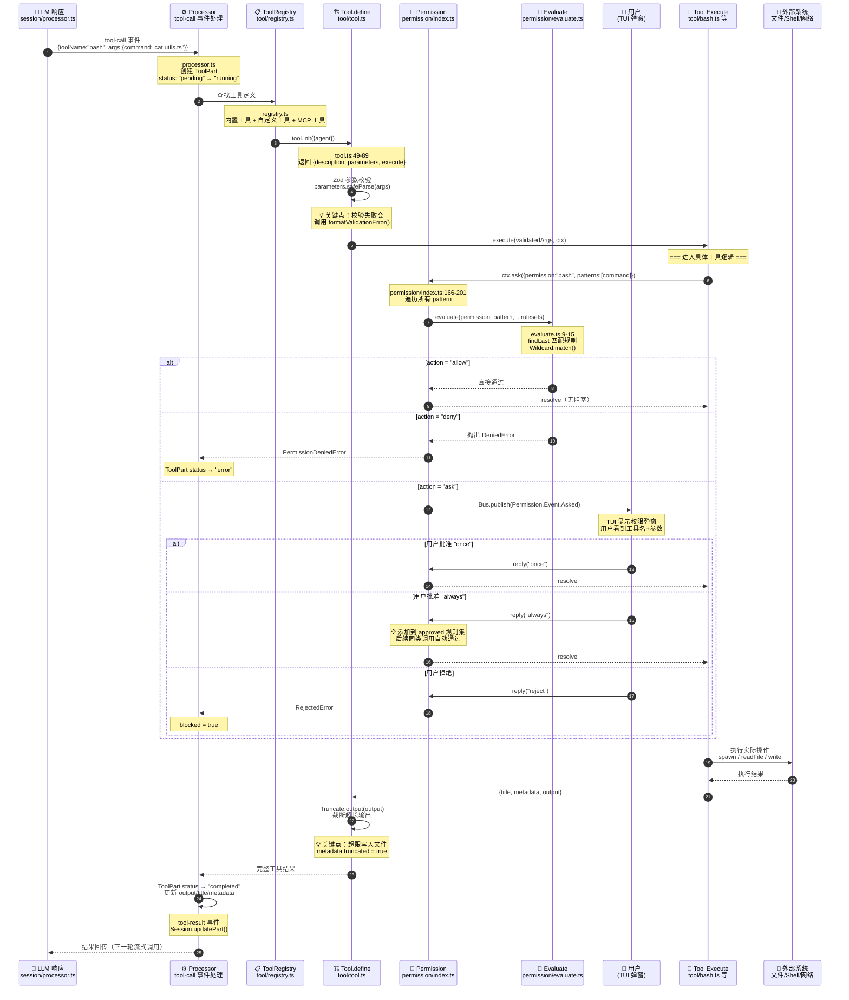
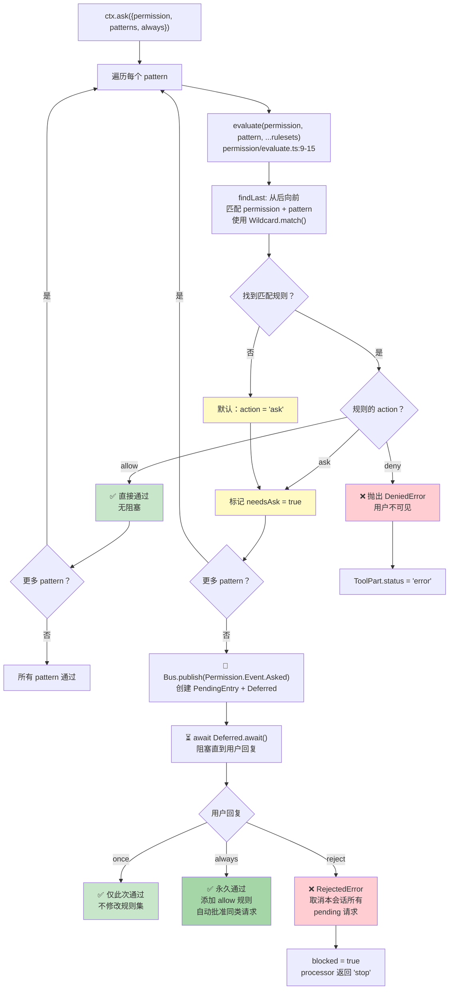

# 一次 Tool 调用的完整旅程

> 📌 一句话总结：从 Agent 说"我要调用 bash 工具"到结果返回，中间经历了注册发现、权限评估、参数校验、执行隔离、输出截断六道关卡。
> 🗺️ 本节在全景中的位置：上一节追踪了完整对话流程，在 Agent 决定"调用工具"的那一刻停下。本节接过接力棒，放大工具调用的完整生命周期。

---

## 全景图：工具调用时序

当 Processor 收到 LLM 返回的 `tool-call` 事件时，以下流程启动：



---

## 工具注册与发现

OpenCode 的工具来自三个来源，最终汇入统一注册表（Unified Registry）：

```mermaid
flowchart TB
    subgraph Builtin["🏗️ 内置工具（Built-in）"]
        direction TB
        bash["bash<br/>tool/bash.ts"]
        read["read<br/>tool/read.ts"]
        edit["edit<br/>tool/edit.ts"]
        write["write<br/>tool/write.ts"]
        grep["grep<br/>tool/grep.ts"]
        glob["glob<br/>tool/glob.ts"]
        task["task<br/>tool/task.ts"]
        fetch["webfetch<br/>tool/webfetch.ts"]
        lsp["lsp<br/>tool/lsp.ts"]
        patch["apply_patch<br/>tool/apply_patch.ts"]
        todo["todowrite<br/>tool/todowrite.ts"]
        batch["batch<br/>tool/batch.ts"]
        question["question<br/>（条件注册）"]
        websearch["websearch / codesearch<br/>（条件注册）"]
    end

    subgraph Custom["📁 自定义工具（Custom）"]
        direction TB
        tooldir["{tool,tools}/*.{js,ts}<br/>项目目录下的工具文件"]
        plugin["Plugin.list()<br/>插件提供的工具"]
    end

    subgraph MCP["🌐 MCP 工具（Model Context Protocol）"]
        direction TB
        mcpserver["MCP Server 连接<br/>mcp/index.ts"]
        mcptools["远程工具列表<br/>.opencode/mcp.json 配置"]
    end

    subgraph Registry["📋 统一注册表<br/>tool/registry.ts"]
        direction TB
        register["register(tool)<br/>注册/更新"]
        ids["ids()<br/>列出所有工具 ID"]
        tools["tools(model, agent)<br/>根据模型+Agent 过滤"]
    end

    subgraph Filter["🔍 运行时过滤"]
        direction TB
        model_filter["模型能力过滤<br/>是否支持 toolcall"]
        agent_filter["Agent 权限过滤<br/>Permission.disabled()"]
        user_filter["用户覆盖<br/>user.tools[name] === false"]
        plugin_filter["Plugin hook<br/>tool.definition 扩展"]
    end

    subgraph Final["✅ 最终工具集"]
        available["Record&lt;string, Tool&gt;<br/>传入 LLM.stream()"]
    end

    Builtin --> Registry
    Custom --> Registry
    MCP --> Registry

    Registry --> Filter
    Filter --> Final

    style Builtin fill:#e8f5e9
    style Custom fill:#fff3e0
    style MCP fill:#e3f2fd
    style Registry fill:#f3e5f5
    style Filter fill:#fce4ec
    style Final fill:#e0f2f1
```



### 💡 关键点：条件注册

并非所有内置工具都会注册。`registry.ts` 中的条件逻辑：

| 工具 | 条件 | 原因 |
|------|------|------|
| `question` | 仅当 `OPENCODE_CLIENT` 或 `OPENCODE_ENABLE_QUESTION_TOOL` | 需要 TUI 交互能力 |
| `websearch` / `codesearch` | 仅当 `ProviderID.opencode` 或 `OPENCODE_ENABLE_EXA` | 需要 Exa 搜索服务 |
| `apply_patch` vs `edit`/`write` | 取决于模型变体（GPT-4/OSS 选择） | 不同模型擅长不同的编辑格式 |
| `batch` | 需要 `experimental.batch` 配置 | 实验性功能 |

### Tool.define() 模式

每个工具通过统一的 `Tool.define(id, init)` 注册（`tool/tool.ts:49-89`）：

```
Tool.define("bash", async (initCtx) => ({
  description: "执行 shell 命令",
  parameters: z.object({ command: z.string(), ... }),
  execute: async (args, ctx) => ({ title, output, metadata }),
}))
```

`init` 函数在工具被请求时**惰性调用**，传入 `{agent}` 上下文。这意味着同一个工具面对不同 Agent 可能返回不同的 `description` 或 `parameters`。

---

## 工具权限模型：Auto / Ask / Deny 决策流

权限系统是工具调用的守门人。每次工具调用都会触发 `ctx.ask()`，启动以下决策流：



### 💡 关键点：规则叠加与优先级

权限规则来自多个层级，**最后匹配的规则胜出**（`findLast` 语义）：

```
1. 全局默认规则（allow all, doom_loop ask, question deny）
2. 白名单目录（Truncate.GLOB + skill 目录）
3. 用户配置权限（config.permission）
4. Agent 配置权限（agent.permission）
5. Session 级权限（session.permission — 可覆盖一切）
```

例如 `explore` Agent 的权限配置：

```
{ "*": "deny", grep: "allow", glob: "allow", list: "allow",
  bash: "allow", read: "allow" }
```

这意味着 `explore` Agent 只能使用只读工具，无法调用 `edit` 或 `write`。

---

## 图解说明：工具执行细节

### Bash 工具执行流（`tool/bash.ts`）

Bash 工具的执行比想象中复杂——它包含**两阶段权限检查**：

1. **外部目录检查**：使用 tree-sitter 解析 bash 命令 AST，提取 `cd`/`rm`/`cp`/`mv` 等文件系统操作的目标路径，判断是否超出项目目录
2. **命令权限检查**：提取命令名，以完整命令文本（含重定向）作为 pattern 请求权限

执行本身通过 `spawn()` 创建子进程，**流式更新 metadata**——用户可以实时在 TUI 中看到命令输出。超时和 abort 信号都会触发进程终止。

### Edit 工具执行流（`tool/edit.ts`）

Edit 工具使用**文件锁 + 时间戳断言**保护并发安全：

```
FileTime.withLock(filePath, async () => {
  FileTime.assert(sessionID, filePath)  // 确认文件未被外部修改
  // ... 执行替换 ...
})
```

替换本身通过**9 种 Replacer 策略**依次尝试（下一节详述），确保即使 LLM 给出的 `oldString` 有微小差异也能匹配成功。

### MCP 工具集成（`mcp/index.ts`）

MCP（Model Context Protocol）工具通过标准协议连接外部工具服务器。配置在 `.opencode/mcp.json` 中定义，OpenCode 作为 MCP client 连接到这些 server，将远程工具注册到统一注册表中。MCP 工具的权限检查与内置工具完全一致。

---

## 关键设计决策

### 1. 为什么工具定义是惰性初始化（Lazy Init）？

💡 `Tool.define(id, init)` 中 `init` 是一个异步函数，只在工具被实际请求时才执行。这允许：
- 不同 Agent 获得不同的工具描述（`init({agent})`）
- 运行时根据环境决定工具能力
- 避免启动时加载所有工具的开销

### 2. 为什么使用 Wildcard 匹配而非精确匹配？

💡 `Wildcard.match()` 让权限规则可以使用 `*` 通配。例如 `bash` 权限的 `always` 模式 `"git *"` 可以一次批准所有 git 命令，避免用户为每个 `git status`、`git diff` 单独确认。

### 3. 为什么 "always" 回复会自动批准同会话的其他请求？

💡 当用户回复 `"always"` 时，系统不仅通过当前请求，还会扫描该 Session 中所有 pending 请求，自动批准匹配的。这避免了"批准了 edit 权限但还要单独批准每个文件"的烦人体验。

### 4. 为什么输出需要截断？

💡 `Tool.define()` 的包装层（`tool.ts:71-84`）会调用 `Truncate.output()` 截断超长输出。过长的工具输出会消耗 LLM 的上下文窗口（Context Window），导致重要信息被挤出。截断后的内容写入临时文件，Agent 可按需读取。

### 5. 死循环检测为什么设在 Processor 层？

💡 Doom Loop 检测在 `processor.ts` 的 `tool-call` 事件处理中——检查最近 3 个 ToolPart 是否使用相同工具+相同参数。这比在工具层面检测更全面，因为它能跨工具类型发现重复模式。

---

## 与下一节的衔接

我们已经看到工具调用的完整生命周期——从发现、权限、执行到结果返回。但其中最复杂的工具是 `edit`——它如何将 LLM 给出的"旧文本 → 新文本"转变为实际的文件修改？下一节 **"一次文件编辑的完整旅程"** 将深入 9 种 Replacer 策略、Patch 系统和 Snapshot 机制。
