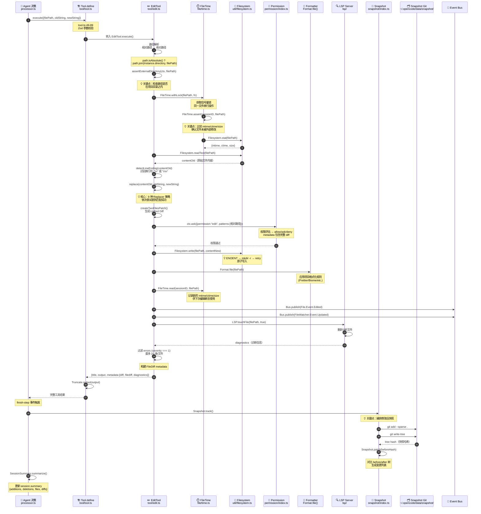
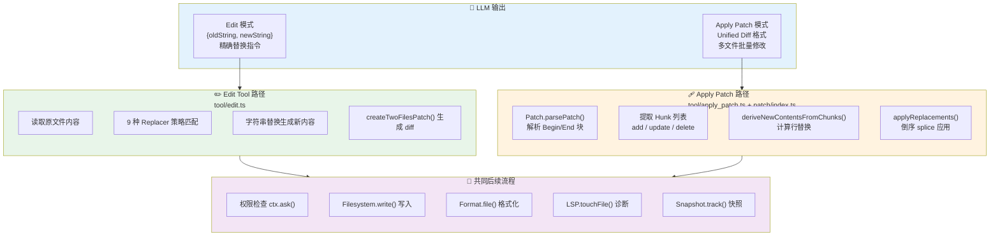
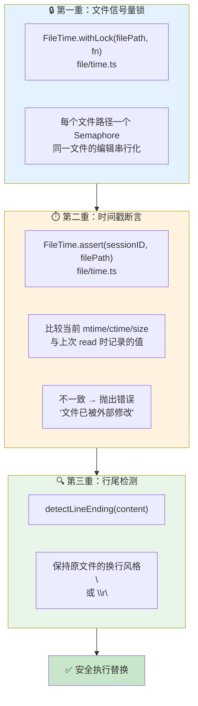

# 一次文件编辑的完整旅程

> 📌 一句话总结：从 Agent 说"我要改这个文件"到文件落盘，中间经历了路径解析、文件锁、时间戳断言、9 种模糊匹配策略、格式化、LSP 诊断、Snapshot 快照——每一步都是一道安全网。
> 🗺️ 本节在全景中的位置：上一节描述了工具调用的通用流程，本节聚焦最复杂、最关键的一类工具——文件编辑。理解这条链路，就理解了 OpenCode 如何**安全、可靠地修改你的代码**。

---

## 场景回顾

还是小明的故事。Agent 已经读取了 `utils.ts` 的内容，现在决定执行编辑：

```json
{
  "toolName": "edit",
  "args": {
    "filePath": "/project/src/utils.ts",
    "oldString": "items.forEach((item) => {",
    "newString": "for (const item of items) {"
  }
}
```

让我们追踪这个 JSON 如何变成磁盘上的真实修改。

---

## 全景图：文件编辑完整链路



---

## Patch 系统：LLM 输出如何变成文件修改

OpenCode 支持两种编辑模式，由不同的工具实现。我们来看它们的完整对比：



### Edit Tool 的 9 种 Replacer 策略

当 LLM 给出的 `oldString` 与文件实际内容有微小差异时（这在实践中非常常见），`replace()` 函数（`edit.ts:630-667`）会依次尝试 9 种匹配策略：

```mermaid
flowchart TD
    Start["replace(content, oldString, newString)"] --> R1

    R1["① SimpleReplacer<br/>精确字符串匹配"]
    R1 -->|匹配成功| Done["✅ 应用替换"]
    R1 -->|失败| R2

    R2["② LineTrimmedReplacer<br/>逐行 trim 后匹配"]
    R2 -->|匹配成功| Done
    R2 -->|失败| R3

    R3["③ BlockAnchorReplacer<br/>首尾行锚定 + Levenshtein 距离"]
    R3 -->|匹配成功| Done
    R3 -->|失败| R4

    R4["④ WhitespaceNormalizedReplacer<br/>所有空白归一化为单空格"]
    R4 -->|匹配成功| Done
    R4 -->|失败| R5

    R5["⑤ IndentationFlexibleReplacer<br/>忽略缩进差异"]
    R5 -->|匹配成功| Done
    R5 -->|失败| R6

    R6["⑥ EscapeNormalizedReplacer<br/>处理转义序列差异<br/>\\n \\t \\' \\\" \\`"]
    R6 -->|匹配成功| Done
    R6 -->|失败| R7

    R7["⑦ MultiOccurrenceReplacer<br/>所有精确匹配（replaceAll 模式）"]
    R7 -->|匹配成功| Done
    R7 -->|失败| R8

    R8["⑧ TrimmedBoundaryReplacer<br/>多行块边界 trim"]
    R8 -->|匹配成功| Done
    R8 -->|失败| R9

    R9["⑨ ContextAwareReplacer<br/>上下文行锚定 + 50% 相似度"]
    R9 -->|匹配成功| Done
    R9 -->|失败| Error["❌ 未找到匹配<br/>返回错误信息"]

    style R1 fill:#c8e6c9
    style R3 fill:#fff9c4
    style R6 fill:#ffe0b2
    style R9 fill:#ffcdd2
    style Done fill:#a5d6a7
    style Error fill:#ef9a9a
```

### 💡 关键点：为什么需要这么多策略？

LLM 生成的 `oldString` 常见问题：
- **缩进不一致**：LLM 可能用 2 空格，而文件用 4 空格 → `IndentationFlexibleReplacer`
- **尾部空白**：LLM 可能丢失行尾空格 → `LineTrimmedReplacer`
- **转义字符**：LLM 可能输出 `\n` 而文件中是实际换行 → `EscapeNormalizedReplacer`
- **上下文偏移**：文件被其他编辑修改后行号偏移 → `BlockAnchorReplacer`（使用 Levenshtein 距离容错）

### Apply Patch 的 Hunk 格式

`apply_patch` 工具解析的 Patch 格式（`patch/index.ts`）：

```
*** Begin Patch
*** Update File: src/utils.ts
@@ items.forEach((item) => { @@
-  items.forEach((item) => {
+  for (const item of items) {
   console.log(item)
*** End Patch
```

解析后生成 `Hunk` 结构，通过 `deriveNewContentsFromChunks()` 应用：
1. `seekSequence()` — 4 轮匹配（精确 → rstrip → trim → Unicode 归一化）
2. `computeReplacements()` — 计算 `[startIndex, oldLength, newLines]` 数组
3. `applyReplacements()` — **倒序 splice** 避免索引偏移

---

## Snapshot 系统：编辑的时光机

每次编辑前后，Snapshot 系统都会用**独立的 Git 仓库**记录文件系统状态：

```mermaid
flowchart LR
    subgraph Before["📸 编辑前"]
        B1["Snapshot.track()<br/>processor.ts start-step"]
        B2["git add --sparse ."]
        B3["git write-tree"]
        B4["hash: abc123"]
    end

    subgraph Edit["✏️ 编辑过程"]
        E1["Filesystem.write()"]
        E2["文件已修改"]
    end

    subgraph After["📸 编辑后"]
        A1["Snapshot.track()<br/>processor.ts finish-step"]
        A2["git add --sparse ."]
        A3["git write-tree"]
        A4["hash: def456"]
    end

    subgraph Ops["🔧 可用操作"]
        O1["Snapshot.diff(abc123)<br/>获取 Unified Diff"]
        O2["Snapshot.diffFull(abc123, def456)<br/>获取 FileDiff[] 详情"]
        O3["Snapshot.restore(abc123)<br/>完全回滚到编辑前"]
        O4["Snapshot.revert(patches)<br/>按文件选择性回滚"]
    end

    Before --> Edit --> After
    After --> Ops

    style Before fill:#e3f2fd
    style Edit fill:#fff3e0
    style After fill:#e8f5e9
    style Ops fill:#f3e5f5
```



### Snapshot 存储位置

```
~/.opencode/data/snapshot/{projectID}/{worktreeHash}/.git
├── objects/     ← 文件内容快照
├── refs/        ← 无分支，纯 tree 对象
├── HEAD
├── config       ← autocrlf=false, fsmonitor=false
└── info/exclude ← 排除 .gitignore + >2MB 文件
```

💡 **关键点**：Snapshot 使用**独立于项目的 Git 仓库**。它不会干扰项目的 `.git`，也不会出现在 `git status` 中。大于 2MB 的文件自动排除，后台每小时运行 `git gc --prune=7.days` 清理过期快照。

---

## 图解说明：并发安全三重保护

文件编辑面临的核心挑战：多个工具可能同时修改同一文件。OpenCode 通过三重机制保护：



---

## 关键设计决策

### 1. 为什么 Edit 而非 Write？

💡 `edit` 工具做**精确替换**（oldString → newString），`write` 工具做**全量覆盖**。精确替换的好处：
- diff 更小、更可读
- 不会意外丢失文件其他部分的内容
- 权限弹窗中展示的 diff 更有意义
- LLM 不需要重复输出整个文件（节省 token）

### 2. 为什么 9 种 Replacer 而非 1 种？

💡 LLM 不是精确的文本复制机。实测中，LLM 输出的 `oldString` 经常有空白差异、缩进偏移、转义不一致。9 种策略从严格到宽松依次尝试，**优先使用最精确的匹配**——这避免了过度模糊导致的错误替换。

### 3. 为什么用独立 Git 做 Snapshot？

💡 三个原因：
- **不污染项目**：Snapshot 的 Git 操作不影响项目的 `.git`
- **原子性**：`git write-tree` 是原子操作，不会出现半写状态
- **高效 diff**：`git diff --cached` 比文件系统级 diff 快得多

### 4. 为什么编辑后要跑 Formatter？

💡 `Format.file(filePath)` 在写入后自动运行项目配置的格式化器（Prettier、Biome 等）。这确保 AI 生成的代码**遵循项目的代码风格**，不会因为 LLM 的格式偏好引入不一致。

### 5. 为什么编辑后要收集 LSP 诊断？

💡 `LSP.touchFile()` + `LSP.diagnostics()` 让 Agent 立即知道编辑是否引入了类型错误或语法错误。如果检测到错误，诊断信息会附在工具输出中——Agent 可以在下一轮 ReAct 循环中自动修复。

```
output: "Edit applied successfully.

LSP errors detected:
<diagnostics>
src/utils.ts:42 - error TS2304: Cannot find name 'item'.
</diagnostics>"
```

### 6. Apply Patch 的倒序 splice

💡 `applyReplacements()` 将替换操作按行号**从大到小排序**后执行。这是一个经典技巧——倒序处理避免了前面的 splice 操作导致后面的行号偏移。

---

## Write 工具与 MultiEdit 工具

除了 `edit`，文件修改还有两个变体：

**`write` 工具**（`tool/write.ts`）— 全量写入：
- 适合创建新文件或大规模重写
- 同样经过权限检查 + 格式化 + LSP 诊断
- diff 展示完整的 before/after 差异

**`multiedit` 工具**（`tool/multiedit.ts`）— 批量编辑：
- 接受一个 `edits` 数组，对同一文件执行多次替换
- 内部循环调用 `EditTool.execute()`
- 避免多次文件读写的开销

**`apply_patch` 工具**（`tool/apply_patch.ts`）— 多文件补丁：
- 解析 `*** Begin Patch ... *** End Patch` 格式
- 支持 Add / Update / Delete / Move 四种操作
- 单次权限请求覆盖所有文件变更
- 适合大规模重构场景

---

## 与下一节的衔接

至此，我们完成了"全景视野"章节的三次旅程——对话、工具调用、文件编辑。你已经看到了 OpenCode 从用户输入到文件落盘的完整数据流。接下来，**"快速上手"** 章节将带你从阅读者变为使用者，亲手体验这些流程。
