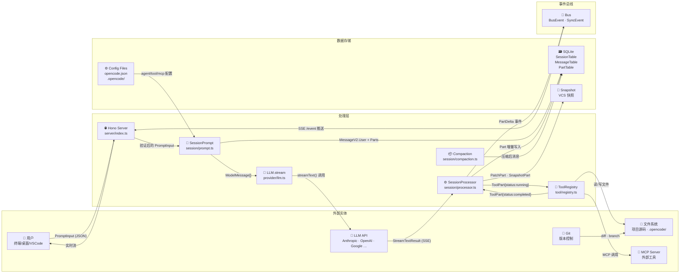
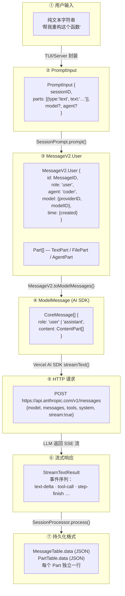
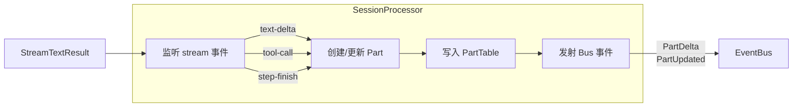
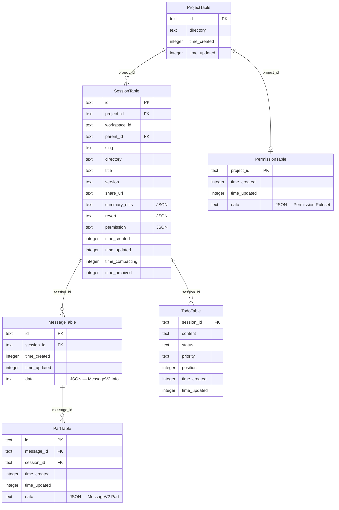
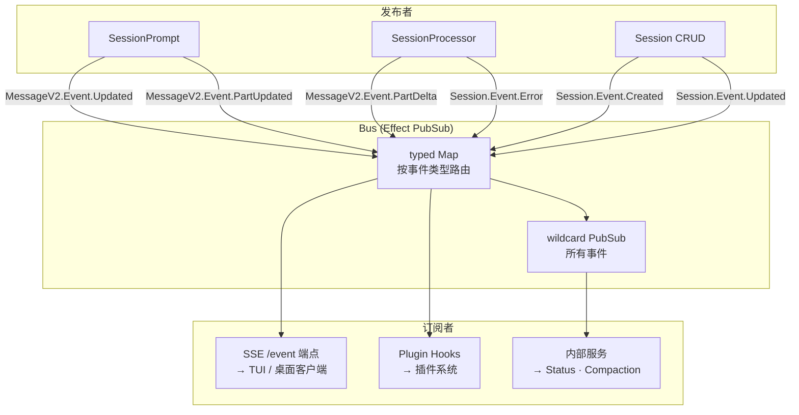
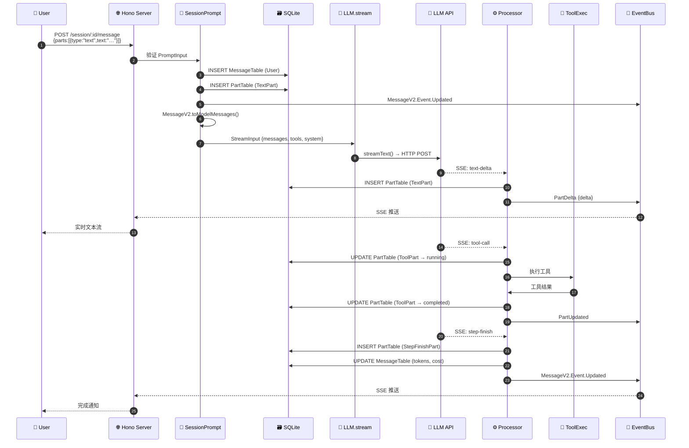

# 数据流全景图

> 📌 一句话总结：从用户敲下回车到 LLM 回复落盘，数据经历 7 次格式变换——字符串 → 内部消息 → AI SDK 格式 → HTTP 请求 → 流式响应 → 结构化 Part → SQLite 行，每一步都有明确的类型守卫。
> 🗺️ 本节在全景中的位置：前三节以"旅程"视角讲述了对话、工具调用、文件编辑的流程。本节切换到**数据（Data）**视角，用 DFD（数据流图）把系统中所有数据的来源、变换、去向画成一张全景图。

---

## 全景图：系统级数据流



---

## 消息格式变换链

这是数据流的核心——一条用户输入从 `string` 到 SQLite 行，经历了 **7 次格式变换**：



---

## 图解说明：每一步的细节

### ① → ② 用户输入 → PromptInput

用户在 TUI 中输入文本后，客户端将其封装为 `PromptInput`：

```typescript
// session/prompt.ts — PromptInput schema
const PromptInput = z.object({
  sessionID: SessionID.zod,
  parts: z.array(z.discriminatedUnion("type", [
    TextPartInput,     // { type: "text", text: string }
    FilePartInput,     // { type: "file", url, mime }
    AgentPartInput,    // { type: "agent", name }
    SubtaskPartInput,  // { type: "subtask", prompt, description, agent }
  ])),
  model: z.object({ providerID, modelID }).optional(),
  agent: z.string().optional(),
  format: MessageV2.Format.optional(),
  noReply: z.boolean().optional(),
})
```

注意 `parts` 数组——用户输入不仅仅是文字，还可以附带文件、指定 Agent、甚至发起子任务。

### ② → ③ PromptInput → MessageV2.User

`SessionPrompt.prompt()` 把 `PromptInput` 转化为持久化的 `MessageV2.User`：

```typescript
// 关键字段映射
MessageV2.User = {
  id:        MessageID.ascending(),    // 时间有序 ID
  sessionID: input.sessionID,
  role:      "user",
  agent:     resolvedAgent.name,       // 从 config 解析
  model:     { providerID, modelID },  // 从 config / input 解析
  time:      { created: Date.now() },
  format:    input.format,             // text 或 json_schema
  tools:     input.tools,              // 工具白名单
}
```

同时，每个 `part` 被写入 `PartTable`，与 `MessageTable` 通过 `message_id` 关联。

### ③ → ④ MessageV2 → ModelMessage（AI SDK 格式）

这是最复杂的变换。`MessageV2.toModelMessages()` 负责把内部 Part 类型映射到 Vercel AI SDK 的 `CoreMessage` 格式：

| 内部 Part 类型 | AI SDK ContentPart | 说明 |
|---|---|---|
| `TextPart` | `{ type: "text", text }` | 直接映射 |
| `FilePart` | `{ type: "file", url, mediaType }` | URL 或 base64 |
| `ReasoningPart` | `{ type: "reasoning", text }` | 思考过程 |
| `ToolPart(completed)` | `{ type: "tool-result", toolCallId, result }` | 工具结果 |
| `ToolPart(error)` | `{ type: "tool-result", isError: true }` | 工具错误 |
| `StepFinishPart` | *(不映射)* | 仅内部使用 |
| `PatchPart` | *(不映射)* | 仅内部使用 |

> 💡 **关键设计**：并非所有 Part 都需要发给 LLM。`StepFinishPart`、`PatchPart`、`SnapshotPart` 等仅用于内部记录和 UI 展示。

### ④ → ⑤ ModelMessage → HTTP 请求

Vercel AI SDK 的 `streamText()` 接管剩余工作：

```typescript
// provider/llm.ts — 简化后的调用
const result = streamText({
  model:    provider(modelID),          // AI SDK provider 实例
  messages: modelMessages,              // CoreMessage[]
  tools:    builtTools,                 // 工具定义
  system:   systemPrompts.join("\n"),   // 合并系统提示词
  abortSignal: abort,
  maxSteps: agent.steps ?? 100,         // 最大迭代步数
  toolChoice: agent.toolChoice,
})
```

### ⑤ → ⑥ HTTP 响应 → StreamTextResult

LLM 以 Server-Sent Events 返回流式数据。Vercel AI SDK 将其解析为标准化事件序列：

```
start → reasoning-start → reasoning-delta* → reasoning-end
      → text-start → text-delta* → text-end
      → tool-input-start → tool-call → tool-result
      → step-finish → finish
```

### ⑥ → ⑦ StreamTextResult → 持久化

`SessionProcessor.process()` 消费这些事件，**实时**写入数据库：



每种流事件对应的 Part 创建逻辑：

| Stream 事件 | 创建的 Part 类型 | Part 状态 |
|---|---|---|
| `reasoning-start` | `ReasoningPart` | `text: ""` |
| `reasoning-delta` | *(更新)* | 追加 `text` |
| `text-start` | `TextPart` | `text: ""` |
| `text-delta` | *(更新)* | 追加 `text` |
| `tool-input-start` | `ToolPart` | `status: "pending"` |
| `tool-call` | *(更新)* | `status: "running"` |
| `tool-result` | *(更新)* | `status: "completed"` |
| `tool-error` | *(更新)* | `status: "error"` |
| `step-finish` | `StepFinishPart` | `cost`, `tokens` |

---

## 数据存储层详解

### SQLite 表结构



### 存储设计决策

**为什么 `data` 列存 JSON？**

`MessageTable.data` 和 `PartTable.data` 都用 JSON 列存储完整对象。这是**事件溯源（Event Sourcing）**的简化实现：

1. **写入快**——消息结构复杂且频繁变化，不值得把每个字段拆成列
2. **读取灵活**——整条 JSON 反序列化后即可得到完整类型
3. **迁移简单**——新增字段只需在应用层处理默认值，不需要 `ALTER TABLE`

但核心索引字段（`session_id`、`time_created`、`id`）仍然是独立列，确保查询性能。

---

## 事件总线：实时数据分发



**事件类型分两类**：

| 类型 | 定义方式 | 用途 | 示例 |
|---|---|---|---|
| `SyncEvent` | `SyncEvent.define()` | 需要持久化/同步的状态变更 | `Session.Event.Created`、`MessageV2.Event.Updated` |
| `BusEvent` | `BusEvent.define()` | 瞬时通知，不持久化 | `MessageV2.Event.PartDelta`、`SessionStatus.Event.Status` |

---

## 完整数据流时序

把上面所有部分串起来，一次完整的对话数据流如下：



---

## 关键设计决策

### 1. 为什么 Part 独立存储？

每个 `Part` 在 `PartTable` 中是独立的一行，而不是嵌入在 `MessageTable.data` 中。这让我们能：

- **增量更新**：流式过程中只需 `UPDATE` 一个 Part 行，而不是重写整条 Message
- **独立删除**：compaction（上下文压缩）时可以只删除工具输出的 Part，保留其他
- **细粒度事件**：`PartDelta` 事件只携带变化部分，减少 SSE 传输量

### 2. 为什么消息 ID 是时间有序的？

`MessageID.ascending()` 生成时间有序 ID（类似 ULID），这意味着：

- 按 `id` 排序 = 按时间排序，无需额外 `ORDER BY time_created`
- `message_session_time_created_id_idx` 索引可以高效支持分页查询
- `SessionID` 使用 `descending()`——最新会话排在前面

### 3. 为什么用 Effect PubSub 而不是 Node.js EventEmitter？

Effect PubSub 提供：

- **背压（Backpressure）**：订阅者消费慢时不会丢失事件
- **类型安全**：每个事件有 Zod schema 验证
- **Effect 集成**：可以无缝嵌入 Effect 的错误处理和资源管理

---

## 与下一节的衔接

我们已经看到数据在系统中如何**流动**。但数据的"形态"在时间轴上是如何变化的？一个 Session 从创建到归档经历了哪些状态？一个 ToolPart 从 `pending` 到 `completed` 的状态机是什么样的？

下一节 [08-状态生命周期全景图](./08-状态生命周期全景图.md) 将从**状态（State）**视角，为每种核心实体画出完整的状态机图。
