# 状态生命周期全景图

> 📌 一句话总结：OpenCode 中有 4 条核心状态机——Session、SessionStatus、Message（含 Assistant 与 Part）、ToolPart，它们互相联动但各自独立，理解这些状态流转就能理解系统在任意时刻"正在做什么"。
> 🗺️ 本节在全景中的位置：上一节从数据流视角画出了信息的变换链路。本节切换到**状态（State）**视角，用状态机图展示每种核心实体的完整生命周期，以及状态之间的触发关系。

---

## 全景图：四大状态机联动

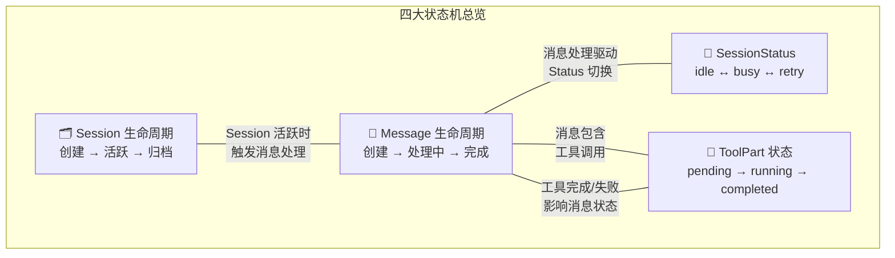

---

## 一、Session 生命周期

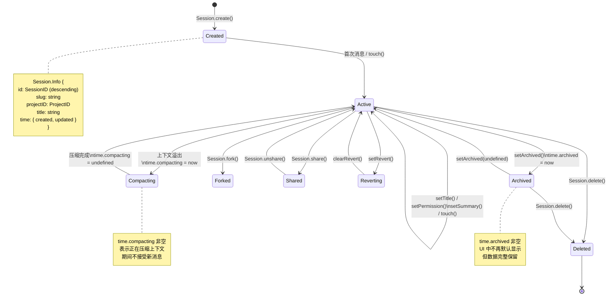

### Session 状态说明

| 状态 | 判断依据 | 触发事件 | 可执行操作 |
|---|---|---|---|
| **Created** | `time.created` 存在，无消息 | `Session.Event.Created` | 发消息、修改标题、设权限 |
| **Active** | `time.updated > time.created` | `Session.Event.Updated` | 全部操作 |
| **Compacting** | `time.compacting` 非空 | 内部状态 | 等待压缩完成 |
| **Shared** | `share.url` 非空 | `Session.Event.Updated` | 取消分享 |
| **Reverting** | `revert` 非空 | `Session.Event.Updated` | 确认/取消回滚 |
| **Archived** | `time.archived` 非空 | `Session.Event.Updated` | 恢复、删除 |
| **Deleted** | 数据已移除 | `Session.Event.Deleted` | *(终态)* |

### 关键字段

```typescript
// session/index.ts — Session.Info 中的时间字段
time: {
  created: number,       // 创建时间
  updated: number,       // 最后更新时间
  compacting?: number,   // 压缩中时间戳（存在即为压缩中）
  archived?: number,     // 归档时间戳（存在即为已归档）
}
```

---

## 二、SessionStatus 状态机

`SessionStatus` 是独立于 `Session` 的**运行时状态**——它不存在数据库中，只在内存 `Map` 中维护。

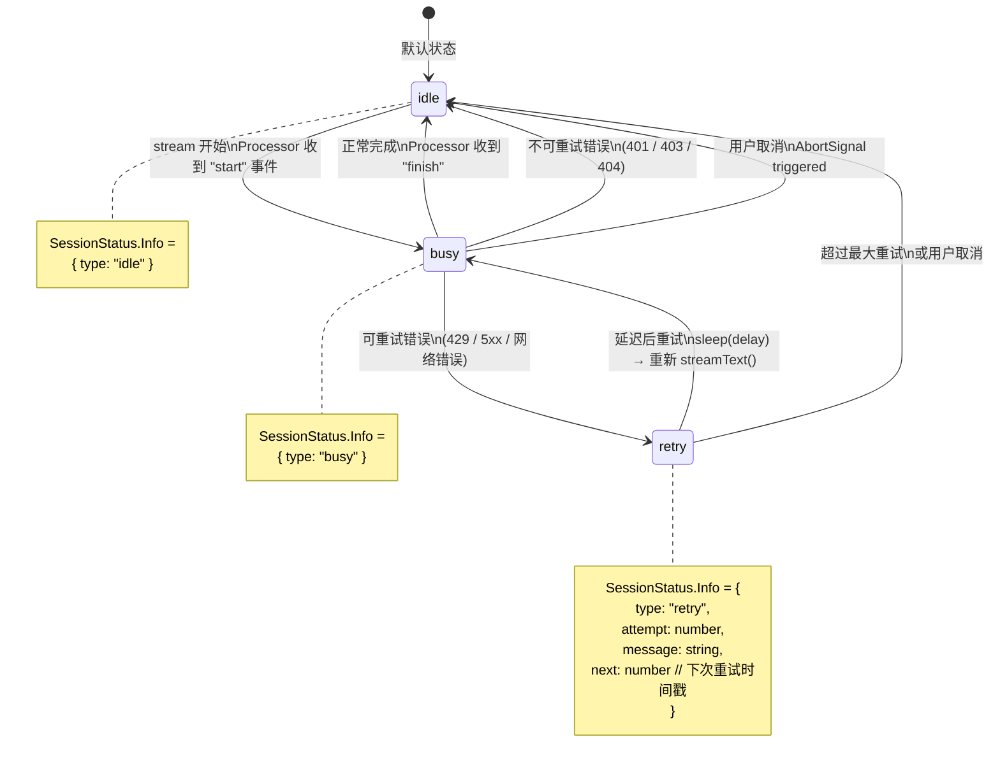

### 重试策略

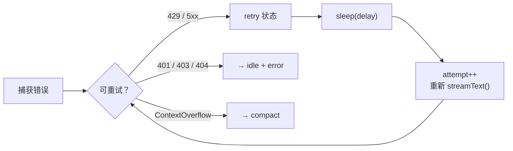

重试延迟采用指数退避（Exponential Backoff），由 `SessionRetry.delay(attempt, error)` 计算。对于 429 错误，会尊重 LLM 返回的 `Retry-After` 头。

### 状态事件

```typescript
// session/status.ts — 事件定义
Event.Status = BusEvent.define("session.status", z.object({
  sessionID: SessionID.zod,
  status: Info,  // { type: "idle" } | { type: "busy" } | { type: "retry", ... }
}))
```

---

## 三、Message 生命周期

### User Message 生命周期

User Message 是**不可变的**——创建后不再修改。

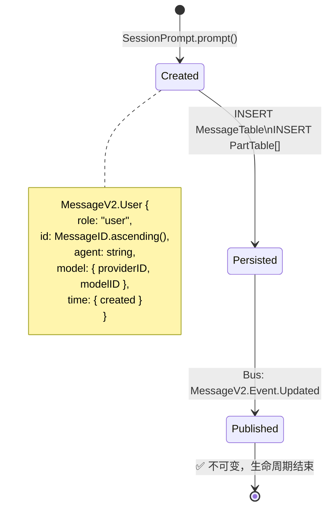

### Assistant Message 生命周期

Assistant Message 是**可变的**——在 LLM 流式返回过程中不断更新。

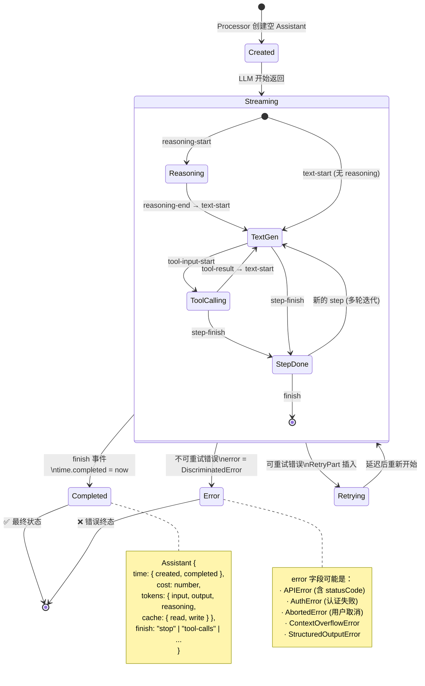

### Assistant Message 累积更新

在 `Streaming` 状态内，`cost` 和 `tokens` 在每个 `step-finish` 时累加：

```typescript
// session/processor.ts — step-finish 处理
case "step-finish": {
  msg.cost    += event.cost
  msg.tokens.input     += event.tokens.input
  msg.tokens.output    += event.tokens.output
  msg.tokens.reasoning += event.tokens.reasoning
  msg.tokens.cache.read  += event.tokens.cache.read
  msg.tokens.cache.write += event.tokens.cache.write
}
```

---

## 四、ToolPart 状态机

每个工具调用在 `PartTable` 中是一个 `ToolPart`，拥有独立的 4 态状态机。

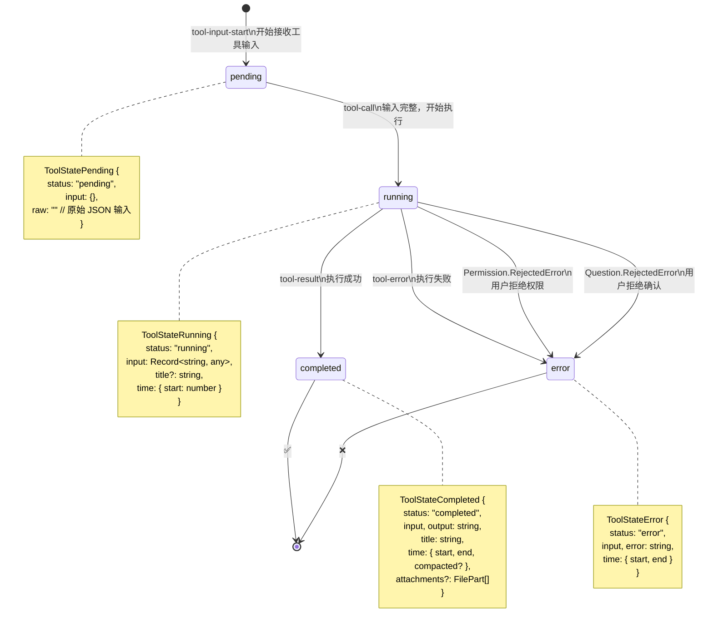

### Doom Loop 检测

Processor 会检测**工具循环调用**——如果最近 3 次工具调用的名称和输入完全相同，则触发 `doom_loop` 权限请求：

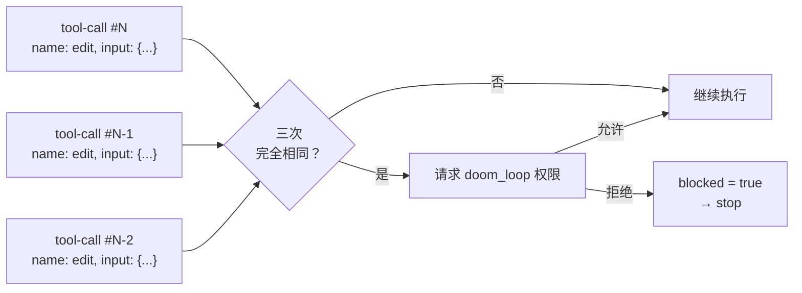

---

## 五、Provider 连接状态

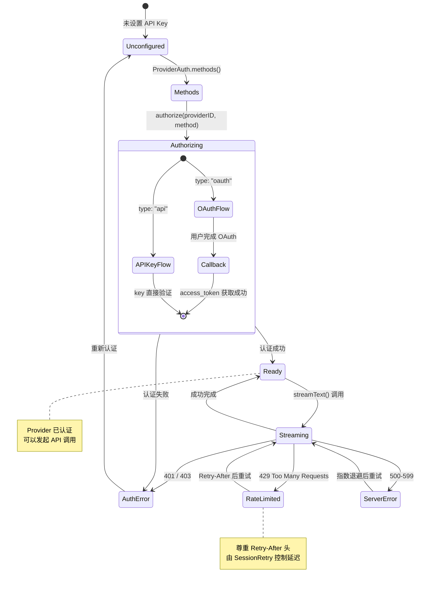

### 上下文溢出特殊处理

`ContextOverflowError` 不走 retry 路径，而是触发**消息压缩**：

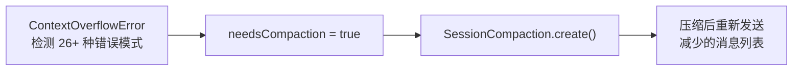

支持的溢出错误模式覆盖所有主要 Provider（Anthropic / OpenAI / Google / Bedrock / xAI / Groq 等），共识别 **26+ 种**不同的错误消息格式。

---

## 六、状态联动总览

所有状态机并非孤立运行。下面的时序图展示了一次包含工具调用的完整状态流转：

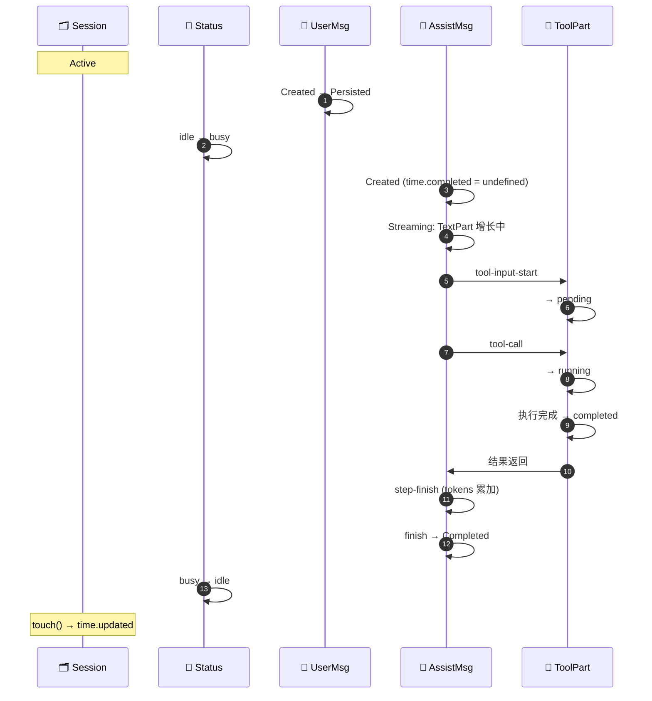

---

## 关键设计决策

### 1. 为什么 SessionStatus 不存数据库？

`SessionStatus`（idle/busy/retry）是纯运行时状态：

- **重启恢复**：进程重启后所有 Session 自然回到 `idle`，不需要数据库恢复
- **性能**：每次 `text-delta` 都可能更新状态，走数据库太重
- **内存高效**：用 `Map<SessionID, Info>` 存储，`idle` 状态从 Map 中移除

### 2. 为什么 ToolPart 有 `pending` 状态？

LLM 流式返回工具调用时，先发送 `tool-input-start`（开始接收 JSON 输入），然后逐步传输输入参数，最后发送 `tool-call`（输入完整）。`pending` 状态存在于这个"输入还在传输中"的窗口期，让 UI 可以显示"正在组装工具参数…"。

### 3. 为什么错误类型是区分联合（Discriminated Union）？

```typescript
type Error = APIError | AuthError | AbortedError | ContextOverflowError | StructuredOutputError
```

不同错误类型需要不同的处理策略：
- `APIError(isRetryable: true)` → 重试
- `ContextOverflowError` → 压缩上下文
- `AuthError` → 提示用户重新认证
- `AbortedError` → 静默处理

使用区分联合让 TypeScript 编译器强制我们处理每种情况。

---

## 与下一节的衔接

我们已经从**数据流**和**状态机**两个角度理解了 OpenCode 的运行机制。但一个更实际的问题是：如果我想扩展 OpenCode——加一个自定义 Agent、写一个工具、接入一个 MCP Server——从哪里下手？

下一节 [09-扩展点全景图](./09-扩展点全景图.md) 将列出 OpenCode 所有可定制的扩展点，每个扩展点附带配置方式、文件位置和上手难度。
