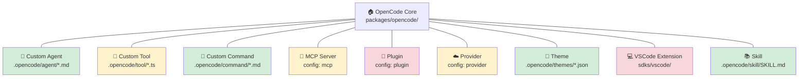
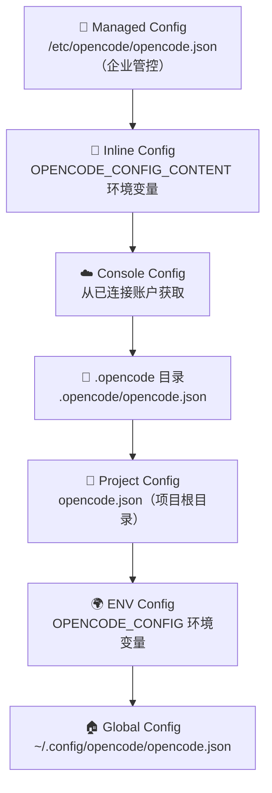

# 扩展点全景图

> 📌 一句话总结：OpenCode 提供 9 大扩展点——从零代码的 Markdown Agent 到完整的 Plugin Hook 系统，覆盖"配置即扩展"到"代码级深度定制"的全部场景。
> 🗺️ 本节在全景中的位置：前两节从数据流和状态机角度理解了系统内部。本节转向**外部视角**——作为使用者或贡献者，你能在哪些地方"插入"自己的逻辑？

---

## 全景图：扩展点辐射图



> 🟢 绿色 = 零代码（Markdown/JSON） · 🟡 黄色 = 少量代码/配置 · 🔴 红色 = 需要开发

---

## 各扩展点详解

### 1. 🤖 Custom Agent（自定义 Agent）🟢

| 属性 | 说明 |
|---|---|
| **配置方式** | Markdown 文件 + YAML frontmatter |
| **文件位置** | `.opencode/agent/*.md` 或 `.opencode/agents/*.md` |
| **源码入口** | `config/config.ts` → `loadAgent()` 函数 |
| **难度** | 🟢 零代码 |

```markdown
---
description: "代码审查专家"
mode: "primary"
model: "anthropic/claude-sonnet-4-20250514"
temperature: 0.3
color: "#38A3EE"
permission:
  edit: "deny"
  bash: "deny"
steps: 50
---

你是一位资深代码审查专家。请仔细审查用户提交的代码...
```

**frontmatter 字段**：`description`、`mode`（`"subagent"` | `"primary"` | `"all"`）、`model`、`temperature`、`top_p`、`color`、`permission`、`hidden`、`steps`、`options`。

文件名即为 Agent 名称：`docs.md` → Agent `docs`。

---

### 2. 📝 Custom Command（自定义命令）🟢

| 属性 | 说明 |
|---|---|
| **配置方式** | Markdown 文件 + YAML frontmatter |
| **文件位置** | `.opencode/command/*.md` 或 `.opencode/commands/*.md` |
| **源码入口** | `config/config.ts` → `loadCommand()` 函数 |
| **难度** | 🟢 零代码 |

```markdown
---
description: "查找 GitHub issue"
model: "anthropic/claude-haiku-4-5-20250501"
agent: "coder"
subtask: false
---

在 GitHub 上搜索以下关键词相关的 issue：$ARGUMENTS
```

**模板变量**：`$1`、`$2`…（位置参数）、`$ARGUMENTS`（全部参数）。

内置命令包括 `init` 和 `review`。

---

### 3. 📚 Skill（技能文件）🟢

| 属性 | 说明 |
|---|---|
| **配置方式** | Markdown 文件，文件名含 `SKILL` |
| **文件位置** | `.opencode/skill/SKILL.md`、`.opencode/skills/` |
| **源码入口** | `skill/index.ts` → `loadSkills()` |
| **难度** | 🟢 零代码 |

```json
// opencode.json
{
  "skills": {
    "paths": ["./skills", "~/shared-skills"],
    "urls": ["https://example.com/.well-known/skills/"]
  }
}
```

Skill 文件会被注入到 Agent 的系统提示词（System Prompt）中，扫描模式为 `**/SKILL.md`。支持本地路径和远程 URL。

---

### 4. 🎨 Theme（主题）🟢

| 属性 | 说明 |
|---|---|
| **配置方式** | JSON 文件 |
| **文件位置** | `.opencode/themes/*.json` |
| **源码入口** | `cli/cmd/tui/context/theme.tsx` |
| **难度** | 🟢 零代码 |

```json
{
  "$schema": "https://opencode.ai/theme.json",
  "defs": {
    "blue": "#38A3EE",
    "dark": "#1a1a2e"
  },
  "theme": {
    "primary": { "dark": "blue", "light": "blue" },
    "background": { "dark": "dark", "light": "#ffffff" },
    "text": { "dark": "#e0e0e0", "light": "#1a1a1a" },
    "border": { "dark": "#333333", "light": "#cccccc" },
    "diffAdded": { "dark": "#2ea043", "light": "#1a7f37" },
    "diffRemoved": { "dark": "#f85149", "light": "#cf222e" }
  }
}
```

在 TUI 中通过 `<leader>t` 打开主题选择器。

---

### 5. 🔧 Custom Tool（自定义工具）🟡

| 属性 | 说明 |
|---|---|
| **配置方式** | TypeScript/JavaScript 文件，使用 `@opencode-ai/plugin` API |
| **文件位置** | `.opencode/tool/*.ts` 或 `.opencode/tools/*.ts` |
| **源码入口** | `tool/registry.ts` → 扫描 `{tool,tools}/*.{js,ts}` |
| **难度** | 🟡 需少量 TypeScript |

```typescript
import { tool } from "@opencode-ai/plugin"

export default tool({
  description: "搜索 GitHub PR",
  args: {
    query: tool.schema.string().describe("搜索关键词"),
    limit: tool.schema.number().optional().describe("结果数量"),
  },
  execute: async (args, ctx) => {
    const result = await fetch(`https://api.github.com/search/issues?q=${args.query}+is:pr`)
    return JSON.stringify(await result.json())
  },
})
```

支持默认导出（单工具）和命名导出（多工具）。

---

### 6. 🔌 MCP Server（模型上下文协议）🟡

| 属性 | 说明 |
|---|---|
| **配置方式** | `opencode.json` 中的 `mcp` 字段 |
| **文件位置** | 配置级，无需项目内文件 |
| **源码入口** | `mcp/index.ts` → `create()` 函数 |
| **难度** | 🟡 需配置 + 外部 MCP Server |

```json
{
  "mcp": {
    "my-local-server": {
      "type": "local",
      "command": ["node", "mcp-server.js"],
      "environment": { "API_KEY": "..." },
      "enabled": true,
      "timeout": 5000
    },
    "remote-api": {
      "type": "remote",
      "url": "https://api.example.com/mcp",
      "headers": { "Authorization": "Bearer ..." },
      "oauth": { "clientId": "..." }
    }
  }
}
```

支持两种传输：**Local**（Stdio 子进程）和 **Remote**（HTTP/SSE，支持 OAuth）。MCP Server 暴露的工具自动注册到 Agent 可用工具列表中。

---

### 7. ☁️ Provider（AI 提供商）🟡

| 属性 | 说明 |
|---|---|
| **配置方式** | `opencode.json` 中的 `provider` 字段 |
| **文件位置** | 配置级 |
| **源码入口** | `provider/provider.ts` |
| **难度** | 🟡 需 API Key |

```json
{
  "provider": {
    "anthropic": { "apiKey": "sk-ant-..." },
    "openai": { "apiKey": "sk-...", "timeout": 300000 }
  },
  "model": "anthropic/claude-sonnet-4-20250514",
  "small_model": "anthropic/claude-haiku-4-5-20250501",
  "enabled_providers": ["anthropic", "openai"],
  "disabled_providers": ["openrouter"]
}
```

内置 Provider 覆盖 **18+** 个：Anthropic、OpenAI、Azure、Google、Vertex、Bedrock、Groq、Mistral、xAI、Cohere、Cerebras、DeepInfra、TogetherAI、Perplexity、Vercel、OpenRouter、GitLab、Gateway。通过 `models.dev` 注册表获取模型元数据。

---

### 8. 🧩 Plugin（插件系统）🔴

| 属性 | 说明 |
|---|---|
| **配置方式** | `opencode.json` 中的 `plugin` 数组 |
| **文件位置** | NPM 包 或 `file://` 本地路径 |
| **源码入口** | `plugin/index.ts` → Hook 系统 |
| **难度** | 🔴 需完整开发 |

```json
{
  "plugin": [
    "opencode-github",
    "oh-my-opencode@1.2.3",
    "file:///path/to/local/plugin.ts"
  ]
}
```

**可用 Hook 列表**：

| Hook | 时机 | 用途 |
|---|---|---|
| `config` | 配置加载后 | 修改运行时配置 |
| `event` | 任何事件触发时 | 监听系统事件 |
| `tool` | 工具注册 | 注册自定义工具 |
| `auth` | 认证流程 | 自定义认证方式 |
| `chat.message` | 消息发送前 | 修改消息内容 |
| `chat.params` | API 参数构建时 | 修改 API 参数 |
| `chat.headers` | API 请求发送前 | 添加自定义 HTTP 头 |
| `permission.ask` | 权限请求时 | 自定义权限逻辑 |
| `tool.execute.before` | 工具执行前 | 拦截工具调用 |
| `tool.execute.after` | 工具执行后 | 后处理工具结果 |
| `tool.definition` | 工具定义时 | 修改工具描述 |
| `shell.env` | Shell 环境构建时 | 注入环境变量 |
| `experimental.chat.messages.transform` | 消息转换时 | 实验性消息变换 |
| `experimental.chat.system.transform` | 系统提示时 | 实验性提示词变换 |
| `experimental.text.complete` | 文本生成完成后 | 后处理文本输出 |

内置插件包括：`CodexAuthPlugin`、`CopilotAuthPlugin`、`GitlabAuthPlugin`、`PoeAuthPlugin`。

---

### 9. 💻 VSCode Extension 🔴

| 属性 | 说明 |
|---|---|
| **配置方式** | VSCode 市场安装 |
| **文件位置** | `sdks/vscode/` |
| **源码入口** | `sdks/vscode/src/extension.ts` |
| **难度** | 🔴 需 VSCode 扩展开发 |

提供 3 个命令：
- `opencode.openTerminal` — 在 VSCode 终端中打开 OpenCode（`Cmd+Escape`）
- `opencode.openNewTerminal` — 新标签页打开（`Cmd+Shift+Escape`）
- `opencode.addFilepathToTerminal` — 将当前文件路径发送到 OpenCode（`Cmd+Alt+K`）

通过 HTTP 与 OpenCode Server 的 `/tui/append-prompt` 端点通信。

---

## 配置文件优先级

从高到低，后者被前者覆盖：



---

## 扩展点速查矩阵

| 扩展点 | 零代码？ | 热重载？ | 对 Agent 可见？ | 需发布？ |
|---|---|---|---|---|
| Custom Agent | ✅ | ✅ | — (本身即 Agent) | ❌ |
| Custom Command | ✅ | ✅ | ❌ | ❌ |
| Skill | ✅ | ✅ | ✅ (系统提示词) | ❌ |
| Theme | ✅ | ✅ | ❌ | ❌ |
| Custom Tool | ❌ (TS) | ✅ | ✅ (工具列表) | ❌ |
| MCP Server | ❌ (配置) | ✅ | ✅ (工具列表) | ❌ |
| Provider | ❌ (API Key) | ✅ | ❌ | ❌ |
| Plugin | ❌ (TS/NPM) | ❌ | ✅ (视 Hook) | 可选 |
| VSCode Ext | ❌ (TS) | ❌ | ❌ | ✅ |

---

## 关键设计决策

### 1. 为什么 Agent 和 Command 用 Markdown？

降低创建门槛——任何人都能用文本编辑器创建自定义 Agent，不需要理解 TypeScript 或构建系统。YAML frontmatter 提供结构化配置，Markdown body 就是 prompt。

### 2. 为什么 Plugin 用 Hook 而不是继承/接口？

Hook 模式（`before/after`）比 OOP 继承更灵活：多个插件可以叠加同一个 Hook，且不会互相干扰。这也是 Webpack/Vite 等工具链验证过的模式。

### 3. 为什么同时支持 MCP 和 Custom Tool？

MCP（Model Context Protocol）是跨应用的标准协议——一个 MCP Server 可以同时被 OpenCode、Claude Desktop 等多个客户端使用。Custom Tool 则是 OpenCode 专属的、更轻量的方案。两者互补。

---

## 与下一节的衔接

了解了"能扩展什么"之后，下一个问题是"底层用了什么技术"。为什么选 Bun 而不是 Node.js？为什么用 Effect-TS 而不是普通 async/await？

下一节 [10-技术栈全景与选型理由](./10-技术栈全景与选型理由.md) 将从技术选型的角度，解释 OpenCode 每一层技术栈的选择理由。
