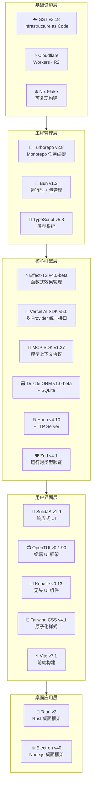
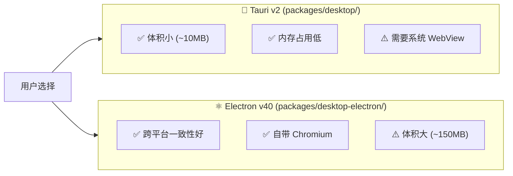

# 技术栈全景与选型理由

> 📌 一句话总结：OpenCode 的技术栈从上到下都围绕两个原则——**开发者体验优先**和**类型安全到底**，每一层选型都有明确的"为什么不用 X"。
> 🗺️ 本节在全景中的位置：前一节列出了 OpenCode 的所有扩展点。本节退后一步，从**技术选型**角度解释整个系统为什么长成这个样子。

---

## 全景图：技术栈分层



---

## 逐层选型分析

### 🥟 Runtime: Bun v1.3.11

**为什么不用 Node.js？**

| 维度 | Bun | Node.js |
|---|---|---|
| 启动速度 | ~50ms | ~200-500ms |
| 包管理 | 内置（极快） | 需要 npm/yarn/pnpm |
| TypeScript | 原生运行 `.ts` | 需要 `tsx` / `ts-node` |
| SQLite | 内置 `bun:sqlite` | 需要 `better-sqlite3` |
| 文件 API | `Bun.file()` / `Bun.write()` | `fs.readFile()` / `fs.writeFile()` |
| 测试 | 内置 `bun test` | 需要 Jest / Vitest |

OpenCode 是一个 CLI 工具——**启动速度至关重要**。Bun 的内置 SQLite 驱动（`bun:sqlite`）消除了原生模块编译问题，`Bun.file()` API 更符合现代 TypeScript 风格。

```toml
# bunfig.toml
[install]
exact = true           # 锁定精确版本

[test]
root = "./do-not-run-tests-from-root"  # 防止从根目录运行测试
```

---

### 📘 Language: TypeScript v5.8.2

**为什么不用 Go / Rust？**

| 维度 | TypeScript | Go | Rust |
|---|---|---|---|
| AI SDK 生态 | ✅ 最丰富 | ⚠️ 有限 | ⚠️ 有限 |
| JSON 处理 | 原生 | 需要 struct tag | 需要 serde |
| Plugin 生态 | NPM (最大) | 需要 CGo 或 gRPC | 需要 FFI |
| 前后端统一 | ✅ SolidJS + 后端 | ❌ 前端另选 | ❌ 前端另选 |
| 类型安全 | ✅ (with Effect + Zod) | ✅ (编译期) | ✅✅ (编译期) |

关键因素是 **AI SDK 生态**——Vercel AI SDK、LangChain、OpenAI SDK 等都以 TypeScript 为第一等公民。选择 TypeScript 意味着可以直接使用 18+ 个 AI Provider 的官方 SDK。

---

### ⚡ Effect Management: Effect-TS v4.0.0-beta.35

**为什么不用普通 async/await？**

```typescript
// 普通 async/await — 错误类型丢失
async function getSession(id: string): Promise<Session> {
  // throw 什么？谁知道呢…
}

// Effect-TS — 错误类型是签名的一部分
function getSession(id: string): Effect<Session, NotFoundError | DatabaseError> {
  // 调用方被强制处理两种错误
}
```

Effect-TS 在 OpenCode 中主要用于：

1. **依赖注入**（Service Layer）——`Bus.Service`、`Database.Service` 等
2. **错误追踪**——`NamedError` 体系让错误类型可追踪
3. **资源管理**——`Effect.acquireRelease` 确保数据库连接、子进程等资源正确释放
4. **PubSub**——`Effect.PubSub` 提供带背压的事件总线

---

### 🤖 AI Integration: Vercel AI SDK v5.0.124

**为什么不用 LangChain？**

| 维度 | Vercel AI SDK | LangChain |
|---|---|---|
| 抽象层级 | 薄——直接映射 API | 厚——Chain/Agent/Memory 抽象 |
| Provider 支持 | 官方维护 18+ Provider | 社区维护，质量不一 |
| 流式支持 | `streamText()` 一等公民 | 需要额外配置 |
| 体积 | 轻量 | 依赖链长 |
| TypeScript | 原生 TS | JS + 类型声明 |

OpenCode 需要**底层控制权**——自己管理 Agent 循环、工具调用、重试逻辑、上下文压缩。LangChain 的高级抽象反而会碍手碍脚。Vercel AI SDK 提供刚好够用的 Provider 统一层，其余由 OpenCode 自己实现。

当前集成的 AI Provider SDK：

```
@ai-sdk/anthropic    @ai-sdk/openai       @ai-sdk/azure
@ai-sdk/google       @ai-sdk/google-vertex @ai-sdk/amazon-bedrock
@ai-sdk/groq         @ai-sdk/mistral      @ai-sdk/xai
@ai-sdk/cohere       @ai-sdk/cerebras     @ai-sdk/deepinfra
@ai-sdk/togetherai   @ai-sdk/perplexity   @ai-sdk/vercel
@ai-sdk/gateway      @openrouter/ai-sdk-provider
gitlab-ai-provider   ai-gateway-provider
```

---

### 🔌 Protocol: MCP SDK v1.27.1

**为什么选 MCP？**

MCP（Model Context Protocol）是 Anthropic 提出的开放协议，已被多个 AI 产品采用（Claude Desktop、Cursor 等）。选择 MCP 意味着：

- 用户已有的 MCP Server 可直接复用
- OpenCode 的工具也可以暴露给其他 MCP 客户端
- 标准化的工具发现、权限协商机制

同时 OpenCode 还集成了 `@agentclientprotocol/sdk v0.14.1`（Agent Client Protocol），为未来的 Agent 间通信做准备。

---

### 💎 TUI Framework: SolidJS v1.9.10 + OpenTUI v0.1.90

**为什么不用 React + Ink？**

| 维度 | SolidJS + OpenTUI | React + Ink |
|---|---|---|
| 响应式模型 | 细粒度 Signal | Virtual DOM + diff |
| 终端渲染 | 直接操作终端 | Yoga 布局引擎 |
| 性能 | O(1) 更新 | O(n) diff |
| 与桌面共享 | ✅ 同一 UI 组件库 | ⚠️ 需要适配 |

SolidJS 的细粒度响应式非常适合终端 UI——当一个 token 到达时，只需更新对应的文本节点，而不是重新 diff 整个组件树。OpenTUI 是 OpenCode 团队自建的终端 UI 框架（`@opentui/core` + `@opentui/solid`），专为这个场景设计。

UI 组件库使用 **Kobalte v0.13.11**（SolidJS 的无头 UI 组件），配合 **Tailwind CSS v4.1** 处理样式。

---

### 🗃️ ORM: Drizzle v1.0.0-beta + SQLite

**为什么不用 PostgreSQL？**

```
OpenCode 是本地 CLI 工具 → 不能要求用户安装 PostgreSQL
                          → SQLite 零配置、单文件、嵌入式
                          → Bun 内置 bun:sqlite 驱动
```

**为什么 Drizzle 不用 Prisma？**

| 维度 | Drizzle | Prisma |
|---|---|---|
| 代码生成 | ❌ 不需要 | ✅ 需要 `prisma generate` |
| 查询风格 | SQL-like（贴近 SQL） | 自定义 API |
| Bundle 大小 | 轻量 | 需要 Prisma Engine |
| TypeScript | Schema as Code | Schema DSL → 生成 |

Drizzle 的"Schema as Code"哲学与项目风格契合——表定义就是 TypeScript 代码，类型推导自动完成，不需要额外的代码生成步骤。

---

### 🔄 Monorepo: Turborepo v2.8.13

**为什么不用 Nx / Lerna？**

| 维度 | Turborepo | Nx | Lerna |
|---|---|---|---|
| 配置复杂度 | 低（单 `turbo.json`） | 高 | 中 |
| 缓存 | ✅ 远程+本地 | ✅ 远程+本地 | ❌ |
| Bun 支持 | ✅ 原生 | ⚠️ 需配置 | ⚠️ 需配置 |
| 学习曲线 | 低 | 高 | 中 |

Turborepo 配置极简，与 Bun workspace 天然集成。`turbo.json` 仅定义任务依赖关系：

```json
{
  "$schema": "https://turbo.build/schema.json",
  "globalEnv": ["CI", "OPENCODE_DISABLE_SHARE"],
  "tasks": {
    "typecheck": {},
    "build": {},
    "opencode#test": {},
    "@opencode-ai/app#test": {}
  }
}
```

---

### 🦀 Desktop: Tauri v2 + Electron v40

**为什么两个都有？**



Tauri 是主力方案（体积小、性能好），Electron 作为兼容性后备——在某些 Linux 发行版上系统 WebView 可能有问题，Electron 自带 Chromium 规避了这个问题。两者共享同一套 SolidJS 前端代码。

---

### ☁️ Infrastructure: SST v3.18.10

**为什么不用 CDK / Terraform？**

SST（Serverless Stack）是专为 TypeScript 全栈应用设计的 IaC 框架：

```typescript
// sst.config.ts
export default $config({
  app(input) {
    return {
      name: "opencode",
      home: "cloudflare",  // 部署目标
      providers: {
        stripe: true,
        planetscale: "0.4.1",
      },
    }
  },
  async run() {
    // TypeScript 编写基础设施
    await import("./infra/app.js")
    await import("./infra/console.js")
    if ($app.stage === "production")
      await import("./infra/enterprise.js")
  },
})
```

- **TypeScript 原生**：与项目技术栈一致，一个语言贯穿前后端和基础设施
- **Cloudflare 优先**：OpenCode 的 Web 服务部署在 Cloudflare Workers
- **开发体验**：`sst dev` 提供实时 Lambda/Worker 调试

---

## 版本总览表

| 层级 | 技术 | 版本 | 用途 |
|---|---|---|---|
| **Runtime** | Bun | 1.3.11 | 运行时 + 包管理 + 测试 |
| **Language** | TypeScript | 5.8.2 | 类型系统 |
| **Effect** | Effect-TS | 4.0.0-beta.35 | 函数式效果管理 |
| **AI SDK** | Vercel AI SDK | 5.0.124 | 多 Provider 统一 |
| **Protocol** | MCP SDK | 1.27.1 | 工具协议 |
| **ORM** | Drizzle ORM | 1.0.0-beta.19 | 数据库访问 |
| **DB** | SQLite | (Bun 内置) | 嵌入式数据库 |
| **HTTP** | Hono | 4.10.7 | Web 框架 |
| **Validation** | Zod | 4.1.8 | 运行时校验 |
| **UI** | SolidJS | 1.9.10 | 响应式 UI |
| **TUI** | OpenTUI | 0.1.90 | 终端 UI |
| **Components** | Kobalte | 0.13.11 | 无头 UI |
| **CSS** | Tailwind CSS | 4.1.11 | 原子化样式 |
| **Build** | Vite | 7.1.4 | 前端构建 |
| **Desktop** | Tauri | v2 | 桌面（主力） |
| **Desktop** | Electron | 40.4.1 | 桌面（兼容） |
| **Monorepo** | Turborepo | 2.8.13 | 任务编排 |
| **IaC** | SST | 3.18.10 | 基础设施 |
| **Website** | Astro | 5.7.13 | 文档站点 |

---

## 关键设计决策

### 1. 为什么大量使用 Beta 版本？

Effect-TS v4.0-beta、Drizzle v1.0-beta——这些库虽然版本号带 beta，但在各自社区已经广泛使用。OpenCode 团队选择"跟进最新"而非"等待稳定"，因为这些 beta 版本的 API 已经足够稳定，且新特性（如 Effect 的改进错误追踪）对项目有实际价值。

### 2. 全栈 TypeScript 的统一性

从 TUI 到 Web 到桌面到基础设施，一个语言覆盖所有层级。这意味着：
- 团队成员无需切换语言上下文
- 类型定义可以跨包共享（`workspace:*`）
- 一套工具链（Bun + Turbo）管理全部代码

### 3. "薄封装"哲学

OpenCode 倾向于选择提供薄封装的库（Vercel AI SDK vs LangChain、Drizzle vs Prisma、Hono vs Express），保留底层控制权。这在 AI 领域尤其重要——Provider API 变化快，薄封装层更容易跟进。

---

## 与下一节的衔接

我们已经从扩展点和技术栈两个角度完成了全景扫描。但如果你只是想快速找到"我想做 X，应该看哪一章"的答案呢？

下一节 [11-速查：我想做X应该看哪章](./11-速查：我想做X应该看哪章.md) 提供一张速查表，覆盖 20+ 种常见场景，直接指向对应章节。
