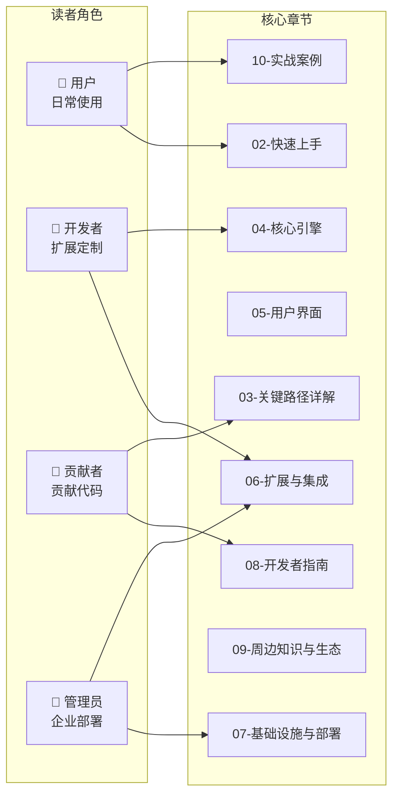

# 速查：我想做X应该看哪章

> 📌 一句话总结：不想从头读？这张表帮你直接跳到需要的章节——覆盖用户、开发者、贡献者、企业管理员四种角色的 20+ 常见场景。
> 🗺️ 本节在全景中的位置：本节是"01-全景视野"的收尾，把前面 10 节的内容浓缩为一张可检索的速查表，作为全书的导航入口。

---

## 全景图：读者角色与章节映射



---

## 速查表

### 👤 用户场景

| 我想要… | 直接去读 | 先了解 |
|---|---|---|
| 安装并跑起来 | 02-快速上手 | — |
| 了解 OpenCode 能做什么 | 01-全景视野/01-一图看懂OpenCode | — |
| 理解一次对话背后发生了什么 | 01-全景视野/04-一次对话的完整旅程 | 01-全景视野/02-核心概念关系图谱 |
| 自定义一个 Agent | 06-扩展与集成（Agent 章节） | 01-全景视野/09-扩展点全景图 |
| 添加自定义命令 | 06-扩展与集成（Command 章节） | 01-全景视野/09-扩展点全景图 |
| 切换 AI 模型 / Provider | 02-快速上手（Provider 配置） | 01-全景视野/10-技术栈全景与选型理由 |
| 配置 MCP Server | 06-扩展与集成（MCP 章节） | 01-全景视野/09-扩展点全景图 |
| 自定义主题 | 06-扩展与集成（Theme 章节） | — |
| 在 VSCode 中使用 | 06-扩展与集成（VSCode 章节） | — |
| 了解权限系统 | 03-关键路径详解（Permission 章节） | 01-全景视野/05-一次Tool调用的完整旅程 |

### 🔧 开发者场景

| 我想要… | 直接去读 | 先了解 |
|---|---|---|
| 写一个自定义 Tool | 06-扩展与集成（Custom Tool 章节） | 01-全景视野/05-一次Tool调用的完整旅程 |
| 开发一个 Plugin | 06-扩展与集成（Plugin 章节） | 01-全景视野/09-扩展点全景图 |
| 理解消息格式和数据流 | 01-全景视野/07-数据流全景图 | 01-全景视野/02-核心概念关系图谱 |
| 理解 Session 状态机 | 01-全景视野/08-状态生命周期全景图 | 01-全景视野/04-一次对话的完整旅程 |
| 对接新的 AI Provider | 04-核心引擎（Provider 章节） | 01-全景视野/10-技术栈全景与选型理由 |
| 理解 Effect-TS 用法 | 09-周边知识与生态（Effect-TS 章节） | 01-全景视野/10-技术栈全景与选型理由 |
| 理解数据库 Schema | 04-核心引擎（Storage 章节） | 01-全景视野/07-数据流全景图 |
| 理解事件总线机制 | 04-核心引擎（Bus 章节） | 01-全景视野/07-数据流全景图 |
| 使用 OpenCode SDK | 06-扩展与集成（SDK 章节） | 01-全景视野/03-Monorepo全景 |

### 🤝 贡献者场景

| 我想要… | 直接去读 | 先了解 |
|---|---|---|
| 搭建本地开发环境 | 08-开发者指南（环境搭建） | 01-全景视野/03-Monorepo全景 |
| 理解 Monorepo 结构 | 01-全景视野/03-Monorepo全景-19个包的关系 | — |
| 运行测试 | 08-开发者指南（测试章节） | 01-全景视野/10-技术栈全景与选型理由 |
| 理解文件编辑的安全机制 | 01-全景视野/06-一次文件编辑的完整旅程 | 01-全景视野/05-一次Tool调用的完整旅程 |
| 理解上下文压缩（Compaction） | 04-核心引擎（Compaction 章节） | 01-全景视野/08-状态生命周期全景图 |
| 给 TUI 加新功能 | 05-用户界面（TUI 章节） | 01-全景视野/10-技术栈全景与选型理由（SolidJS + OpenTUI） |
| 理解 Server API 端点 | 04-核心引擎（Server 章节） | 01-全景视野/07-数据流全景图 |
| 构建桌面应用 | 05-用户界面（Desktop 章节） | 01-全景视野/10-技术栈全景与选型理由（Tauri vs Electron） |

### 🏢 企业管理员场景

| 我想要… | 直接去读 | 先了解 |
|---|---|---|
| 企业级部署 | 07-基础设施与部署 | 01-全景视野/10-技术栈全景与选型理由（SST） |
| 配置全局权限策略 | 06-扩展与集成（Permission 章节） | 01-全景视野/09-扩展点全景图（配置优先级） |
| Managed Config 管控 | 07-基础设施与部署（企业配置） | 01-全景视野/09-扩展点全景图 |
| 理解安全模型 | 03-关键路径详解（安全章节） | 01-全景视野/05-一次Tool调用的完整旅程 |

---

## 按知识域速查

| 知识域 | 入门 | 进阶 | 深入 |
|---|---|---|---|
| **架构总览** | 01-01 一图看懂 | 01-02 概念图谱 | 01-03 Monorepo 全景 |
| **对话流程** | 01-04 对话旅程 | 01-07 数据流全景图 | 04 核心引擎 |
| **工具系统** | 01-05 Tool 调用旅程 | 01-06 文件编辑旅程 | 04 核心引擎（Tool 章节） |
| **状态管理** | 01-08 状态生命周期 | 04 核心引擎（Session） | 04 核心引擎（Processor） |
| **扩展定制** | 01-09 扩展点全景 | 06 扩展与集成 | Plugin 开发实战 |
| **技术选型** | 01-10 技术栈全景 | 09 周边知识 | 各技术官方文档 |
| **UI 开发** | 05 用户界面 | SolidJS + OpenTUI | 05 深入章节 |
| **部署运维** | 07 基础设施 | SST + Cloudflare | 07 企业部署 |

---

## 阅读路径推荐

### 🚀 "我赶时间"（30 分钟）

```
01-01 一图看懂 → 02 快速上手 → 01-09 扩展点全景（按需跳转）
```

### 📖 "我想全面了解"（2-3 小时）

```
01 全景视野全部 11 节 → 02 快速上手 → 感兴趣的章节
```

### 🔬 "我要贡献代码"（1 天）

```
01 全景视野 → 08 开发者指南 → 03 关键路径详解 → 04 核心引擎
```

### 🏗️ "我要基于 OpenCode 做产品"（2-3 天）

```
01 全景视野 → 04 核心引擎 → 06 扩展与集成 → 10 实战案例
```

---

## 关键设计决策

本节作为全书导航，刻意**不引入新概念**，只做索引。设计原则：

1. **按角色分组**——不同读者关心的问题完全不同
2. **"直接去读"+"先了解"双列**——有些章节需要前置知识，明确告知
3. **多维度索引**——按场景、按知识域、按阅读时间三种方式

---

## 与下一章的衔接

"01-全景视野"到此结束。我们已经从一张总图出发，逐步展开了概念关系、包结构、对话旅程、工具调用、文件编辑、数据流、状态机、扩展点、技术栈——最后用这张速查表把所有内容串联起来。

准备好了吗？下一章 [02-快速上手](../02-快速上手/) 将带你从零开始，5 分钟内跑起 OpenCode。
