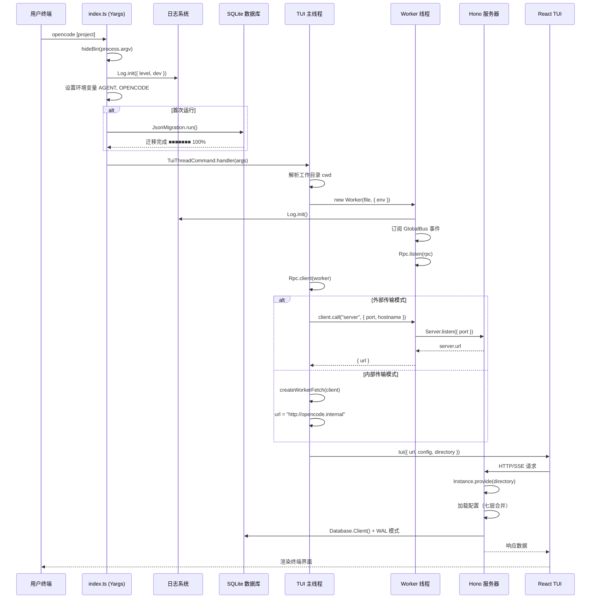

# 第一节 启动流程详解

📍 **你在这里**
> 在第01章全景视野中，我们用一张大图鸟瞰了整个 OpenCode。现在我们沿着 **CLI 入口 → 配置加载 → 数据库迁移 → 服务器启动 → TUI 渲染** 这条线路，深入探索每一步的实现细节。

---

## 学习目标

读完本节，你将能够：

1. 理解从 `opencode` 命令到最终 TUI 界面出现之间发生的**每一步**
2. 掌握 Yargs 命令注册（Command Registration）和中间件（Middleware）机制
3. 了解配置（Config）的**七层加载优先级**
4. 理解 SQLite 数据库迁移（Migration）与 WAL 模式的作用
5. 理解 Worker 线程（Worker Thread）架构及 RPC 通信机制

---

## 一、CLI 入口：一切从这里开始

OpenCode 的所有命令都从一个文件出发：

```typescript
// 文件: packages/opencode/src/index.ts

import yargs from "yargs"
import { hideBin } from "yargs/helpers"

let cli = yargs(hideBin(process.argv))
  .parserConfiguration({ "populate--": true })
  .scriptName("opencode")
  .wrap(100)
  .help("help", "show help")
  .version("version", "show version number", Installation.VERSION)
```

`hideBin(process.argv)` 会去掉前两个参数（`node` 和脚本路径），只保留用户实际输入的部分。`parserConfiguration({ "populate--": true })` 让双破折号后面的参数原样传递——这在转发参数给子进程时非常有用。

### 1.1 全局错误守卫

在任何命令执行前，两个全局错误处理器就已经就位：

```typescript
// 文件: packages/opencode/src/index.ts

process.on("unhandledRejection", (e) => {
  Log.Default.error("rejection", {
    e: e instanceof Error ? e.message : e,
  })
})

process.on("uncaughtException", (e) => {
  Log.Default.error("exception", {
    e: e instanceof Error ? e.message : e,
  })
})
```

这确保了即使在异步操作中出现意外错误，也能被记录而不是默默消失。

### 1.2 日志初始化中间件

Yargs 的 `middleware` 会在**所有命令执行前**运行：

```typescript
// 文件: packages/opencode/src/index.ts

.middleware(async (opts) => {
    await Log.init({
      print: process.argv.includes("--print-logs"),
      dev: Installation.isLocal(),
      level: (() => {
        if (opts.logLevel) return opts.logLevel as Log.Level
        if (Installation.isLocal()) return "DEBUG"
        return "INFO"
      })(),
    })

    process.env.AGENT = "1"
    process.env.OPENCODE = "1"
    process.env.OPENCODE_PID = String(process.pid)

    Log.Default.info("opencode", {
      version: Installation.VERSION,
      args: process.argv.slice(2),
    })
```

注意三个环境变量的设置——`AGENT`、`OPENCODE` 和 `OPENCODE_PID`。其他工具和子进程可以通过这些变量检测自己是否运行在 OpenCode 环境中。

---

## 二、数据库迁移：一次性初始化

紧接着日志初始化，是一段**只执行一次**的数据库迁移逻辑：

```typescript
// 文件: packages/opencode/src/index.ts

const marker = path.join(Global.Path.data, "opencode.db")
if (!(await Filesystem.exists(marker))) {
  process.stderr.write(
    "Performing one time database migration, may take a few minutes..." + EOL,
  )
  // ...带进度条的迁移过程...
  await JsonMigration.run(Database.Client().$client, {
    progress: (event) => {
      const percent = Math.floor((event.current / event.total) * 100)
      // 渲染进度条 ■■■■■■■■■■･････ 45%
    },
  })
  process.stderr.write("Database migration complete." + EOL)
}
```

这段代码检查 `~/.local/share/opencode/opencode.db` 是否存在。如果是首次运行或从旧版本 JSON 存储升级，会将所有 JSON 数据迁移到 SQLite 数据库，并在终端显示一个精美的进度条。

---

## 三、命令注册树

迁移完成后，所有子命令被注册到 Yargs：

```typescript
// 文件: packages/opencode/src/index.ts

.command(AcpCommand)
.command(McpCommand)
.command(TuiThreadCommand)    // ← 默认命令 "$0"
.command(AttachCommand)
.command(RunCommand)
.command(GenerateCommand)
.command(ServeCommand)
.command(ModelsCommand)
// ... 更多命令
```

其中 `TuiThreadCommand` 的命令名是 `$0`——这是 Yargs 的特殊语法，表示**默认命令**。当用户直接运行 `opencode` 而不带任何子命令时，就会执行这个 TUI 命令。

```typescript
// 文件: packages/opencode/src/cli/cmd/tui/thread.ts

export const TuiThreadCommand = cmd({
  command: "$0 [project]",
  describe: "start opencode tui",
  builder: (yargs) => yargs
    .positional("project", { type: "string", describe: "path to start opencode in" })
    .option("model", { type: "string", alias: ["m"], describe: "model to use" })
    .option("continue", { alias: ["c"], describe: "continue last session" })
    .option("session", { alias: ["s"], describe: "session id to continue" })
    .option("prompt", { type: "string", describe: "initial prompt" })
    .option("agent", { type: "string", describe: "agent to use" }),
  handler: async (args) => { /* ... */ },
})
```

---

## 四、TUI 启动：Worker 线程架构

当默认命令被触发后，OpenCode 不会在主线程中运行服务器——它启动一个独立的 **Worker 线程**：

```typescript
// 文件: packages/opencode/src/cli/cmd/tui/thread.ts

handler: async (args) => {
    // 1. Windows 平台特殊处理
    const unguard = win32InstallCtrlCGuard()
    win32DisableProcessedInput()

    // 2. 解析工作目录
    const cwd = Filesystem.resolve(process.cwd())

    // 3. 启动 Worker 线程
    const file = await target()
    const worker = new Worker(file, { env: process.env })

    // 4. 建立 RPC 通信
    const client = Rpc.client<typeof rpc>(worker)
```

### 4.1 为什么使用 Worker 线程？

这种架构有三个关键优势：

| 优势 | 说明 |
|------|------|
| **UI 不阻塞** | 主线程专注于 TUI 渲染，LLM 调用在 Worker 中异步执行 |
| **内存隔离** | Worker 有独立的 V8 堆，大模型响应不影响 UI 内存 |
| **优雅重载** | 可以向 Worker 发送 `reload` 指令而不重启整个进程 |

### 4.2 两种传输模式

OpenCode 支持两种 Transport（传输模式）：

```typescript
// 文件: packages/opencode/src/cli/cmd/tui/thread.ts

const external = process.argv.includes("--port") || network.port !== 0

const transport = external
  ? {
      url: (await client.call("server", network)).url,
      fetch: undefined,
      events: undefined,
    }
  : {
      url: "http://opencode.internal",
      fetch: createWorkerFetch(client),
      events: createEventSource(client),
    }
```

**内部传输（Internal）**：HTTP 请求直接通过 RPC 转发给 Worker 线程内的 Hono 服务器，无需占用真实网络端口。URL 使用虚拟地址 `http://opencode.internal`。

**外部传输（External）**：在指定端口启动真实的 HTTP 服务器。这在 `opencode serve` 命令或远程访问时使用。

### 4.3 Worker 内部初始化

Worker 线程启动后的工作：

```typescript
// 文件: packages/opencode/src/cli/cmd/tui/worker.ts

// 初始化日志
await Log.init({
  print: process.argv.includes("--print-logs"),
  dev: Installation.isLocal(),
  level: Installation.isLocal() ? "DEBUG" : "INFO",
})

// 订阅全局事件并转发
GlobalBus.on("event", (event) => {
  Rpc.emit("global.event", event)
})

// 暴露 RPC 接口
export const rpc = {
  async fetch(input) {
    const response = await Server.Default().fetch(new Request(input.url, { ... }))
    return { status: response.status, headers: ..., body: await response.text() }
  },
  async server(input) {
    server = await Server.listen(input)
    return { url: server.url.toString() }
  },
  async reload() {
    Config.global.reset()
    await Instance.disposeAll()
  },
  async shutdown() {
    if (eventStream.abort) eventStream.abort.abort()
    await Instance.disposeAll()
    if (server) await server.stop(true)
  },
}

Rpc.listen(rpc)
```

---

## 五、Bootstrap 模式：实例生命周期

每当一个命令需要访问项目上下文时，它会通过 `bootstrap()` 函数初始化：

```typescript
// 文件: packages/opencode/src/cli/bootstrap.ts

export async function bootstrap<T>(directory: string, cb: () => Promise<T>) {
  return Instance.provide({
    directory,
    init: InstanceBootstrap,
    fn: async () => {
      try {
        const result = await cb()
        return result
      } finally {
        await Instance.dispose()
      }
    },
  })
}
```

`Instance.provide()` 做了这些事情：

1. 解析目录路径，查找 Git worktree 根目录
2. 加载项目配置（`opencode.json`）
3. 初始化数据库连接
4. 缓存实例——同一目录不会重复初始化
5. 回调执行完毕后，调用 `dispose()` 清理资源

---

## 六、配置加载：七层优先级

配置加载是启动过程中最复杂的部分。OpenCode 使用多层配置合并（Merge），优先级从低到高：

```typescript
// 文件: packages/opencode/src/config/config.ts

export const state = Instance.state(async () => {
    let result = {} as Config

    // 1. 远程配置（Organization 默认）
    for (const [key, value] of Object.entries(auth)) {
      if (value.type === "wellknown") {
        const response = await fetch(`${url}/.well-known/opencode`)
        result = mergeConfigConcatArrays(result, remoteConfig)
      }
    }

    // 2. 全局用户配置 (~/.config/opencode/opencode.json)
    result = mergeConfigConcatArrays(result, await global())

    // 3. 自定义路径 (OPENCODE_CONFIG 环境变量)
    if (Flag.OPENCODE_CONFIG) {
      result = mergeConfigConcatArrays(result, await loadFile(Flag.OPENCODE_CONFIG))
    }

    // 4. 项目配置 (./opencode.json)
    for (const file of await ConfigPaths.projectFiles(...)) {
      result = mergeConfigConcatArrays(result, await loadFile(file))
    }

    // 5. .opencode 目录 (agents/, commands/, plugins/)
    for (const dir of unique(directories)) {
      if (dir.endsWith(".opencode")) {
        result.plugin.push(...(await loadPlugin(dir)))
        result.agent = mergeDeep(result.agent, await loadAgent(dir))
      }
    }

    // 6. 内联配置 (OPENCODE_CONFIG_CONTENT 环境变量)
    if (process.env.OPENCODE_CONFIG_CONTENT) {
      result = mergeConfigConcatArrays(result, await load(...))
    }

    // 7. 企业托管配置（最高优先级）
    if (existsSync(managedDir)) {
      result = mergeConfigConcatArrays(result, await loadFile(...))
    }

    return { config: result, directories, deps }
})
```

```
┌─────────────────────────────────────┐  优先级最高
│  7. 企业托管配置 (Managed Config)    │  ↑
├─────────────────────────────────────┤
│  6. 内联环境变量                      │
├─────────────────────────────────────┤
│  5. .opencode/ 目录                  │
├─────────────────────────────────────┤
│  4. 项目 opencode.json               │
├─────────────────────────────────────┤
│  3. OPENCODE_CONFIG 路径             │
├─────────────────────────────────────┤
│  2. 全局 ~/.config/opencode/         │
├─────────────────────────────────────┤
│  1. 远程 .well-known/opencode        │  ↓
└─────────────────────────────────────┘  优先级最低
```

---

## 七、数据库初始化

OpenCode 使用 **SQLite + Drizzle ORM** 作为存储引擎：

```typescript
// 文件: packages/opencode/src/storage/db.ts

export const Client = lazy(() => {
    const db = init(Path)

    // 性能优化 Pragma
    db.run("PRAGMA journal_mode = WAL")        // 写前日志（并发读写）
    db.run("PRAGMA synchronous = NORMAL")       // 平衡性能与安全
    db.run("PRAGMA busy_timeout = 5000")        // 等待锁 5 秒
    db.run("PRAGMA cache_size = -64000")        // 64MB 缓存
    db.run("PRAGMA foreign_keys = ON")          // 启用外键
    db.run("PRAGMA wal_checkpoint(PASSIVE)")    // 被动检查点

    // 执行数据库迁移
    migrate(db, entries)
    return db
})
```

> 💡 **为什么选择 WAL 模式？** WAL（Write-Ahead Logging）模式允许读操作和写操作同时进行，而不互相阻塞。这对于 TUI 前端实时刷新消息列表非常关键——前端可以在 LLM 写入新 token 的同时读取消息历史。

---

## 八、服务器启动

服务器基于 **Hono 框架** 构建，通过 `Bun.serve()` 启动：

```typescript
// 文件: packages/opencode/src/server/server.ts

export function listen(opts) {
  const app = createApp(opts)

  const tryServe = (port: number) => {
    try {
      return Bun.serve({ ...args, port })
    } catch {
      return undefined
    }
  }

  // 端口分配策略：指定端口 → 4096 → 系统分配
  const server = opts.port === 0
    ? (tryServe(4096) ?? tryServe(0))
    : tryServe(opts.port)
}
```

服务器的中间件栈（Middleware Stack）：

```typescript
// 文件: packages/opencode/src/server/server.ts

const app = new Hono()
  // 1. 错误处理
  .onError((err, c) => {
    if (err instanceof NamedError) {
      let status = 500
      if (err instanceof NotFoundError) status = 404
      return c.json(err.toObject(), { status })
    }
  })
  // 2. 基础认证（可选）
  .use((c, next) => {
    const password = Flag.OPENCODE_SERVER_PASSWORD
    if (!password) return next()
    return basicAuth({ username, password })(c, next)
  })
  // 3. 请求日志
  .use(async (c, next) => {
    const timer = log.time("request", { method: c.req.method, path: c.req.path })
    await next()
    timer.stop()
  })
  // 4. CORS 策略
  .use(cors({ origin(input) { /* localhost 和 opencode.ai 域名 */ } }))
  // 5. 实例上下文注入
  .use(async (c, next) => {
    const directory = c.req.query("directory") || process.cwd()
    return Instance.provide({ directory, init: InstanceBootstrap, fn: () => next() })
  })
  // 6. 路由注册
  .route("/session", SessionRoutes())
  .route("/config", ConfigRoutes())
  .route("/project", ProjectRoutes())
  // ... 更多路由
```

---

## 九、完整启动时序



---

## 十、XDG 目录规范

OpenCode 严格遵循 **XDG Base Directory** 规范来组织文件：

```typescript
// 文件: packages/opencode/src/global/index.ts

export const Path = {
  data:   path.join(xdgData, "opencode"),    // ~/.local/share/opencode
  config: path.join(xdgConfig, "opencode"),  // ~/.config/opencode
  cache:  path.join(xdgCache, "opencode"),   // ~/.cache/opencode
  state:  path.join(xdgState, "opencode"),   // ~/.local/state/opencode
  log:    path.join(data, "log"),             // ~/.local/share/opencode/log
  bin:    path.join(cache, "bin"),            // ~/.cache/opencode/bin
}
```

| 路径 | 用途 | 示例内容 |
|------|------|----------|
| `data/` | 持久数据 | `opencode.db`、会话文件 |
| `config/` | 用户配置 | `opencode.json` |
| `cache/` | 可清除缓存 | 下载的二进制工具 |
| `state/` | 运行时状态 | 锁文件 |
| `log/` | 日志文件 | `opencode.log` |

---

## 动手练习

### 练习 1：追踪启动日志

启用详细日志来观察启动过程：

```bash
opencode --print-logs --log-level DEBUG 2>startup.log
# 在另一个终端查看日志
tail -f startup.log | grep -E "(creating instance|request|migration)"
```

### 练习 2：观察配置合并

在项目根目录创建 `opencode.json`，设置一个自定义选项，然后在 `~/.config/opencode/opencode.json` 设置不同的值，观察最终生效的是哪一个。

### 练习 3：使用外部传输模式

```bash
# 启动带有外部端口的 TUI
opencode --port 4096

# 在另一个终端用 curl 查看 API
curl http://localhost:4096/session?directory=$(pwd) | jq
```

---

## 常见问题

### Q: 为什么 OpenCode 启动时要检查 `opencode.db` 是否存在？

这是一个**一次性迁移守卫**。早期版本使用 JSON 文件存储会话数据，升级后需要将这些数据迁移到 SQLite。通过检查数据库文件是否存在，可以判断是否需要执行迁移。

### Q: Worker 线程崩溃会怎样？

Worker 线程中的 `unhandledRejection` 和 `uncaughtException` 都被捕获并记录日志。如果 Worker 意外终止，主线程的 TUI 也会跟着退出（通过 `finally` 块中的 `stop()`）。

### Q: 内部传输模式中，HTTP 请求真的会走网络吗？

不会。`createWorkerFetch(client)` 创建了一个自定义的 `fetch` 函数，它通过 RPC 直接调用 Worker 线程内的 Hono 服务器的 `fetch` 方法。整个过程在进程内部完成，不涉及 TCP 连接。

### Q: 我能在同一台机器上运行多个 OpenCode 实例吗？

可以。端口分配策略会自动处理冲突——如果 4096 被占用，系统会自动分配一个可用端口。每个实例有独立的 Worker 线程和数据库连接。

---

## 小结

本节我们完整追踪了 OpenCode 的启动流程：

1. **CLI 解析**：Yargs 解析命令行参数，执行日志初始化中间件
2. **数据库迁移**：首次运行时从 JSON 迁移到 SQLite
3. **命令路由**：默认执行 `TuiThreadCommand`（`$0`）
4. **Worker 架构**：主线程负责 TUI 渲染，Worker 线程运行服务器
5. **传输模式**：内部 RPC 传输（默认）或外部 HTTP 传输
6. **配置合并**：七层优先级从远程到企业托管
7. **服务器中间件**：错误处理 → 认证 → 日志 → CORS → 实例注入

> ⏭️ 下一节，我们将深入对话循环——从用户发送消息到 LLM 返回响应的完整路径。
