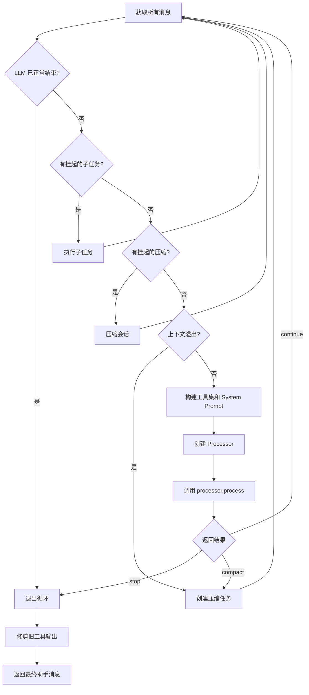
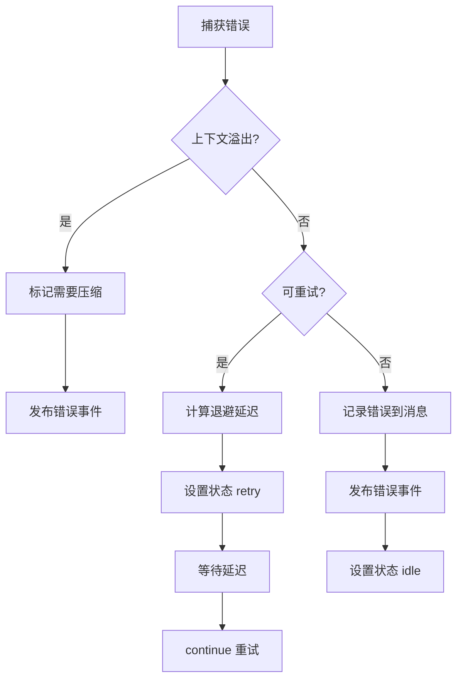
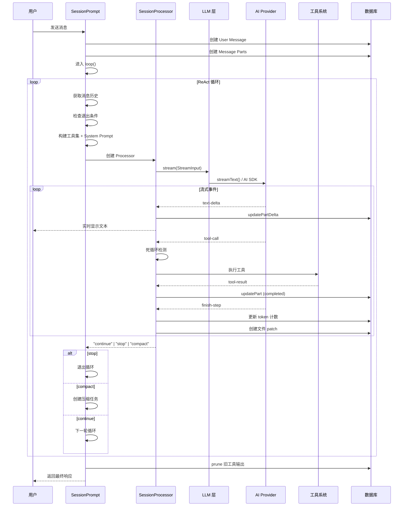
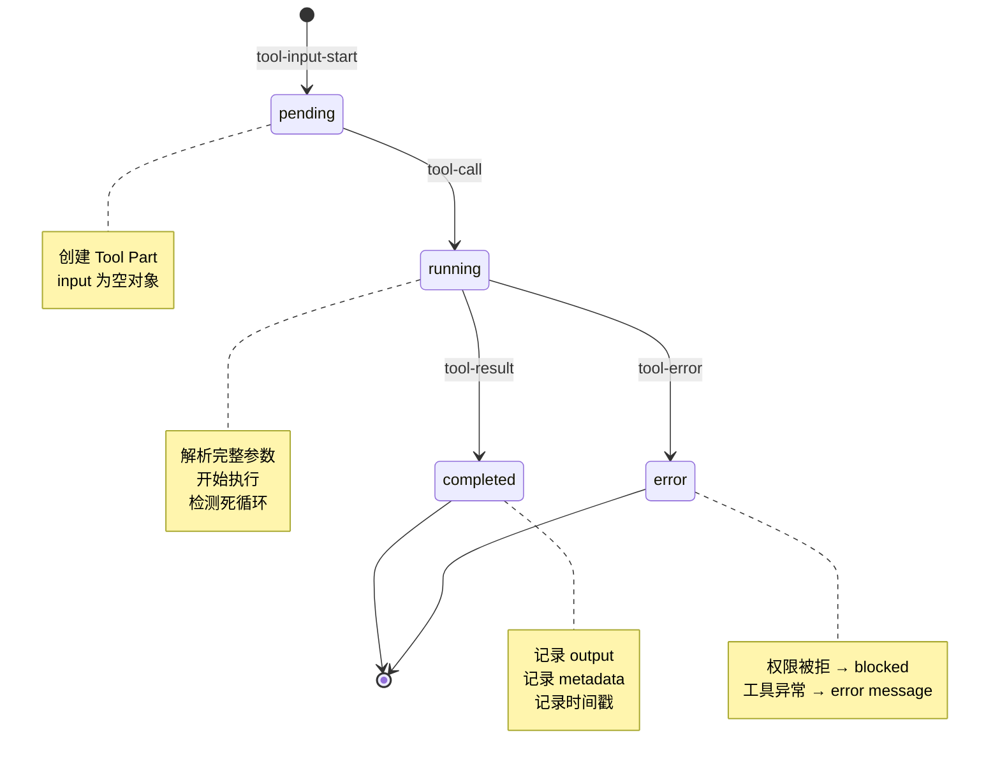

# 第二节 对话循环详解

📍 **你在这里**
> 在第01章全景视野中，我们用一张大图鸟瞰了整个 OpenCode。现在我们沿着 **消息发送 → Prompt 组装 → LLM 流式调用 → Tool 检测与执行 → 结果反馈 → 下一轮调用** 这条线路，深入探索每一步的实现细节。

---

## 学习目标

读完本节，你将能够：

1. 理解 OpenCode 的 **ReAct 循环**（Reasoning + Acting）完整实现
2. 掌握从用户消息到 LLM 响应的**三层架构**：Prompt → Processor → LLM
3. 了解流式事件（Stream Event）的种类和处理方式
4. 理解 Doom Loop（死循环）检测机制
5. 掌握结构化输出（Structured Output）模式的工作原理

---

## 一、概念解释：ReAct 模式

OpenCode 的对话循环基于 **ReAct** 模式——LLM 交替执行"推理"（Reasoning）和"行动"（Acting）：

```
用户提问 → LLM 思考 → 调用工具 → 获得结果 → LLM 再思考 → 调用工具 → ... → 最终回答
```

这不是简单的一问一答，而是一个**多步循环**，LLM 可以在一轮对话中多次调用工具，直到它认为任务完成。

---

## 二、三层架构总览

对话循环由三层组件协作完成：

```
┌──────────────────────────────────────────────┐
│         SessionPrompt（会话提示层）            │
│  创建用户消息 → 管理循环生命周期 → 处理退出条件   │
├──────────────────────────────────────────────┤
│         SessionProcessor（处理器层）            │
│  驱动流式调用 → 处理事件 → 检测死循环 → 错误重试   │
├──────────────────────────────────────────────┤
│                LLM（调用层）                   │
│  组装 System Prompt → 转换消息格式 → 调用 AI SDK │
└──────────────────────────────────────────────┘
```

我们从最上层开始，逐层深入。

---

## 三、SessionPrompt：循环的起点

### 3.1 用户消息创建

当用户在 TUI 中按下回车发送消息时，`SessionPrompt.prompt()` 被调用：

```typescript
// 文件: packages/opencode/src/session/prompt.ts

export const prompt = fn(PromptInput, async (input) => {
  // 创建用户消息
  const msg = await Session.updateMessage({
    id: MessageID.ascending(),
    role: "user",
    sessionID: input.sessionID,
    agent: agent.name,
    model: { providerID: model.providerID, modelID: model.id },
    format: input.format,
    time: { created: Date.now() },
  })

  // 添加消息部件（文本、文件、Agent 引用）
  for (const part of input.parts) {
    await Session.updatePart({
      id: PartID.ascending(),
      messageID: msg.id,
      sessionID: input.sessionID,
      ...part,
    })
  }

  // 启动对话循环
  if (!input.noReply) {
    loop({ sessionID: input.sessionID })
  }
})
```

> 💡 `MessageID.ascending()` 生成**单调递增**的 ID（基于 ULID），保证消息的时间顺序。

### 3.2 主循环 — loop()

`loop()` 是整个对话循环的核心。它是一个 `while(true)` 循环，每一轮都做出"继续"或"停止"的决策：

```typescript
// 文件: packages/opencode/src/session/prompt.ts

export const loop = fn(LoopInput, async (input) => {
  const abort = input.resume_existing
    ? resume(input.sessionID)
    : start(input.sessionID)

  while (true) {
    // 获取所有消息（跳过已压缩的）
    let msgs = await MessageV2.filterCompacted(
      MessageV2.stream(input.sessionID),
    )

    // 找到最后的用户消息和助手消息
    let lastUser: MessageV2.User
    let lastAssistant: MessageV2.Assistant

    // ========== 退出条件检查 ==========
    if (
      lastAssistant.finish &&
      !["tool-calls", "unknown"].includes(lastAssistant.finish) &&
      lastUser.id < lastAssistant.id
    ) {
      break  // LLM 正常结束，退出循环
    }

    // ========== 处理挂起任务 ==========
    if (task?.type === "subtask") {
      // 执行子任务（委派给其他 Agent）
      continue
    }
    if (task?.type === "compaction") {
      // 压缩会话历史
      continue
    }

    // ========== 上下文溢出检查 ==========
    if (await SessionCompaction.isOverflow({ ... })) {
      await SessionCompaction.create({ ... })
      continue
    }

    // ========== 构建工具集 ==========
    const agent = await Agent.get(lastUser.agent)
    const tools = await resolveTools({ ... })

    // ========== 构建 System Prompt ==========
    const system = [
      ...(await SystemPrompt.environment(model)),
      ...(skills ? [skills] : []),
      ...(await InstructionPrompt.system()),
    ]

    // ========== 调用 Processor ==========
    const processor = SessionProcessor.create({
      assistantMessage,
      sessionID: input.sessionID,
      model,
      abort,
    })

    const result = await processor.process({
      user: lastUser,
      agent,
      abort,
      messages: MessageV2.toModelMessages(msgs, model),
      tools,
      system,
    })

    // ========== 处理结果 ==========
    if (result === "stop") break
    if (result === "compact") {
      await SessionCompaction.create({ ... })
    }
    // result === "continue" → 下一轮循环
  }

  // 循环结束后：修剪旧工具输出
  SessionCompaction.prune({ sessionID: input.sessionID })
  return lastAssistantMessage
})
```

### 3.3 循环流程图



---

## 四、SessionProcessor：流式事件处理引擎

### 4.1 创建处理器

```typescript
// 文件: packages/opencode/src/session/processor.ts

export namespace SessionProcessor {
  const DOOM_LOOP_THRESHOLD = 3

  export function create(input: {
    assistantMessage: MessageV2.Assistant
    sessionID: SessionID
    model: Provider.Model
    abort: AbortSignal
  }) {
    const toolcalls: Record<string, MessageV2.ToolPart> = {}
    let snapshot: string | undefined
    let blocked = false
    let attempt = 0
    let needsCompaction = false
    // ...
  }
}
```

`toolcalls` 字典是整个处理器的核心数据结构——它追踪每一个正在执行的工具调用，从 `pending` 到 `running` 到 `completed`/`error`。

### 4.2 process() — 事件驱动的内循环

`process()` 方法驱动了实际的 LLM 调用和响应处理：

```typescript
// 文件: packages/opencode/src/session/processor.ts

async process(streamInput: LLM.StreamInput) {
  const shouldBreak =
    (await Config.get()).experimental?.continue_loop_on_deny !== true

  while (true) {
    try {
      const stream = await LLM.stream(streamInput)

      for await (const value of stream.fullStream) {
        input.abort.throwIfAborted()

        switch (value.type) {
          case "start":
            await SessionStatus.set(input.sessionID, { type: "busy" })
            break

          case "text-start":
            // 创建文本部件
            currentText = {
              id: PartID.ascending(),
              messageID: input.assistantMessage.id,
              sessionID: input.assistantMessage.sessionID,
              type: "text",
              text: "",
              time: { start: Date.now() },
            }
            await Session.updatePart(currentText)
            break

          case "text-delta":
            // 流式追加文本
            currentText.text += value.text
            await Session.updatePartDelta({
              sessionID: currentText.sessionID,
              messageID: currentText.messageID,
              partID: currentText.id,
              field: "text",
              delta: value.text,
            })
            break

          case "tool-call":
            // 工具被调用
            // ...
            break

          case "tool-result":
            // 工具执行完毕
            // ...
            break

          case "finish-step":
            // 一步完成，更新 token 计数
            // ...
            break
        }
      }
    } catch (e) {
      // 错误处理与重试
    }
  }
}
```

### 4.3 流式事件完整清单

LLM 返回的流式事件（Stream Event）包括：

| 事件类型 | 触发时机 | 处理方式 |
|----------|----------|----------|
| `start` | 流开始 | 设置会话状态为 `busy` |
| `reasoning-start` | 开始思考（Claude/o1） | 创建 Reasoning Part |
| `reasoning-delta` | 思考增量 | 追加文本 + 发布 delta |
| `reasoning-end` | 思考结束 | 更新时间戳 |
| `text-start` | 开始输出文本 | 创建 Text Part |
| `text-delta` | 文本增量 | 追加文本 + 发布 delta |
| `text-end` | 文本结束 | 触发 Plugin hook |
| `tool-input-start` | 开始构建工具参数 | 创建 Tool Part (pending) |
| `tool-call` | 工具调用确认 | 更新为 running + 死循环检测 |
| `tool-result` | 工具返回结果 | 更新为 completed |
| `tool-error` | 工具执行出错 | 更新为 error |
| `start-step` | 新步骤开始 | 创建文件快照 |
| `finish-step` | 步骤结束 | 更新 token、创建 patch |
| `error` | 流式错误 | 抛出异常 |

### 4.4 文本流式更新机制

文本更新使用了两层机制——**持久化**和**广播**：

```typescript
// 文件: packages/opencode/src/session/processor.ts

case "text-delta":
  if (currentText) {
    // 1. 内存中追加
    currentText.text += value.text

    // 2. 通过 Bus 广播增量（TUI 实时更新）
    await Session.updatePartDelta({
      sessionID: currentText.sessionID,
      messageID: currentText.messageID,
      partID: currentText.id,
      field: "text",
      delta: value.text,   // 仅发送增量，不是全文
    })
  }
  break

case "text-end":
  if (currentText) {
    currentText.text = currentText.text.trimEnd()
    // 3. 文本完成后，触发插件 hook
    const output = await Plugin.trigger(
      "experimental.text.complete",
      { sessionID, messageID, partID: currentText.id },
      { text: currentText.text },
    )
    currentText.text = output.text
    // 4. 最终持久化到数据库
    await Session.updatePart(currentText)
  }
  break
```

> 💡 `updatePartDelta` 只发布增量文本——这让 TUI 可以高效地逐字符渲染，而不需要每次重新获取全文。

---

## 五、Doom Loop 检测

当 LLM 陷入死循环，反复用相同参数调用同一个工具时，OpenCode 能检测到并中断：

```typescript
// 文件: packages/opencode/src/session/processor.ts

case "tool-call": {
  const match = toolcalls[value.toolCallId]
  if (match) {
    // 更新工具状态为 running
    const part = await Session.updatePart({
      ...match,
      tool: value.toolName,
      state: {
        status: "running",
        input: value.input,
        time: { start: Date.now() },
      },
    })

    // ===== 死循环检测 =====
    const parts = await MessageV2.parts(input.assistantMessage.id)
    const lastThree = parts.slice(-DOOM_LOOP_THRESHOLD)

    if (
      lastThree.length === DOOM_LOOP_THRESHOLD &&
      lastThree.every(
        (p) =>
          p.type === "tool" &&
          p.tool === value.toolName &&
          p.state.status !== "pending" &&
          JSON.stringify(p.state.input) === JSON.stringify(value.input),
      )
    ) {
      // 连续 3 次相同工具+相同参数 → 请求用户许可
      await Permission.ask({
        permission: "doom_loop",
        patterns: [value.toolName],
        sessionID: input.assistantMessage.sessionID,
        metadata: { tool: value.toolName, input: value.input },
        always: [value.toolName],
        ruleset: agent.permission,
      })
    }
  }
  break
}
```

检测算法非常简洁：取最近 3 个工具调用，如果工具名和输入参数完全相同，就触发权限询问。用户可以选择：

- **允许一次**：继续执行，但下次还会问
- **始终允许**：加入白名单
- **拒绝**：中断循环

---

## 六、错误处理与重试

流式调用可能因为多种原因失败。处理器有一套完整的重试机制：

```typescript
// 文件: packages/opencode/src/session/processor.ts

catch (e: any) {
  const error = MessageV2.fromError(e, {
    providerID: input.model.providerID,
    aborted: input.abort.aborted,
  })

  if (MessageV2.ContextOverflowError.isInstance(error)) {
    // 上下文溢出 → 触发压缩
    needsCompaction = true
    Bus.publish(Session.Event.Error, { sessionID: input.sessionID, error })
  } else {
    const retry = SessionRetry.retryable(error)
    if (retry !== undefined) {
      // 可重试错误 → 指数退避
      attempt++
      const delay = SessionRetry.delay(attempt, error)
      await SessionStatus.set(input.sessionID, {
        type: "retry",
        attempt,
        message: retry,
        next: Date.now() + delay,
      })
      await SessionRetry.sleep(delay, input.abort).catch(() => {})
      continue  // 重试
    }
    // 不可重试错误 → 记录并停止
    input.assistantMessage.error = error
    Bus.publish(Session.Event.Error, { ... })
  }
}
```

错误处理流程：



---

## 七、LLM 调用层

### 7.1 StreamInput 结构

```typescript
// 文件: packages/opencode/src/session/llm.ts

export type StreamInput = {
  user: MessageV2.User           // 用户消息
  sessionID: string              // 会话 ID
  model: Provider.Model          // 模型定义
  agent: Agent.Info              // Agent 配置
  permission?: Permission.Ruleset // 权限规则
  system: string[]               // System Prompt 数组
  abort: AbortSignal             // 取消信号
  messages: ModelMessage[]       // 对话历史
  tools: Record<string, Tool>    // 可用工具集
  toolChoice?: "auto" | "required" | "none"
}
```

### 7.2 System Prompt 组装

System Prompt 的构建遵循严格的优先级：

```typescript
// 文件: packages/opencode/src/session/llm.ts

export async function stream(input: StreamInput) {
  // System Prompt 分两部分（用于缓存优化）
  // 第一部分：稳定内容（命中缓存）
  // 第二部分：动态内容（可能变化）

  const system = input.system

  // 插件可以修改 System Prompt
  const transformed = await Plugin.trigger(
    "experimental.chat.system.transform",
    { sessionID: input.sessionID },
    { system },
  )
```

### 7.3 消息历史转换

不同 Provider（提供商）对消息格式有不同要求：

```typescript
// 文件: packages/opencode/src/session/llm.ts

// OAuth 模型：system 放在 instructions 字段
// 普通模型：system 作为消息历史的第一条
if (isOAuthModel) {
  messages = input.messages  // system 在别处传入
} else {
  messages = [
    { role: "system", content: systemPrompt },
    ...input.messages,
  ]
}
```

### 7.4 工具准备

```typescript
// 文件: packages/opencode/src/session/llm.ts

// 过滤被禁用的工具
const filtered = Object.fromEntries(
  Object.entries(input.tools).filter(([id]) => {
    // 检查权限规则
    return evaluate(id, "*", input.permission).action !== "deny"
  }),
)

// 为 LiteLLM 兼容性添加空操作工具
if (needsNoop) {
  filtered["_noop"] = tool({ /* 什么都不做的工具 */ })
}
```

> 💡 `_noop` 工具是一个兼容性 hack——某些 LLM 代理（如 LiteLLM）在工具列表为空时会报错，所以加一个空操作工具。

---

## 八、完整的 ReAct 循环时序



---

## 九、工具调用的状态机

每个工具调用都经历一个明确的状态机转换：



对应的数据结构：

```typescript
// 文件: packages/opencode/src/session/message-v2.ts

// Pending 状态
{ status: "pending", input: {}, raw: "" }

// Running 状态
{ status: "running", input: { command: "ls -la" }, time: { start: 1234567890 } }

// Completed 状态
{
  status: "completed",
  input: { command: "ls -la" },
  output: "total 42\ndrwxr-xr-x ...",
  title: "Listed directory contents",
  metadata: { exitCode: 0 },
  time: { start: 1234567890, end: 1234567900 },
}

// Error 状态
{
  status: "error",
  input: { command: "rm -rf /" },
  error: "Permission denied",
  time: { start: 1234567890, end: 1234567895 },
}
```

---

## 十、结构化输出模式

当用户需要 JSON 格式的输出时，OpenCode 会注入一个特殊的 `StructuredOutput` 工具：

```typescript
// 文件: packages/opencode/src/session/prompt.ts

if (lastUser.format?.type === "json_schema") {
  tools["StructuredOutput"] = createStructuredOutputTool({
    schema: lastUser.format.schema,
    onOutput: (output) => {
      structuredOutput = output
    },
  })
}
```

当 LLM 调用 `StructuredOutput` 工具并传入有效 JSON 时，循环立即停止并返回结构化数据。这是一种巧妙的设计——不修改 LLM 的行为，而是通过工具机制"截获"输出。

---

## 十一、步骤快照与文件 Patch

每一步（Step）开始和结束时，OpenCode 会创建文件系统快照：

```typescript
// 文件: packages/opencode/src/session/processor.ts

case "start-step":
  snapshot = await Snapshot.track()
  await Session.updatePart({
    id: PartID.ascending(),
    messageID: input.assistantMessage.id,
    sessionID: input.sessionID,
    snapshot,
    type: "step-start",
  })
  break

case "finish-step":
  // ...更新 token 和 cost...
  if (snapshot) {
    const patch = await Snapshot.patch(snapshot)
    if (patch.files.length) {
      await Session.updatePart({
        id: PartID.ascending(),
        messageID: input.assistantMessage.id,
        sessionID: input.sessionID,
        type: "patch",
        hash: patch.hash,
        files: patch.files,
      })
    }
    snapshot = undefined
  }
  // 在步骤结束后触发摘要生成
  SessionSummary.summarize({
    sessionID: input.sessionID,
    messageID: input.assistantMessage.parentID,
  })
  break
```

这使得 OpenCode 能够精确追踪每一步修改了哪些文件，并在需要时回滚到之前的状态。

---

## 动手练习

### 练习 1：观察 ReAct 循环

在 TUI 中向 OpenCode 发送一个需要多步工具调用的请求，例如：

```
请阅读 src/index.ts 文件，然后在其中添加一个注释
```

观察日志中的 `tool-call` → `tool-result` 循环。

### 练习 2：触发死循环检测

尝试构造一个让 LLM 反复执行相同操作的提示，观察 Doom Loop 检测是否触发权限询问。

### 练习 3：追踪流式事件

启用 DEBUG 日志后，观察一次完整对话产生的事件序列：

```bash
opencode --print-logs --log-level DEBUG 2>events.log
# 发送一条消息后查看
grep "process" events.log
```

---

## 常见问题

### Q: `process()` 返回 "continue" 和 "stop" 的区别是什么？

`"continue"` 表示 LLM 执行了工具调用后还需要继续处理（`finishReason` 是 `"tool-calls"`）。`"stop"` 表示 LLM 认为任务已完成，或者发生了不可恢复的错误。`"compact"` 表示上下文溢出，需要先压缩才能继续。

### Q: 为什么要用 `Bus.publish` 广播 delta 而不是直接写入数据库？

性能考虑。LLM 每秒可能产生数十个 `text-delta` 事件，如果每个都写入 SQLite 会造成 I/O 瓶颈。通过 Bus 广播（内存中的发布/订阅），TUI 可以即时收到更新。最终的完整文本在 `text-end` 时才写入数据库。

### Q: 如果 LLM 提供商的 API 临时不可用怎么办？

`SessionRetry` 模块会计算指数退避（Exponential Backoff）延迟。第一次重试等待几秒，随后每次翻倍。同时会在 TUI 中显示重试状态和下次重试时间，用户可以选择等待或取消。

### Q: 一轮对话循环最多能调用多少次工具？

没有硬编码的限制。循环会持续到 LLM 自己决定停止，或者上下文窗口溢出触发压缩。不过，Doom Loop 检测会在连续 3 次相同调用时介入。

---

## 小结

本节我们完整追踪了对话循环的每一个环节：

1. **用户消息创建**：`SessionPrompt.prompt()` 创建 User Message 和 Parts
2. **主循环管理**：`loop()` 持续驱动，检查退出条件、处理子任务和压缩
3. **流式处理**：`SessionProcessor.process()` 消费 LLM 流式事件
4. **事件类型**：从 `text-delta` 到 `tool-call`，11 种事件各司其职
5. **安全机制**：Doom Loop 检测防止 LLM 陷入死循环
6. **错误恢复**：上下文溢出触发压缩，API 错误触发指数退避重试
7. **快照系统**：每步开始/结束时创建快照，精确追踪文件变更

> ⏭️ 下一节，我们将深入 Tool 执行系统——了解 Bash、Edit、Read 等工具的具体实现。
