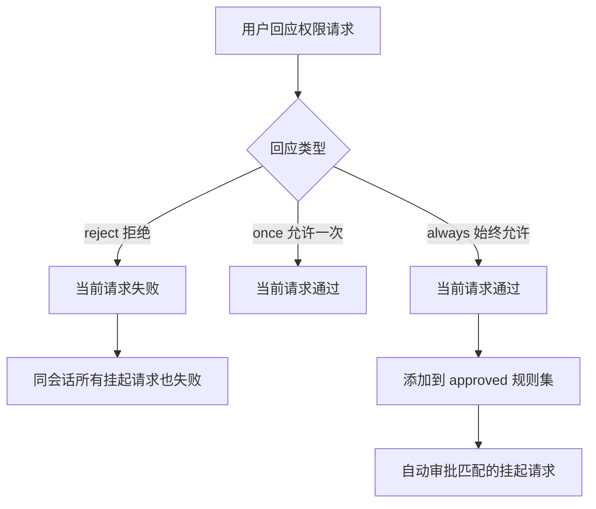
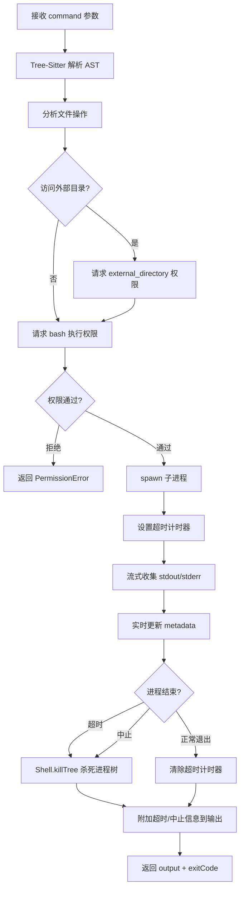
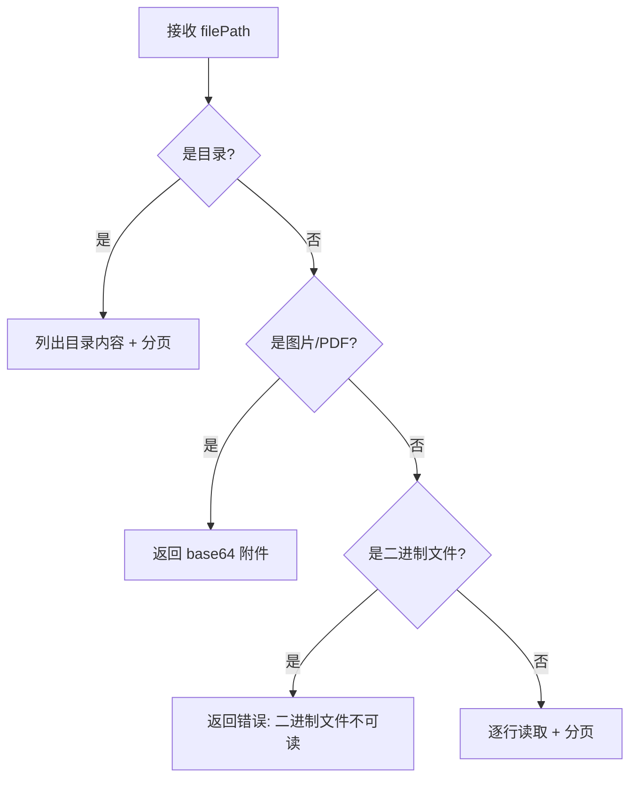
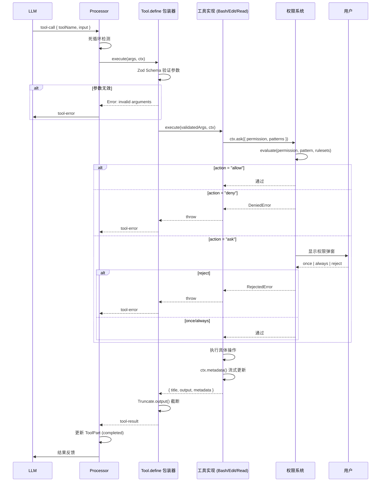

# 第三节 Tool 执行详解

📍 **你在这里**
> 在第01章全景视野中，我们用一张大图鸟瞰了整个 OpenCode。现在我们沿着 **Tool 注册 → 初始化 → 选择 → 权限检查 → 执行 → 结果格式化** 这条线路，深入探索每一步的实现细节。

---

## 学习目标

读完本节，你将能够：

1. 理解 Tool 的**定义、注册和初始化**三阶段生命周期
2. 掌握权限系统（Permission System）的**规则评估算法**
3. 深入了解 **Bash Tool** 的 AST 分析和安全沙箱机制
4. 理解 **Edit Tool** 的 9 种替换策略（Replacement Strategy）
5. 了解 **Read Tool** 的文件类型检测和分页机制

---

## 一、概念解释：Tool 是什么？

在 OpenCode 中，Tool 是 LLM 与现实世界交互的**唯一通道**。LLM 本身不能读文件、不能执行命令——它只能请求调用一个 Tool，并等待结果。

```
LLM: "我想读取 src/index.ts 的内容"
  → 调用 ReadTool({ filePath: "src/index.ts" })
  → OpenCode 执行读取，检查权限
  → 返回文件内容给 LLM
```

每个 Tool 都有严格的 **Zod Schema** 定义输入参数，并经过**权限检查**才能执行。

---

## 二、Tool 定义：`Tool.define()`

### 2.1 核心接口

```typescript
// 文件: packages/opencode/src/tool/tool.ts

export namespace Tool {
  export type Context<M extends Metadata = Metadata> = {
    sessionID: SessionID
    messageID: MessageID
    agent: string
    abort: AbortSignal
    callID?: string
    messages: MessageV2.WithParts[]
    metadata(input: { title?: string; metadata?: M }): void
    ask(input: Omit<Permission.Request, "id" | "sessionID" | "tool">): Promise<void>
  }

  export interface Info<Parameters extends z.ZodType, M extends Metadata> {
    id: string
    init: (ctx?: InitContext) => Promise<{
      description: string
      parameters: Parameters
      execute(
        args: z.infer<Parameters>,
        ctx: Context,
      ): Promise<{
        title: string
        metadata: M
        output: string
        attachments?: Omit<MessageV2.FilePart, "id" | "sessionID" | "messageID">[]
      }>
      formatValidationError?(error: z.ZodError): string
    }>
  }
}
```

关键设计点：

| 字段 | 作用 |
|------|------|
| `init()` | 惰性初始化——只在需要时加载描述和参数 Schema |
| `ctx.metadata()` | 流式更新元数据——工具运行中就能在 TUI 显示进度 |
| `ctx.ask()` | 权限请求——向用户申请执行许可 |
| `attachments` | 文件附件——如图片、PDF 的 base64 内容 |

### 2.2 `define()` 的包装逻辑

`Tool.define()` 不只是创建工具——它还包装了**参数验证**和**输出截断**：

```typescript
// 文件: packages/opencode/src/tool/tool.ts

export function define<Parameters extends z.ZodType, Result extends Metadata>(
  id: string,
  init: Info<Parameters, Result>["init"] | Awaited<ReturnType<Info<Parameters, Result>["init"]>>,
): Info<Parameters, Result> {
  return {
    id,
    init: async (initCtx) => {
      const toolInfo = init instanceof Function ? await init(initCtx) : init
      const execute = toolInfo.execute

      toolInfo.execute = async (args, ctx) => {
        // 1. 参数验证（Zod Schema）
        try {
          toolInfo.parameters.parse(args)
        } catch (error) {
          if (error instanceof z.ZodError && toolInfo.formatValidationError) {
            throw new Error(toolInfo.formatValidationError(error), { cause: error })
          }
          throw new Error(
            `The ${id} tool was called with invalid arguments: ${error}.` +
            `\nPlease rewrite the input so it satisfies the expected schema.`,
            { cause: error },
          )
        }

        // 2. 执行工具
        const result = await execute(args, ctx)

        // 3. 输出截断（除非工具已自行处理）
        if (result.metadata.truncated !== undefined) {
          return result
        }
        const truncated = await Truncate.output(result.output, {}, initCtx?.agent)
        return {
          ...result,
          output: truncated.content,
          metadata: {
            ...result.metadata,
            truncated: truncated.truncated,
            outputPath: truncated.truncated ? truncated.outputPath : undefined,
          },
        }
      }
      return toolInfo
    },
  }
}
```

> 💡 如果工具的返回值中 `metadata.truncated` 已经有值（如 Bash Tool 自行截断了输出），`define()` 就不会再次截断。这避免了双重截断的问题。

---

## 三、Tool 注册：Registry

### 3.1 内置工具列表

```typescript
// 文件: packages/opencode/src/tool/registry.ts

const BUILTIN_TOOLS = [
  InvalidTool,      // 无效工具调用的 fallback
  QuestionTool,     // 向用户提问
  BashTool,         // 执行 Shell 命令
  ReadTool,         // 读取文件/目录
  GlobTool,         // 文件模式匹配
  GrepTool,         // 内容搜索
  EditTool,         // 编辑文件
  WriteTool,        // 创建新文件
  TaskTool,         // 委派子任务
  WebFetchTool,     // 获取网页内容
  TodoWriteTool,    // 管理待办事项
  WebSearchTool,    // 网络搜索
  CodeSearchTool,   // 代码语义搜索
  SkillTool,        // 自定义技能
  ApplyPatchTool,   // 应用 Git Patch
  LspTool,          // LSP 诊断（实验性）
  BatchTool,        // 批量工具调用（实验性）
  PlanExitTool,     // Plan 模式退出（实验性）
]
```

### 3.2 基于模型的工具过滤

不同模型会看到不同的工具集：

```typescript
// 文件: packages/opencode/src/tool/registry.ts

// GPT 模型使用 ApplyPatchTool 代替 EditTool/WriteTool
if (isGptModel) {
  tools = tools.filter(t => t.id !== "edit" && t.id !== "write")
} else {
  tools = tools.filter(t => t.id !== "apply_patch")
}

// WebSearch/CodeSearch 仅在特定条件下启用
if (!isOpenCodeProvider && !Flag.OPENCODE_ENABLE_EXA) {
  tools = tools.filter(t => !["websearch", "codesearch"].includes(t.id))
}
```

### 3.3 插件工具加载

```typescript
// 文件: packages/opencode/src/tool/registry.ts

function fromPlugin(id: string, def: ToolDefinition): Tool.Info {
  return {
    id,
    init: async (initCtx) => ({
      parameters: z.object(def.args),
      description: def.description,
      execute: async (args, toolCtx) => {
        const result = await def.execute(args, pluginCtx)
        const out = await Truncate.output(result, {}, initCtx?.agent)
        return {
          title: "",
          output: out.truncated ? out.content : result,
          metadata: {
            truncated: out.truncated,
            outputPath: out.truncated ? out.outputPath : undefined,
          },
        }
      },
    }),
  }
}
```

---

## 四、权限系统

### 4.1 权限评估算法

权限评估的核心在一个仅有 15 行的文件中：

```typescript
// 文件: packages/opencode/src/permission/evaluate.ts

import { Wildcard } from "@/util/wildcard"

type Rule = {
  permission: string
  pattern: string
  action: "allow" | "deny" | "ask"
}

export function evaluate(
  permission: string,
  pattern: string,
  ...rulesets: Rule[][],
): Rule {
  const rules = rulesets.flat()
  const match = rules.findLast(
    (rule) =>
      Wildcard.match(permission, rule.permission) &&
      Wildcard.match(pattern, rule.pattern),
  )
  return match ?? { action: "ask", permission, pattern: "*" }
}
```

算法非常简洁：

1. 将所有规则集扁平化为一个数组
2. **从后向前查找**第一个匹配的规则（最后添加的规则优先级最高）
3. 使用通配符匹配 `permission` 和 `pattern`
4. 没有匹配规则时，默认 `"ask"`（询问用户）

### 4.2 权限请求流程

当工具需要执行敏感操作时：

```typescript
// 简化的权限请求流程

// 1. 工具调用 ctx.ask()
await ctx.ask({
  permission: "edit",
  patterns: ["src/index.ts"],
  always: ["*"],
  metadata: { filepath, diff },
})

// 2. 评估规则
for (const pattern of request.patterns) {
  const rule = evaluate(request.permission, pattern, ruleset, approved)
  if (rule.action === "deny") throw new DeniedError()
  if (rule.action === "allow") continue
  needsAsk = true
}

// 3. 如果需要询问，创建 Deferred 并等待
if (needsAsk) {
  const deferred = Deferred.make()
  pending.set(id, { info, deferred })
  Bus.publish(Event.Asked, info)  // 通知 TUI 显示权限弹窗
  return await deferred           // 阻塞直到用户响应
}
```

### 4.3 权限级联效应

当用户对一个权限做出回应时，会触发级联效应：



这个设计非常巧妙——当用户选择"始终允许编辑 `*`"时，队列中等待的其他编辑请求也会自动通过，无需逐个确认。

---

## 五、Bash Tool 详解

Bash Tool 是最复杂的内置工具，它使用 **Tree-Sitter** 解析 Shell 语法来进行安全分析。

### 5.1 参数定义

```typescript
// 文件: packages/opencode/src/tool/bash.ts

parameters: z.object({
  command: z.string().describe("The command to execute"),
  timeout: z.number().optional().describe("Timeout in milliseconds"),
  workdir: z.string().optional().describe("Working directory"),
  description: z.string().describe("Description of what command does"),
})
```

### 5.2 命令 AST 分析

Bash Tool 不会盲目执行命令——它先用 Tree-Sitter 解析命令的 AST（抽象语法树）来识别潜在的安全问题：

```typescript
// 文件: packages/opencode/src/tool/bash.ts

// 1. 解析命令语法
const ast = parseBashCommand(params.command)

// 2. 分析文件操作
// 识别: cd, rm, cp, mv, mkdir, touch, chmod, chown, cat 等
const ops = analyzeFileOperations(ast)

// 3. 检测外部目录访问
for (const op of ops) {
  if (!Instance.containsPath(op.path)) {
    await ctx.ask({
      permission: "external_directory",
      patterns: [op.path + "/*"],
      always: [op.path + "/*"],
      metadata: {},
    })
  }
}

// 4. 请求 Bash 执行权限
await ctx.ask({
  permission: "bash",
  patterns: [fullCommandText],
  always: [BashArity.prefix(command).join(" ") + " *"],
  metadata: {},
})
```

> 💡 `BashArity.prefix()` 提取命令的前缀部分用于"始终允许"规则。例如 `git commit -m "fix"` 的前缀是 `git commit`，这样用户选择"始终允许"时，所有 `git commit *` 命令都会被自动批准。

### 5.3 进程生成与管理

```typescript
// 文件: packages/opencode/src/tool/bash.ts

const proc = spawn(params.command, {
  shell: Shell.acceptable(),  // sh (Unix) 或 cmd.exe (Windows)
  cwd: params.workdir || Instance.directory,
  env: { ...process.env, ...shellEnv },
  stdio: ["ignore", "pipe", "pipe"],
  detached: process.platform !== "win32",
})
```

### 5.4 超时与中止处理

```typescript
// 文件: packages/opencode/src/tool/bash.ts

// 默认超时 2 分钟
const timeout = params.timeout ?? DEFAULT_TIMEOUT_MS

// 超时处理
const timeoutHandler = setTimeout(() => {
  Shell.killTree(proc.pid)  // 杀死整个进程树
}, timeout)

// 中止信号处理
ctx.abort.addEventListener("abort", () => {
  Shell.killTree(proc.pid)
})
```

### 5.5 输出流处理

```typescript
// 文件: packages/opencode/src/tool/bash.ts

// stdout 和 stderr 交织收集
let output = ""
const MAX_METADATA = 30 * 1024  // 30KB 元数据截断

proc.stdout.on("data", (data) => {
  output += data.toString()
  // 流式更新元数据（TUI 实时显示输出）
  ctx.metadata({
    title: params.description,
    metadata: {
      output: output.slice(-MAX_METADATA),
      exitCode: undefined,
    },
  })
})

proc.stderr.on("data", (data) => {
  output += data.toString()
  ctx.metadata({ ... })
})
```

### 5.6 完整执行流程



---

## 六、Edit Tool 详解

Edit Tool 采用了一种极其健壮的**多策略替换引擎**来处理 LLM 输出中可能存在的格式差异。

### 6.1 参数定义

```typescript
// 文件: packages/opencode/src/tool/edit.ts

parameters: z.object({
  filePath: z.string().describe("Absolute path to file"),
  oldString: z.string().describe("Text to replace"),
  newString: z.string().describe("Replacement text"),
  replaceAll: z.boolean().optional().describe("Replace all occurrences"),
})
```

### 6.2 九种替换策略

当 LLM 生成的 `oldString` 与文件中的实际内容存在细微差异时（缩进不同、空白字符差异等），Edit Tool 会依次尝试 9 种策略：

| 顺序 | 策略名 | 匹配方式 |
|------|--------|----------|
| 1 | **SimpleReplacer** | 精确字符串匹配 |
| 2 | **LineTrimmedReplacer** | 每行去除首尾空白后匹配 |
| 3 | **BlockAnchorReplacer** | 用首行和末行作为锚点，Levenshtein 距离模糊匹配 |
| 4 | **WhitespaceNormalizedReplacer** | 将所有连续空白规范化为单个空格 |
| 5 | **IndentationFlexibleReplacer** | 忽略缩进差异 |
| 6 | **EscapeNormalizedReplacer** | 处理转义序列差异（`\n` vs 实际换行） |
| 7 | **MultiOccurrenceReplacer** | 查找所有匹配（用于 `replaceAll`） |
| 8 | **TrimmedBoundaryReplacer** | 首尾内容被截断时的匹配 |
| 9 | **ContextAwareReplacer** | 使用上下文锚点和相似度检查 |

### 6.3 执行流程

```typescript
// 文件: packages/opencode/src/tool/edit.ts（简化）

async execute(args, ctx) {
  // 1. 权限检查——展示 diff 给用户
  const diff = createTwoFilesPatch(args.filePath, args.filePath, args.oldString, args.newString)
  await ctx.ask({
    permission: "edit",
    patterns: [path.relative(Instance.worktree, args.filePath)],
    always: ["*"],
    metadata: { filepath: args.filePath, diff },
  })

  // 2. 读取文件内容
  const content = await Bun.file(args.filePath).text()

  // 3. 检测行尾风格
  const lineEnding = detectLineEnding(content)

  // 4. 依次尝试替换策略
  let result: string | undefined
  for (const strategy of strategies) {
    result = strategy.replace(content, args.oldString, args.newString)
    if (result !== undefined) break
  }

  if (result === undefined) {
    throw new Error("oldString not found in file")
  }

  // 5. 写入文件
  await Bun.write(args.filePath, result)

  // 6. 自动格式化
  await Format.run(args.filePath)

  // 7. LSP 诊断
  const diagnostics = await LSP.diagnostics(args.filePath)
  if (diagnostics.length > 0) {
    output += formatDiagnostics(diagnostics)
  }

  return { title: "Edit applied", output, metadata: {} }
}
```

### 6.4 LSP 集成

编辑完成后，Edit Tool 会自动运行 LSP 诊断并报告错误：

```
Edit applied successfully.

LSP errors detected in this file, please fix:
<diagnostics file="/home/user/project/src/index.ts">
Error at line 42: Property 'foo' does not exist on type 'Bar'.
Error at line 58: Expected 2 arguments, but got 1.
</diagnostics>
```

这让 LLM 能够**立即发现并修复**编辑引入的类型错误或语法错误。

---

## 七、Read Tool 详解

### 7.1 参数定义

```typescript
// 文件: packages/opencode/src/tool/read.ts

parameters: z.object({
  filePath: z.string().describe("Absolute path to file or directory"),
  offset: z.coerce.number().optional().describe("Line number to start (1-indexed)"),
  limit: z.coerce.number().optional().describe("Max lines to read (default 2000)"),
})
```

### 7.2 文件类型检测

Read Tool 能智能处理不同类型的文件：



### 7.3 文本文件读取

```typescript
// 文件: packages/opencode/src/tool/read.ts（简化）

// 读取限制
const DEFAULT_LIMIT = 2000      // 默认行数
const MAX_LINE_LENGTH = 2000    // 最大行长
const MAX_OUTPUT = 50 * 1024    // 50KB 最大输出

// 逐行读取
const lines: string[] = []
let lineNum = 0

for await (const line of readline.createInterface({ input: stream })) {
  lineNum++
  if (lineNum < offset) continue
  if (lines.length >= limit) break

  // 截断超长行
  const display = line.length > MAX_LINE_LENGTH
    ? line.slice(0, MAX_LINE_LENGTH) + "... (truncated)"
    : line

  lines.push(`${lineNum}: ${display}`)
}
```

### 7.4 输出格式

```xml
<path>/home/user/project/src/index.ts</path>
<type>file</type>
<content>
1: import { createApp } from "./app"
2: import { Config } from "./config"
3:
4: const app = createApp()
5: app.listen(3000)
...
(Showing lines 1-2000 of 3456. Use offset=2001 to continue.)
</content>
```

### 7.5 二进制检测

```typescript
// 文件: packages/opencode/src/tool/read.ts

// 检查前 8KB 内容中非打印字符的比例
// 超过 30% 判定为二进制文件
const sample = await file.slice(0, 8192).arrayBuffer()
const bytes = new Uint8Array(sample)
let nonPrintable = 0
for (const byte of bytes) {
  if (byte < 32 && byte !== 9 && byte !== 10 && byte !== 13) {
    nonPrintable++
  }
}
const isBinary = nonPrintable / bytes.length > 0.3
```

---

## 八、权限检查的实际场景

### 8.1 不同工具的权限类型

| 工具 | 权限类型 | 模式示例 |
|------|---------|---------|
| Bash | `bash` | `git commit *`, `npm install *` |
| Bash | `external_directory` | `/etc/*`, `~/../other-project/*` |
| Edit | `edit` | `src/index.ts`, `*.config.js` |
| Read | `read` | `src/index.ts`, `*` |
| Write | `write` | `src/new-file.ts` |

### 8.2 规则匹配示例

假设有以下规则：

```json
[
  { "permission": "read", "pattern": "*", "action": "allow" },
  { "permission": "edit", "pattern": "src/*", "action": "allow" },
  { "permission": "edit", "pattern": "*.lock", "action": "deny" },
  { "permission": "bash", "pattern": "git *", "action": "allow" }
]
```

评估结果：

| 请求 | 匹配规则 | 结果 |
|------|---------|------|
| `read`, `src/index.ts` | `read` + `*` → allow | ✅ 通过 |
| `edit`, `src/app.ts` | `edit` + `src/*` → allow | ✅ 通过 |
| `edit`, `package-lock.json` | `edit` + `*.lock` → deny | ❌ 拒绝 |
| `bash`, `git status` | `bash` + `git *` → allow | ✅ 通过 |
| `bash`, `rm -rf /` | 无匹配 → ask | ❓ 询问 |

---

## 九、完整的 Tool 执行时序



---

## 十、其他内置工具简介

### 10.1 GlobTool — 文件模式匹配

```typescript
// 参数: { pattern: "**/*.ts", path?: "/project/src" }
// 输出: 匹配的文件路径列表
```

### 10.2 GrepTool — 内容搜索

```typescript
// 参数: { pattern: "TODO|FIXME", path?: "src/", include?: "*.ts" }
// 输出: 匹配行及上下文
```

### 10.3 WriteTool — 创建新文件

```typescript
// 参数: { filePath: "/abs/path/new.ts", content: "..." }
// 需要 "write" 权限
// 文件已存在时报错
```

### 10.4 TaskTool — 子任务委派

```typescript
// 参数: { agent: "explore", prompt: "分析这段代码的复杂度" }
// 创建子会话，委派给指定 Agent
// 结果汇总后返回给主会话
```

### 10.5 ApplyPatchTool — Git Patch

```typescript
// 参数: { patch: "--- a/file\n+++ b/file\n@@ ..." }
// GPT 模型专用——替代 Edit/Write
// 支持标准 unified diff 格式
```

---

## 动手练习

### 练习 1：观察权限规则

在 `opencode.json` 中配置权限规则，然后观察不同操作的权限行为：

```jsonc
{
  "permission": [
    { "permission": "read", "pattern": "*", "action": "allow" },
    { "permission": "edit", "pattern": "*.test.ts", "action": "deny" }
  ]
}
```

### 练习 2：追踪 Tool 执行

用 DEBUG 日志观察一次 Edit Tool 的执行过程：

```bash
opencode --print-logs --log-level DEBUG 2>tool.log
# 发送编辑请求后查看
grep -E "(tool-call|permission|edit)" tool.log
```

### 练习 3：创建自定义 Tool

在 `.opencode/tools/` 目录下创建一个简单的自定义工具：

```typescript
// .opencode/tools/hello.ts
export default {
  description: "Say hello",
  args: { name: z.string() },
  async execute({ name }) {
    return `Hello, ${name}!`
  },
}
```

---

## 常见问题

### Q: 为什么 Edit Tool 需要 9 种替换策略？

因为 LLM 生成的代码片段经常与实际文件有细微差异——缩进用了 tab 而不是空格、多了一个空行、转义字符不同等。9 种策略从精确到模糊依次尝试，极大地提高了编辑的成功率。

### Q: Bash Tool 能执行任意命令吗？

技术上可以，但每次执行都需要经过权限系统。首次执行时用户必须确认，之后如果选择了"始终允许"，匹配前缀的命令会自动通过。关键命令如 `rm` 通常需要逐次确认。

### Q: 工具的输出截断阈值是多少？

默认约 **50KB**。超过此大小的输出会被截断，截断的完整内容会保存到一个临时文件中，LLM 可以通过 `outputPath` 元数据知道完整内容的位置。

### Q: 权限规则存储在哪里？

权限规则来自三个来源：1) `opencode.json` 配置文件中的静态规则；2) Agent 定义中的默认规则；3) 用户在会话中选择"始终允许"后动态添加的规则（存储在数据库中）。

---

## 小结

本节我们深入探索了 Tool 系统的每一个环节：

1. **Tool.define()**：自动包装参数验证和输出截断
2. **Registry**：管理 17+ 内置工具，支持基于模型的过滤和插件扩展
3. **权限系统**：15 行核心算法，支持通配符匹配、级联审批和持久化规则
4. **Bash Tool**：Tree-Sitter AST 分析 → 安全检查 → 进程管理 → 超时保护
5. **Edit Tool**：9 种替换策略 → 自动格式化 → LSP 诊断反馈
6. **Read Tool**：文件类型检测 → 分页读取 → 二进制保护

> ⏭️ 下一节，我们将深入 Session 管理——了解会话的创建、消息持久化、上下文压缩和摘要生成。
