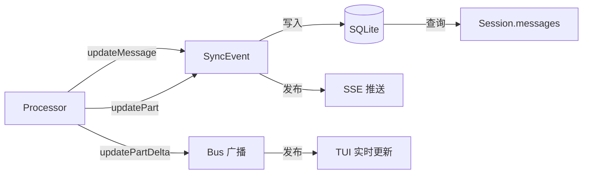
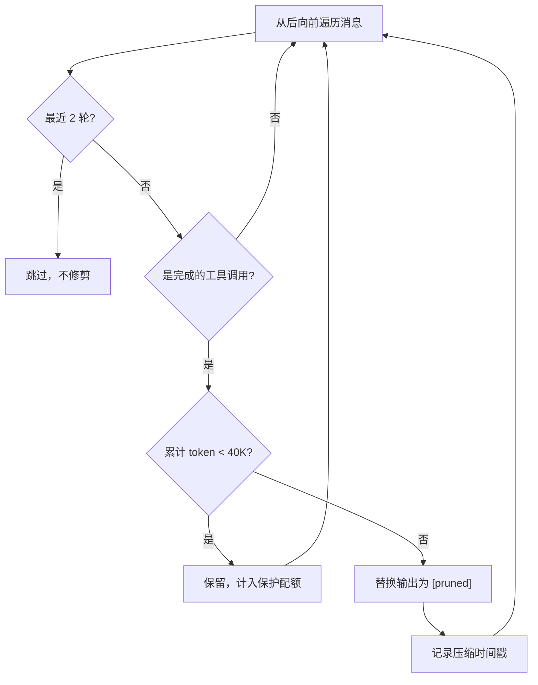
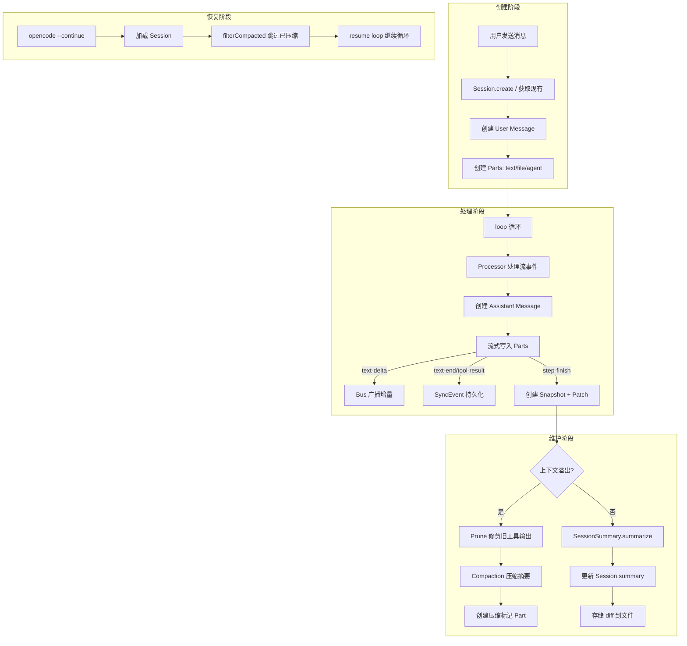

# 第四节 Session 管理详解

📍 **你在这里**
> 在第01章全景视野中，我们用一张大图鸟瞰了整个 OpenCode。现在我们沿着 **Session 创建 → 消息写入 → 持久化 → 上下文压缩 → 摘要生成 → 会话恢复** 这条线路，深入探索每一步的实现细节。

---

## 学习目标

读完本节，你将能够：

1. 理解 Session 和 Message 的**数据库 Schema** 设计
2. 掌握消息持久化的**事件溯源**（Event Sourcing）模式
3. 了解上下文压缩（Compaction）的**触发条件和执行策略**
4. 理解 Prune（修剪）机制如何在不丢失结构的前提下减少上下文
5. 掌握摘要生成（Summary）和 Diff 快照的工作原理

---

## 一、概念解释：Session 的数据模型

一个 Session（会话）包含一系列交替出现的 User Message（用户消息）和 Assistant Message（助手消息）。每条消息又包含多个 Part（部件），如文本、工具调用、文件附件等。

```
Session
├── User Message #1
│   ├── TextPart: "请读取 index.ts"
│   └── FilePart: screenshot.png
├── Assistant Message #1
│   ├── TextPart: "好的，让我读取..."
│   ├── ToolPart: read({ filePath: "index.ts" }) → completed
│   ├── TextPart: "文件内容如下..."
│   ├── StepStartPart: { snapshot: "abc123" }
│   └── StepFinishPart: { tokens: {...}, cost: 0.003 }
├── User Message #2
│   └── TextPart: "请修改第10行"
└── Assistant Message #2
    ├── ToolPart: edit({ filePath: "index.ts", ... }) → completed
    ├── PatchPart: { hash: "def456", files: ["index.ts"] }
    └── TextPart: "已完成修改"
```

---

## 二、数据库 Schema

### 2.1 Session 表

```typescript
// 文件: packages/opencode/src/session/index.ts

export type Info = {
  id: SessionID
  slug: string                    // URL 友好的短标识
  projectID: ProjectID
  workspaceID?: WorkspaceID
  directory: string               // 工作目录
  parentID?: SessionID            // 父会话（fork 场景）
  title: string
  version: string
  summary?: {
    additions: number             // 新增行数
    deletions: number             // 删除行数
    files: number                 // 变更文件数
    diffs?: FileDiff[]            // 详细 diff
  }
  share?: { url: string }        // 分享链接
  revert?: {                     // 回滚信息
    messageID: MessageID
    partID?: PartID
    snapshot?: string
    diff?: string
  }
  permission?: Permission.Ruleset // 会话级权限规则
  time: {
    created: number
    updated: number
    compacting?: number           // 正在压缩中
    archived?: number             // 归档时间
  }
}
```

对应的数据库列：

```sql
CREATE TABLE session (
  id            TEXT PRIMARY KEY,
  project_id    TEXT NOT NULL,
  workspace_id  TEXT,
  directory     TEXT NOT NULL,
  parent_id     TEXT,
  title         TEXT NOT NULL,
  version       TEXT NOT NULL,
  slug          TEXT NOT NULL,
  share_url     TEXT,
  permission    TEXT,             -- JSON
  summary_additions  INTEGER,
  summary_deletions  INTEGER,
  summary_files      INTEGER,
  summary_diffs      TEXT,       -- JSON
  time_created    INTEGER NOT NULL,
  time_updated    INTEGER NOT NULL,
  time_compacting INTEGER,
  time_archived   INTEGER,
  revert          TEXT            -- JSON
);
```

### 2.2 Message 表

```typescript
// 文件: packages/opencode/src/session/message-v2.ts

// User Message
export type User = {
  id: MessageID
  sessionID: SessionID
  role: "user"
  time: { created: number }
  format?: {
    type: "text" | "json_schema"
    schema?: Record<string, any>
  }
  agent: string
  model: { providerID: ProviderID; modelID: ModelID }
  system?: string                  // 自定义 System Prompt
  variant?: string
}

// Assistant Message
export type Assistant = {
  id: MessageID
  sessionID: SessionID
  role: "assistant"
  parentID: MessageID              // 关联的用户消息
  time: { created: number; completed?: number }
  error?: ErrorObject
  agent: string
  modelID: ModelID
  providerID: ProviderID
  summary?: boolean                // 压缩消息标记
  cost: number
  tokens: {
    total?: number
    input: number
    output: number
    reasoning: number
    cache: { read: number; write: number }
  }
  structured?: any                 // JSON Schema 输出
  finish?: string                  // 结束原因
}
```

```sql
CREATE TABLE message (
  id          TEXT PRIMARY KEY,
  session_id  TEXT NOT NULL REFERENCES session(id),
  data        TEXT NOT NULL,     -- JSON: 完整消息对象
  time_created INTEGER NOT NULL
);
```

### 2.3 Part 表

```sql
CREATE TABLE part (
  id          TEXT PRIMARY KEY,
  session_id  TEXT NOT NULL REFERENCES session(id),
  message_id  TEXT NOT NULL REFERENCES message(id),
  data        TEXT NOT NULL      -- JSON: 完整部件对象
);
```

### 2.4 Part 类型一览

```typescript
// 文件: packages/opencode/src/session/message-v2.ts

// 所有 Part 类型
type Part =
  | TextPart          // LLM 文本输出
  | ReasoningPart     // 扩展思考（Claude, o1）
  | ToolPart          // 工具调用及结果
  | FilePart          // 文件附件（图片、PDF）
  | StepStartPart     // 步骤开始快照
  | StepFinishPart    // 步骤结束（token 计数）
  | PatchPart         // Git 风格 diff
  | CompactionPart    // 压缩标记
  | SubtaskPart       // 子任务执行
  | AgentPart         // Agent 引用 (@agent)
  | SnapshotPart      // 文件系统快照
```

---

## 三、消息持久化：事件溯源模式

OpenCode 使用**事件溯源**（Event Sourcing）模式来持久化消息。每次更新都通过 `SyncEvent` 发布，然后由同步处理器写入数据库。

### 3.1 更新消息

```typescript
// 文件: packages/opencode/src/session/index.ts（简化）

export async function updateMessage(msg: MessageV2.User | MessageV2.Assistant) {
  // 通过事件溯源写入
  SyncEvent.run(MessageV2.Event.Updated, {
    sessionID: msg.sessionID,
    info: msg,
  })
}
```

### 3.2 更新 Part

```typescript
// 文件: packages/opencode/src/session/index.ts（简化）

export async function updatePart(part: MessageV2.Part) {
  SyncEvent.run(MessageV2.Event.PartUpdated, {
    sessionID: part.sessionID,
    messageID: part.messageID,
    info: part,
  })
  return part
}
```

### 3.3 流式增量更新

对于流式文本输出，使用更轻量的增量更新：

```typescript
// 文件: packages/opencode/src/session/index.ts（简化）

export async function updatePartDelta(delta: {
  sessionID: SessionID
  messageID: MessageID
  partID: PartID
  field: string
  delta: string
}) {
  // 只通过 Bus 广播，不写入数据库
  Bus.publish(MessageV2.Event.PartDelta, delta)
}
```

> 💡 **关键区分**：`updatePart()` 触发数据库写入（持久化），`updatePartDelta()` 只触发 Bus 广播（内存通知）。这避免了每个 token 都写入数据库的 I/O 开销。

### 3.4 事件流架构



---

## 四、Session 生命周期

### 4.1 创建会话

```typescript
// 文件: packages/opencode/src/session/index.ts（简化）

export async function create() {
  return createNext({})
}

export async function createNext(input: {
  parentID?: SessionID
  title?: string
  permission?: Permission.Ruleset
}) {
  const id = SessionID.ascending()
  const session: Info = {
    id,
    slug: generateSlug(),
    projectID: Instance.current.project.id,
    directory: Instance.directory,
    title: input.title ?? "",
    version: Installation.VERSION,
    time: {
      created: Date.now(),
      updated: Date.now(),
    },
    // ...
  }

  // 写入数据库
  Database.transaction((tx) => {
    tx.insert(SessionTable).values(toRow(session)).run()
  })

  // 发布创建事件
  Bus.publish(Session.Event.Created, { session })
  return session
}
```

### 4.2 Fork 会话

Fork（分叉）允许从历史某一点创建新的分支会话：

```typescript
// 文件: packages/opencode/src/session/index.ts（简化）

export async function fork(sessionID: SessionID, messageID?: MessageID) {
  // 1. 创建新会话
  const forked = await createNext({
    parentID: sessionID,
    title: original.title + " (fork)",
    permission: original.permission,
  })

  // 2. 复制消息到分叉点
  const messages = await Session.messages({ sessionID })
  for (const msg of messages) {
    if (messageID && msg.info.id > messageID) break
    // 复制消息和部件到新会话
    await copyMessage(msg, forked.id)
  }

  return forked
}
```

### 4.3 查询消息

```typescript
// 文件: packages/opencode/src/session/index.ts（简化）

export async function messages(input: { sessionID: SessionID; limit?: number }) {
  // 从数据库查询
  const rows = Database.Client()
    .select()
    .from(MessageTable)
    .where(eq(MessageTable.session_id, input.sessionID))
    .orderBy(asc(MessageTable.time_created))
    .limit(input.limit ?? Infinity)
    .all()

  // 关联查询 Parts
  const parts = Database.Client()
    .select()
    .from(PartTable)
    .where(eq(PartTable.session_id, input.sessionID))
    .all()

  // 组装 WithParts 结构
  return rows.map(row => ({
    info: JSON.parse(row.data),
    parts: parts.filter(p => p.message_id === row.id).map(p => JSON.parse(p.data)),
  }))
}
```

---

## 五、上下文压缩（Compaction）

当对话历史超过模型的上下文窗口时，OpenCode 会自动触发压缩。

### 5.1 溢出检测

```typescript
// 文件: packages/opencode/src/session/compaction.ts

const COMPACTION_BUFFER = 20_000

export async function isOverflow(input: {
  tokens: MessageV2.Assistant["tokens"]
  model: Provider.Model
}) {
  const config = await Config.get()
  if (config.compaction?.auto === false) return false

  const context = input.model.limit.context
  if (context === 0) return false

  const count =
    input.tokens.total ||
    input.tokens.input +
    input.tokens.output +
    input.tokens.cache.read +
    input.tokens.cache.write

  const reserved = config.compaction?.reserved ??
    Math.min(COMPACTION_BUFFER, ProviderTransform.maxOutputTokens(input.model))
  const usable = input.model.limit.input
    ? input.model.limit.input - reserved
    : context - ProviderTransform.maxOutputTokens(input.model)

  return count >= usable
}
```

核心公式：

```
可用上下文 = min(input_limit, context_limit - max_output) - reserved_buffer
如果 实际使用 token ≥ 可用上下文 → 触发压缩
```

### 5.2 Prune（修剪）机制

在触发完整压缩之前，OpenCode 先尝试"修剪"——清除旧工具调用的输出内容：

```typescript
// 文件: packages/opencode/src/session/compaction.ts

export const PRUNE_MINIMUM = 20_000
export const PRUNE_PROTECT = 40_000

const PRUNE_PROTECTED_TOOLS = ["skill"]

export async function prune(input: { sessionID: SessionID }) {
  const config = await Config.get()
  if (config.compaction?.prune === false) return

  const msgs = await Session.messages({ sessionID: input.sessionID })
  let total = 0
  let pruned = 0
  let turns = 0

  // 从后向前遍历
  loop: for (let msgIndex = msgs.length - 1; msgIndex >= 0; msgIndex--) {
    const msg = msgs[msgIndex]
    if (msg.info.role === "user") turns++
    if (turns < 2) continue          // 保护最近 2 轮
    if (msg.info.role === "assistant" && msg.info.summary) break loop

    for (let partIndex = msg.parts.length - 1; partIndex >= 0; partIndex--) {
      const part = msg.parts[partIndex]
      if (part.type !== "tool") continue
      if (part.state.status !== "completed") continue
      if (PRUNE_PROTECTED_TOOLS.includes(part.tool)) continue

      const size = Token.estimate(part.state.output ?? "")
      total += size

      if (total <= PRUNE_PROTECT) continue  // 保护前 40K tokens
      // 超过保护阈值，开始修剪
      if (part.state.time.compacted) continue

      part.state.time.compacted = Date.now()
      part.state.output = "[pruned]"
      await Session.updatePart(part)
      pruned += size
    }
  }
}
```

修剪策略的核心思想：



**关键设计**：
- **保护最近 2 轮**：避免修剪用户刚看到的内容
- **保护前 40K tokens**：保留一定量的上下文
- **保护 `skill` 工具**：自定义技能的输出通常包含重要说明
- **标记而非删除**：`time.compacted` 时间戳标记修剪，方便调试

### 5.3 压缩处理

当修剪不够时，执行完整压缩——让 LLM 生成对话摘要：

```typescript
// 文件: packages/opencode/src/session/compaction.ts（简化）

export async function process(input: {
  parentID: MessageID
  messages: MessageV2.WithParts[]
  sessionID: SessionID
  abort: AbortSignal
  auto: boolean
  overflow?: boolean
}) {
  // 1. 创建压缩助手消息
  const msg = await Session.updateMessage({
    id: MessageID.ascending(),
    role: "assistant",
    sessionID: input.sessionID,
    parentID: input.parentID,
    agent: "compaction",
    summary: true,           // 标记为压缩消息
    cost: 0,
    tokens: { input: 0, output: 0, reasoning: 0, cache: { read: 0, write: 0 } },
    time: { created: Date.now() },
  })

  // 2. 调用 LLM 生成摘要
  // 使用专门的压缩 Prompt，要求：
  // - 保留关键决策和上下文
  // - 记录已执行的文件变更
  // - 压缩重复信息
  const processor = SessionProcessor.create({
    assistantMessage: msg,
    sessionID: input.sessionID,
    model: compactionModel,
    abort: input.abort,
  })

  await processor.process({
    system: [COMPACTION_PROMPT],
    messages: MessageV2.toModelMessages(input.messages, compactionModel),
    tools: {},             // 压缩时不提供工具
    agent: compactionAgent,
    // ...
  })

  // 3. 发布压缩完成事件
  Bus.publish(Event.Compacted, { sessionID: input.sessionID })
}
```

### 5.4 压缩前后的消息结构

```
压缩前：
├── User #1: "帮我重构 auth 模块"
├── Assistant #1: [read auth.ts] [edit auth.ts] [read test.ts] "重构完成"
├── User #2: "测试通过了吗？"
├── Assistant #2: [bash "npm test"] "3 个测试通过"
├── User #3: "再优化一下性能"
├── Assistant #3: [read auth.ts] [edit auth.ts] "已优化"

压缩后：
├── Assistant (summary=true): "对话摘要：
│     1. 用户请求重构 auth 模块
│     2. 已完成重构，修改了 auth.ts
│     3. 测试通过（3/3）
│     4. 进行了性能优化
│     5. 当前状态：auth.ts 已更新..."
├── CompactionPart: { auto: true }
├── User #3: "再优化一下性能"        ← 最后的用户消息被保留
└── Assistant #3: ...                ← 继续对话
```

---

## 六、摘要生成（Summary）

### 6.1 会话级摘要

每次步骤完成后，都会异步生成摘要：

```typescript
// 文件: packages/opencode/src/session/summary.ts（简化）

export async function summarize(input: {
  sessionID: SessionID
  messageID: MessageID
}) {
  const all = await Session.messages({ sessionID: input.sessionID })

  // 计算整个会话的文件变更
  const diffs = await computeDiff({ messages: all })
  await Session.setSummary({
    additions: sum(diffs.map(d => d.additions)),
    deletions: sum(diffs.map(d => d.deletions)),
    files: diffs.length,
  })

  // 存储详细 diff 到文件
  await Storage.write(["session_diff", input.sessionID], diffs)

  // 广播 diff 事件
  Bus.publish(Session.Event.Diff, { sessionID: input.sessionID, diff: diffs })
}
```

### 6.2 消息级摘要

```typescript
// 文件: packages/opencode/src/session/summary.ts（简化）

// 每条用户消息也有独立的摘要
const msgWithParts = messages.find(m => m.info.id === input.messageID)
const diffs = await computeDiff({ messages: [userMsg, ...assistantMsgs] })
userMsg.summary = { diffs }
await Session.updateMessage(userMsg)
```

### 6.3 Diff 计算

```typescript
// 文件: packages/opencode/src/session/summary.ts（简化）

export async function computeDiff(input: {
  messages: MessageV2.WithParts[]
}) {
  // 找最早的 "step-start" 快照作为起点
  let from: string | undefined
  // 找最晚的 "step-finish" 快照作为终点
  let to: string | undefined

  for (const msg of input.messages) {
    for (const part of msg.parts) {
      if (part.type === "step-start" && part.snapshot) {
        from = from ?? part.snapshot
      }
      if (part.type === "step-finish" && part.snapshot) {
        to = part.snapshot
      }
    }
  }

  if (from && to) {
    return Snapshot.diffFull(from, to)
  }
  return []
}
```

### 6.4 Diff 输出格式

```typescript
export type FileDiff = {
  file: string       // 文件路径
  additions: number  // 新增行数
  deletions: number  // 删除行数
  hunks: Hunk[]      // diff 区块
}
```

---

## 七、会话恢复

### 7.1 继续上次会话

```bash
# 继续上次的会话
opencode --continue

# 继续指定会话
opencode --session <session-id>

# Fork 后继续
opencode --session <session-id> --fork
```

### 7.2 消息流过滤

恢复会话时，需要跳过已压缩的消息：

```typescript
// 文件: packages/opencode/src/session/message-v2.ts（简化）

export async function filterCompacted(
  messages: AsyncIterable<MessageV2.WithParts>,
) {
  const result: MessageV2.WithParts[] = []
  let lastCompactionIndex = -1

  // 找到最后一个压缩标记
  for await (const msg of messages) {
    result.push(msg)
    const hasCompaction = msg.parts.some(p => p.type === "compaction")
    if (hasCompaction) {
      lastCompactionIndex = result.length - 1
    }
  }

  // 跳过压缩标记之前的所有消息
  if (lastCompactionIndex >= 0) {
    return result.slice(lastCompactionIndex)
  }
  return result
}
```

---

## 八、完整数据流



---

## 九、Session 事件系统

Session 通过 Bus 发布多种事件，TUI 和 API 客户端可以订阅：

| 事件 | 触发时机 | 包含数据 |
|------|---------|---------|
| `Session.Event.Created` | 会话创建 | `{ session }` |
| `Session.Event.Updated` | 会话元数据更新 | `{ session }` |
| `Session.Event.Deleted` | 会话删除 | `{ sessionID }` |
| `MessageV2.Event.Updated` | 消息创建/更新 | `{ sessionID, info }` |
| `MessageV2.Event.PartUpdated` | Part 创建/更新 | `{ sessionID, messageID, info }` |
| `MessageV2.Event.PartDelta` | 流式增量 | `{ sessionID, messageID, partID, delta }` |
| `Session.Event.Error` | 错误发生 | `{ sessionID, error }` |
| `Session.Event.Diff` | Diff 计算完成 | `{ sessionID, diff }` |
| `SessionCompaction.Event.Compacted` | 压缩完成 | `{ sessionID }` |

---

## 十、数据库事务管理

OpenCode 使用上下文感知的事务管理：

```typescript
// 文件: packages/opencode/src/storage/db.ts

export function transaction<T>(
  callback: (tx: TxOrDb) => NotPromise<T>,
  options?: { behavior?: "deferred" | "immediate" | "exclusive" },
): NotPromise<T> {
  try {
    // 尝试使用当前上下文中的事务
    return callback(ctx.use().tx)
  } catch (err) {
    if (err instanceof Context.NotFound) {
      // 没有现有事务 → 创建新事务
      const effects: (() => void | Promise<void>)[] = []
      const result = Client().transaction(
        (tx: TxOrDb) => {
          return ctx.provide({ tx, effects }, () => callback(tx))
        },
        { behavior: options?.behavior },
      )
      // 事务成功后执行副作用
      for (const effect of effects) effect()
      return result as NotPromise<T>
    }
    throw err
  }
}
```

**关键设计**：
- 如果已在事务上下文中，复用现有事务（嵌套友好）
- 如果不在事务中，创建新事务
- 副作用（如 Bus 事件发布）在事务**提交后**才执行

---

## 动手练习

### 练习 1：查看 Session 数据库

```bash
# 查看数据库路径
ls ~/.local/share/opencode/opencode*.db

# 用 sqlite3 查看表结构
sqlite3 ~/.local/share/opencode/opencode.db ".schema session"
sqlite3 ~/.local/share/opencode/opencode.db ".schema message"
sqlite3 ~/.local/share/opencode/opencode.db ".schema part"
```

### 练习 2：观察压缩过程

创建一个会使用大量 token 的对话（让 LLM 读取多个大文件），然后观察日志中的压缩事件：

```bash
opencode --print-logs 2>session.log
# 发送需要大量上下文的请求
grep -E "(compaction|prune|overflow)" session.log
```

### 练习 3：Fork 会话

```bash
# 列出会话
opencode session list

# Fork 一个会话
opencode --session <id> --fork
# 在 fork 的会话中做不同的修改
```

---

## 常见问题

### Q: 为什么消息和 Part 分开存储？

这种设计有两个优势：1) Part 可以独立更新而不需要重写整个消息（工具调用状态频繁变化）；2) 查询时可以选择只加载消息元数据，需要时再加载 Part（延迟加载）。

### Q: 压缩会丢失历史信息吗？

不会完全丢失。压缩后的摘要保留了关键决策和文件变更记录。原始消息仍然存在于数据库中，只是在 `filterCompacted()` 时被跳过。如果需要，可以通过数据库直接查看完整历史。

### Q: `updatePartDelta` 的增量数据如果丢失怎么办？

没有关系。`updatePartDelta` 是纯广播机制（用于 TUI 实时更新），最终的完整内容会通过 `updatePart()` 持久化到数据库。TUI 重新连接时会从数据库读取完整状态。

### Q: Prune 和 Compaction 有什么区别？

**Prune**（修剪）只清除旧工具调用的输出文本，不调用 LLM，速度快且成本为零。**Compaction**（压缩）调用 LLM 生成对话摘要，替换整个历史前缀，更彻底但需要消耗 token。Prune 是压缩的轻量级替代方案。

---

## 小结

本节我们深入探索了 Session 管理的完整生命周期：

1. **数据模型**：Session → Message → Part 三层结构，JSON 序列化存储在 SQLite
2. **持久化模式**：事件溯源（SyncEvent）+ 增量广播（Bus）双通道
3. **上下文压缩**：`isOverflow()` 检测 → `prune()` 修剪旧输出 → `process()` LLM 摘要
4. **摘要生成**：Snapshot 快照 + Diff 计算，追踪每步文件变更
5. **会话恢复**：`filterCompacted()` 跳过已压缩消息，`resume()` 恢复循环
6. **事务管理**：上下文感知的嵌套事务 + 提交后副作用

> ⏭️ 下一节，我们将深入 Provider 调用系统——了解多提供商适配、认证、消息转换和流式处理。
