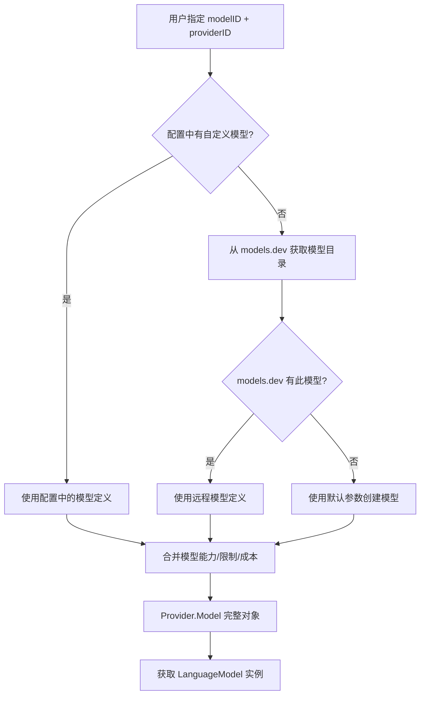
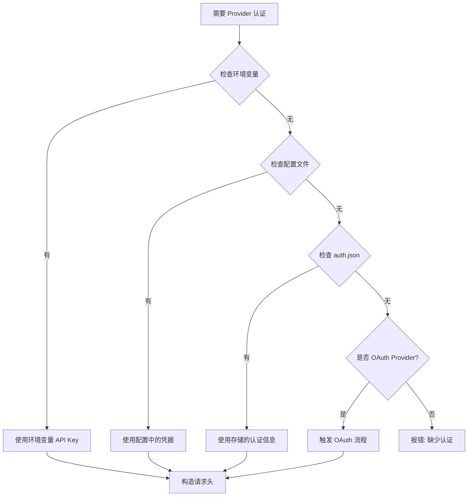
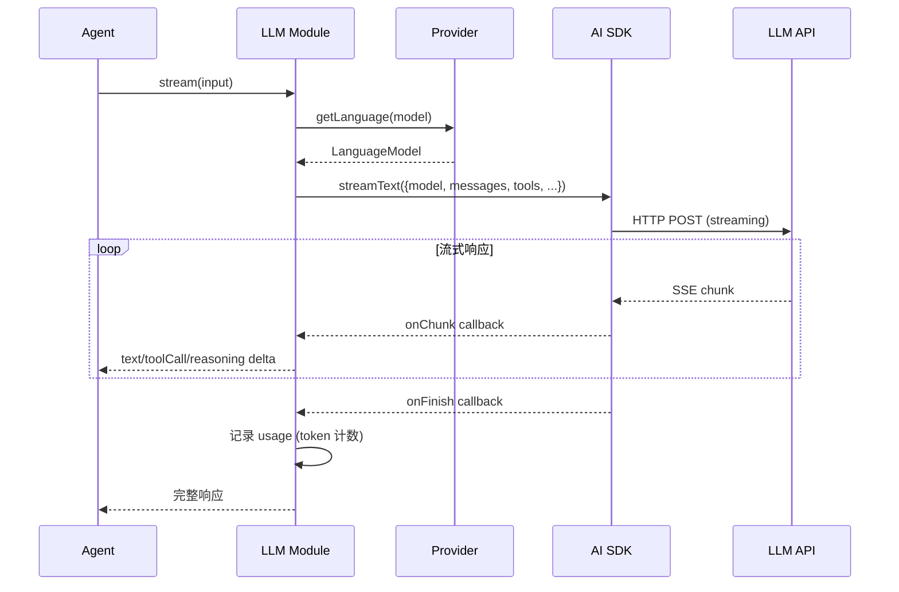

# Provider 调用详解

📍 **你在这里**
> 在第01章全景视野中，我们看到 Provider 是连接 Agent 与 LLM 的"万能适配器"。现在我们深入探索 Provider 从配置到调用的完整链路。

> 📌 Provider 系统负责将 20+ 种 LLM 服务统一为一致的调用接口，处理认证、模型解析、参数转换和流式响应。

## 本章学习目标

- [ ] 理解 Provider 和 Model 的关系
- [ ] 掌握模型解析（Model Resolution）的完整流程
- [ ] 理解认证凭据的管理方式
- [ ] 知道 LLM API 调用是如何构造和发送的
- [ ] 理解流式响应的处理机制

## 概念解释

### Provider 是什么？

提供商（Provider）是 OpenCode 与各种大语言模型（LLM）服务之间的适配层。每个 Provider 对应一个 LLM 服务商，如 Anthropic（Claude）、OpenAI（GPT）、Google（Gemini）等。

```
// 文件: packages/opencode/src/provider/schema.ts
// ProviderID 和 ModelID 都是品牌类型（Branded Type）
export const ProviderID = Schema.String.pipe(Schema.brand("ProviderID"))
export const ModelID = Schema.String.pipe(Schema.brand("ModelID"))
```

### 支持的 Provider 列表

| Provider ID | 服务商 | AI SDK 包 | 代表模型 |
|-------------|--------|-----------|----------|
| `anthropic` | Anthropic | `@ai-sdk/anthropic` | Claude 4, Claude 3.5 Sonnet |
| `openai` | OpenAI | `@ai-sdk/openai` | GPT-4o, GPT-4.1, o3 |
| `google` | Google | `@ai-sdk/google` | Gemini 2.5 Pro/Flash |
| `amazon-bedrock` | AWS | `@ai-sdk/amazon-bedrock` | Claude via Bedrock |
| `azure` | Microsoft | `@ai-sdk/azure` | GPT via Azure |
| `openrouter` | OpenRouter | `@openrouter/ai-sdk-provider` | 多模型路由 |
| `mistral` | Mistral | `@ai-sdk/mistral` | Mistral Large |
| `groq` | Groq | `@ai-sdk/groq` | Llama 3, Mixtral |
| `deepinfra` | DeepInfra | `@ai-sdk/openai` (兼容) | 各开源模型 |
| `gitlab` | GitLab | `gitlab-ai-provider` | GitLab Duo |
| `opencode` | OpenCode | 内置 | Zen (托管模型) |
| `copilot` | GitHub Copilot | 自定义 | GPT-4o via Copilot |
| `cerebras` | Cerebras | `@ai-sdk/cerebras` | 快速推理 |
| `cohere` | Cohere | `@ai-sdk/cohere` | Command R |
| `together` | Together AI | `@ai-sdk/togetherai` | 开源模型 |
| `perplexity` | Perplexity | `@ai-sdk/openai` (兼容) | 搜索增强 |
| `vercel` | Vercel | `@ai-sdk/vercel` | v0 模型 |

```
// 文件: packages/opencode/src/provider/provider.ts
// BUNDLED_PROVIDERS 定义了所有内置的 Provider SDK 映射
const BUNDLED_PROVIDERS: Record<string, () => Promise<...>> = {
  "@ai-sdk/anthropic": () => import("@ai-sdk/anthropic"),
  "@ai-sdk/openai": () => import("@ai-sdk/openai"),
  "@ai-sdk/google": () => import("@ai-sdk/google-vertex"),
  // ... 15+ 个 Provider
}
```

## 模型解析流程

当用户选择一个模型（或使用默认模型）时，Provider 系统需要解析出完整的模型信息：



### Model 数据结构

```typescript
// 文件: packages/opencode/src/provider/provider.ts
// Provider.Model 包含模型的所有元数据
Model = {
  id: ModelID              // 如 "claude-sonnet-4-20250514"
  providerID: ProviderID   // 如 "anthropic"
  family?: string          // 如 "claude"
  capabilities: {
    temperature: boolean   // 是否支持温度调节
    reasoning: boolean     // 是否支持推理模式
    interleaved?: boolean  // 是否支持交错内容
    attachment: boolean    // 是否支持文件附件
    toolCall: boolean      // 是否支持工具调用
  }
  cost?: {
    input: number          // 每百万 token 输入成本
    output: number         // 每百万 token 输出成本
    cache_read?: number    // 缓存读取成本
    cache_write?: number   // 缓存写入成本
  }
  limit: {
    context: number        // 上下文窗口大小（token 数）
    output: number         // 最大输出 token 数
  }
  variants?: Record<string, Record<string, any>>  // 模型变体
  headers?: Record<string, string>                 // 自定义请求头
}
```

### models.dev 集成

OpenCode 使用 [models.dev](https://models.dev) 作为模型目录服务，获取最新的模型信息：

```typescript
// 文件: packages/opencode/src/provider/models.ts
// 从 models.dev API 获取模型目录
// 包含本地缓存，避免重复请求
// 可通过 OPENCODE_DISABLE_MODELS_FETCH 禁用
```

## 认证管理

### 认证类型

```typescript
// 文件: packages/opencode/src/auth/index.ts
// 三种认证方式
type AuthInfo =
  | { type: "oauth"; refresh: string; access: string; expires: number }
  | { type: "api"; key: string }
  | { type: "wellknown"; key: string; token: string }
```

### 认证解析流程



### 凭据存储

认证信息存储在 `~/.opencode/auth.json`，权限设为 `0o600`（仅所有者可读写）：

```typescript
// 文件: packages/opencode/src/auth/index.ts
// 安全存储认证信息
// set(key, info) - 保存凭据
// get(providerID) - 获取凭据
// remove(key) - 删除凭据
```

## API 调用构造

### LanguageModel 获取

```typescript
// 文件: packages/opencode/src/provider/provider.ts
// getLanguage(model) 将 Provider.Model 转换为 AI SDK 的 LanguageModel
// 1. 查找对应的 BUNDLED_PROVIDER SDK
// 2. 获取认证凭据
// 3. 创建 provider 实例（带 baseURL、headers）
// 4. 调用 provider(modelID) 返回 LanguageModel
```

### 参数转换（ProviderTransform）

```typescript
// 文件: packages/opencode/src/provider/transform.ts
// ProviderTransform.options(model, agent) 将模型+代理配置转为 AI SDK 选项
// - maxTokens: 根据 model.limit.output 设置
// - temperature: 根据 agent 配置或模型默认值
// - topP: 同上
// - providerOptions: Provider 特定的参数
//   - anthropic: thinking.type, cacheControl
//   - openai: reasoningEffort
//   - google: thinkingConfig
```

### Provider 特定参数

不同 Provider 需要不同的参数格式：

| Provider | 特殊参数 | 说明 |
|----------|---------|------|
| Anthropic | `thinking.type`, `cacheControl` | 推理模式和缓存控制 |
| OpenAI | `reasoningEffort` | 推理强度（low/medium/high） |
| Google | `thinkingConfig.thinkingBudget` | 思考预算 token 数 |
| Bedrock | `anthropic.thinking` | Bedrock 中的 Claude 推理 |
| OpenRouter | `x-openrouter-*` 请求头 | 路由控制 |

## 流式响应处理

### 调用流程



### 流式事件类型

```typescript
// 文件: packages/opencode/src/session/llm.ts
// streamText 返回的事件流包含以下类型:
// - text-delta: 文本增量
// - tool-call: 工具调用请求
// - tool-call-streaming-start: 工具调用流开始
// - tool-call-delta: 工具调用参数增量
// - tool-result: 工具执行结果
// - reasoning: 推理过程文本
// - finish: 完成信号（含 usage 统计）
```

### Token 计费

```typescript
// 文件: packages/opencode/src/session/llm.ts
// onFinish 回调中记录 token 使用量:
// usage.promptTokens - 输入 token 数
// usage.completionTokens - 输出 token 数
// usage.totalTokens - 总 token 数
// 结合 model.cost 计算实际费用
```

## 错误处理

Provider 调用可能遇到的错误和处理策略：

| 错误类型 | 原因 | 处理方式 |
|----------|------|---------|
| 认证失败 (401) | API Key 无效或过期 | 提示用户重新配置 |
| 配额超限 (429) | 速率限制或余额不足 | 自动重试 + 退避 |
| 模型不可用 (404) | 模型 ID 错误或已下线 | 提示切换模型 |
| 超时 | 网络问题或响应过长 | 重试机制 |
| 内容过滤 | 提供商安全策略 | 返回错误信息 |

```typescript
// 文件: packages/opencode/src/provider/error.ts
// ProviderError 封装了各种 Provider 相关错误
// 包含友好的错误消息和原始错误信息
```

## 插件扩展点

Provider 系统提供多个插件钩子（Hook）：

```typescript
// 文件: packages/opencode/src/plugin/index.ts
// Plugin hooks 相关到 Provider:
// - chat.params: 修改 LLM 调用参数（temperature, topP 等）
// - chat.headers: 添加自定义请求头
// - auth: 自定义认证流程
```

## 动手练习

### 练习 1：查看当前 Provider 配置

```bash
# 启动 OpenCode 后查看可用 Provider
opencode providers
```

### 练习 2：配置一个新的 Provider

在项目的 `.opencode/opencode.jsonc` 中添加：

```jsonc
{
  "provider": {
    "openai": {
      "options": {}
    }
  }
}
```

然后设置环境变量：
```bash
export OPENAI_API_KEY="sk-..."
```

### 练习 3：阅读 Provider 源码

```bash
# 查看所有支持的 Provider
cat packages/opencode/src/provider/provider.ts | grep "BUNDLED_PROVIDERS" -A 30

# 查看模型转换逻辑
cat packages/opencode/src/provider/transform.ts | head -100
```

## 常见问题

**Q: 如何添加自定义 Provider？**
A: 在配置中设置 provider，使用 OpenAI 兼容的 baseURL 指向自定义端点。许多 Provider 使用 `@ai-sdk/openai` 的兼容模式。

**Q: 为什么有些模型不支持工具调用？**
A: 模型的 `capabilities.toolCall` 标志决定了是否支持。某些小模型或特殊模型（如嵌入模型）不支持工具调用。

**Q: 如何切换模型？**
A: 在 TUI 中使用 `/model` 命令或快捷键选择模型。也可以在配置中设置默认模型。

## 本章小结

Provider 系统是 OpenCode 多模型支持的核心。通过统一的抽象层，它将 20+ 种 LLM 服务整合为一致的接口：

1. **模型解析**：从配置、models.dev 或默认值获取模型信息
2. **认证管理**：支持 API Key、OAuth、环境变量等多种方式
3. **参数转换**：将通用参数转为 Provider 特定格式
4. **流式处理**：基于 Vercel AI SDK 的统一流式接口
5. **错误处理**：友好的错误提示和自动重试

## 延伸阅读

- [01-全景视野/04-一次对话的完整旅程](../01-全景视野/04-一次对话的完整旅程.md) — Provider 在对话链路中的位置
- [04-核心引擎/04-Provider-LLM提供商](../04-核心引擎-packages-opencode/04-Provider-LLM提供商.md) — Provider 模块源码深入分析
- [09-周边知识/03-AI-SDK与LLM调用](../09-周边知识与生态/03-AI-SDK与LLM调用.md) — Vercel AI SDK 详解
- [06-扩展与集成/06-Provider适配](../06-扩展与集成/06-Provider适配.md) — 如何适配新 Provider
