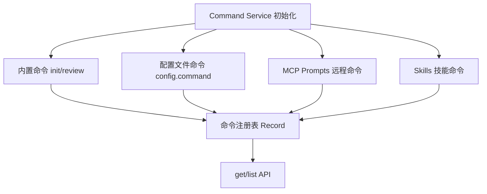
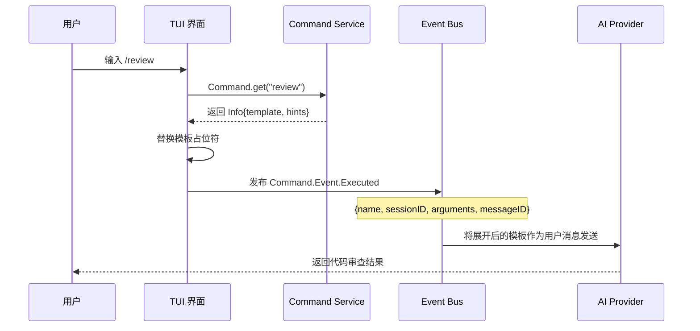

# 08 - Command 系统

## 学习目标

- 理解 OpenCode 的斜杠命令（Slash Command）系统架构
- 掌握命令的四种来源：内置命令、配置命令、MCP Prompts、Skills
- 了解命令注册、模板解析与执行流程
- 学会自定义命令扩展系统

## 概念解释

在 OpenCode 中，**Command 系统**是用户与 AI 交互的快捷入口。当我们在输入框中键入 `/review` 或 `/init` 时，背后就是 Command 系统在工作。它将用户的简短指令扩展为完整的提示词（Prompt），再交给 AI 模型执行。

核心概念包括：

- **命令（Command）**：一个带名称、描述和模板的指令单元
- **模板（Template）**：命令对应的提示词模板，支持 `$1`、`$ARGUMENTS` 等占位符（Placeholder）
- **提示词（Hints）**：从模板中自动提取的占位符列表，用于 UI 提示
- **命令来源（Source）**：命令可来自内置 `"command"`、MCP `"mcp"` 或技能 `"skill"`

## 设计原理

Command 系统采用**多源聚合、懒加载、名称去重**的设计：



**设计决策：**

1. **InstanceState 缓存**：命令注册表只初始化一次，后续调用从缓存读取
2. **优先级机制**：同名命令中，先注册者胜出（内置 > 配置 > MCP > Skill）
3. **异步模板**：MCP Prompts 的模板是 `Promise<string>`，实现按需加载
4. **Effect 架构**：整个服务基于 Effect.js 构建，支持依赖注入与资源管理

## 源码分析

### 文件结构

```
packages/opencode/src/command/
├── index.ts                    # 主模块（~186 行）
└── template/
    ├── initialize.txt          # init 命令模板
    └── review.txt              # review 命令模板（~102 行）
```

### 命令信息 Schema

```typescript
// packages/opencode/src/command/index.ts (约第 33-51 行)
const Info = z.object({
  name: z.string(),
  description: z.string().optional(),
  agent: z.string().optional(),
  model: z.string().optional(),
  source: z.enum(["command", "mcp", "skill"]).optional(),
  template: z.custom<Promise<string> | string>(),
  subtask: z.boolean().optional(),
  hints: z.array(z.string()),   // 自动提取的占位符
})
```

每个命令由 `Info` 描述。注意 `template` 字段支持同步字符串或异步 Promise——这是为了适配 MCP 远程获取的场景。

### Hints 提取函数

```typescript
// packages/opencode/src/command/index.ts (约第 53-61 行)
function hints(template: string) {
  const numbered = [...new Set(template.match(/\$\d+/g) || [])].sort()
  const args = template.includes("$ARGUMENTS") ? ["$ARGUMENTS"] : []
  return [...numbered, ...args]
}
```

这个函数从模板中提取 `$1`、`$2`、`$ARGUMENTS` 等占位符，供 UI 层展示参数提示。

### 内置命令注册

```typescript
// 约第 63-100 行
const DEFAULT = { INIT: "init", REVIEW: "review" } as const

// init 命令 —— 创建/更新 AGENTS.md
commands[DEFAULT.INIT] = {
  name: DEFAULT.INIT,
  description: "create/update AGENTS.md",
  source: "command",
  template: initTemplate.replace("${path}", Instance.directory),
  hints: hints(initTemplate),
}

// review 命令 —— 代码审查
commands[DEFAULT.REVIEW] = {
  name: DEFAULT.REVIEW,
  description: "review changes",
  source: "command",
  template: reviewTemplate,
  hints: hints(reviewTemplate),
}
```

### 配置文件命令

```typescript
// 约第 102-115 行
for (const [name, cmd] of Object.entries(cfg.command ?? {})) {
  commands[name] = {
    name,
    agent: cmd.agent,
    model: cmd.model,
    description: cmd.description,
    template: cmd.template,
    subtask: cmd.subtask,
    hints: hints(cmd.template),
  }
}
```

用户可以在配置文件中自定义命令，指定使用的 agent 和 model。

### MCP Prompts 命令

```typescript
// 约第 117-140 行
const prompts = yield* Effect.promise(() => Mcp.prompts())
for (const [key, prompt] of Object.entries(prompts)) {
  if (commands[prompt.name]) continue  // 名称去重
  commands[prompt.name] = {
    name: prompt.name,
    description: prompt.description,
    source: "mcp",
    // 异步模板 —— 按需从 MCP 服务器获取
    template: Mcp.getPrompt(key, args).then(r => r.messages.map(...).join("\n")),
    hints: (prompt.arguments ?? []).map((_, i) => `$${i + 1}`),
  }
}
```

### Skills 命令

```typescript
// 约第 142-153 行
const skills = yield* Effect.promise(() => Skill.all())
for (const skill of skills) {
  if (commands[skill.name]) continue  // 已注册则跳过
  commands[skill.name] = {
    name: skill.name,
    description: skill.description,
    source: "skill",
    template: skill.content,
    hints: hints(skill.content),
  }
}
```

## 执行流程



**关键步骤：**

1. 用户键入 `/review commit abc123`
2. UI 调用 `Command.get("review")` 获取命令信息
3. 模板中的 `$ARGUMENTS` 被替换为 `commit abc123`
4. 通过 `Bus.publish(Command.Event.Executed, ...)` 触发执行
5. AI 接收完整提示词并返回结果

## 动手练习

### 练习 1：查看所有可用命令

在 OpenCode 中输入 `/` 即可看到命令列表。尝试理解每个命令的来源（source）。

### 练习 2：自定义配置命令

在配置文件中添加：

```json
{
  "command": {
    "explain": {
      "description": "解释代码",
      "template": "请详细解释以下代码的功能和设计思路：$ARGUMENTS"
    }
  }
}
```

重启后输入 `/explain` 即可使用。

### 练习 3：阅读 review 模板

打开 `packages/opencode/src/command/template/review.txt`，理解它如何指导 AI 进行代码审查——包括确定审查范围（未提交、特定 commit、分支、PR）和审查关注点。

## 常见问题

**Q：自定义命令和 MCP 命令同名会怎样？**
A：配置命令优先。注册顺序是：内置 → 配置 → MCP → Skill，同名命令先到先得。

**Q：模板中 `$1` 和 `$ARGUMENTS` 有什么区别？**
A：`$1`、`$2` 是按位置匹配的参数，`$ARGUMENTS` 则捕获所有剩余参数。

**Q：为什么 MCP 命令的模板是 Promise？**
A：MCP Prompts 内容存储在远程服务器上，使用 Promise 实现懒加载，避免初始化时的网络开销。

**Q：命令注册表何时刷新？**
A：当前实现中，命令表在 `InstanceState` 初始化时加载一次。MCP 工具变更会触发 `ToolsChanged` 事件，但命令表需重启刷新。

## 小结

OpenCode 的 Command 系统通过**多源聚合**将内置命令、用户配置、MCP Prompts 和 Skills 统一为斜杠命令接口。核心设计要点：

- **Zod Schema** 定义命令元数据，`hints` 自动提取模板占位符
- **InstanceState** 实现一次初始化、全程缓存
- **名称去重**保证优先级：内置 > 配置 > MCP > Skill
- **异步模板**支持远程 MCP Prompts 的按需加载
- **Event Bus** 解耦命令执行与 UI 层
