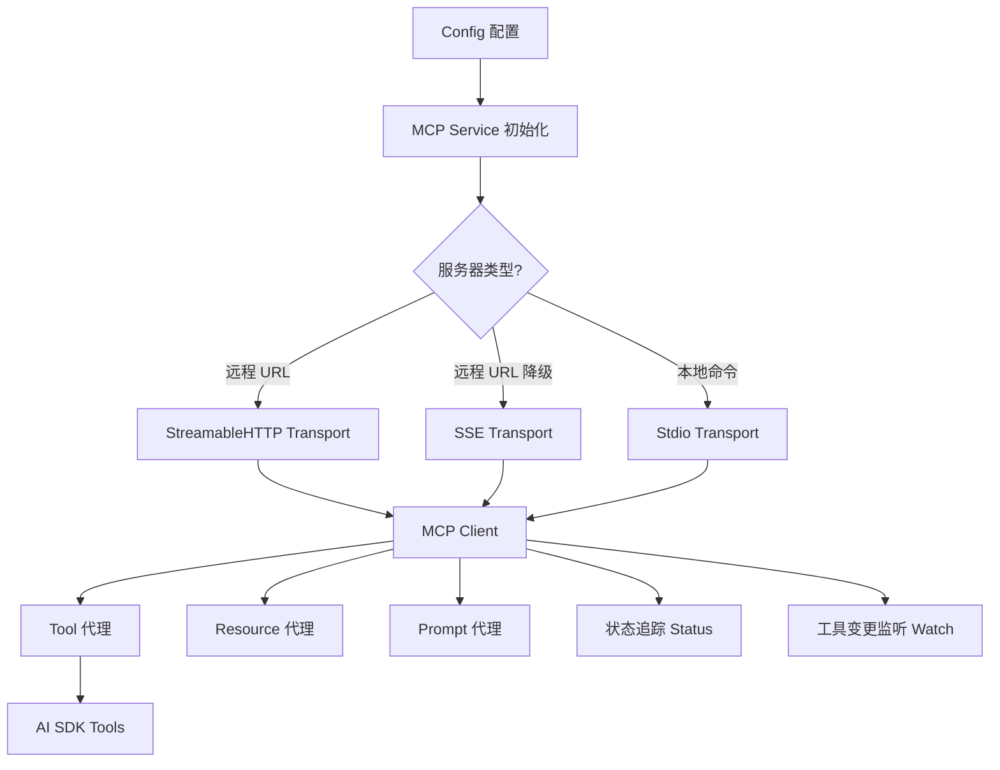
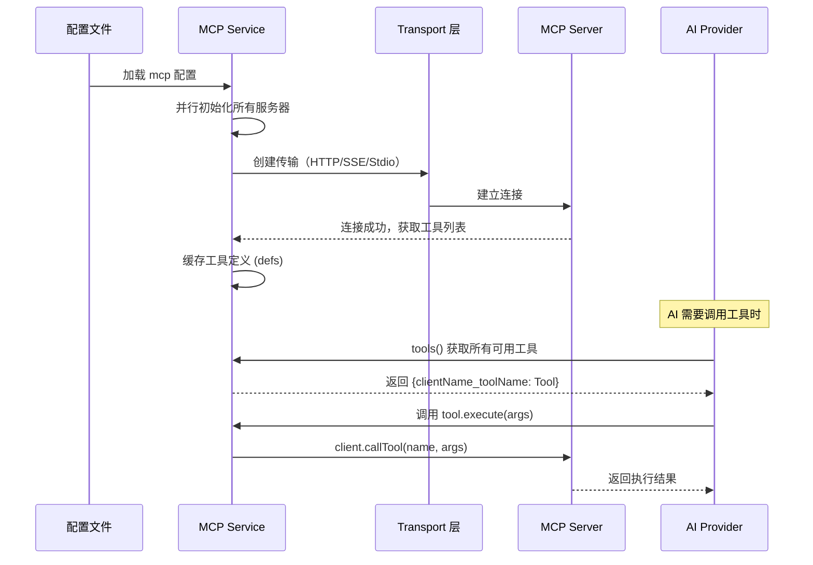
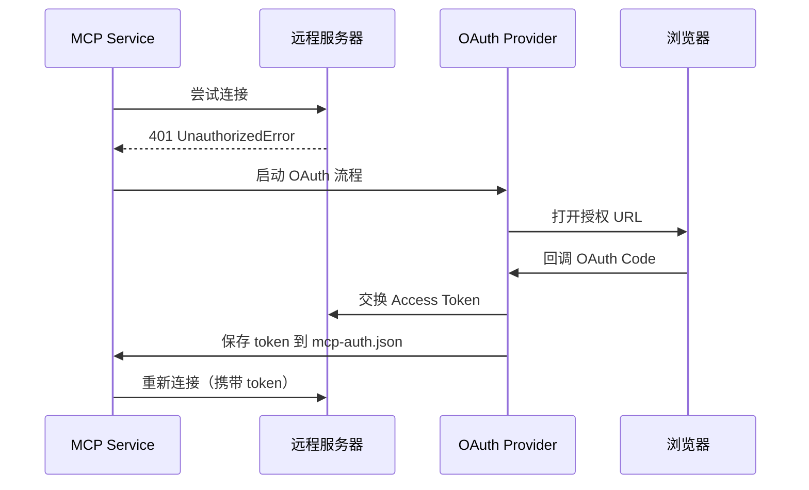

# 09 - MCP 集成

## 学习目标

- 理解 MCP（Model Context Protocol）在 OpenCode 中的集成架构
- 掌握 MCP 客户端的三种传输方式：StreamableHTTP、SSE、Stdio
- 了解工具（Tool）、资源（Resource）、提示词（Prompt）的代理机制
- 学会配置远程和本地 MCP 服务器

## 概念解释

**MCP（Model Context Protocol）** 是一种标准化协议，让 AI 模型能够调用外部工具和访问外部资源。在 OpenCode 中，MCP 集成模块扮演着**桥梁（Bridge）**的角色——它管理多个 MCP 服务器连接，将远程工具转换为 AI SDK 可用的工具格式。

核心概念：

- **MCP 客户端（Client）**：与 MCP 服务器建立连接的客户端实例
- **传输层（Transport）**：通信方式，支持 HTTP 流、SSE（Server-Sent Events）和 Stdio
- **工具代理（Tool Proxying）**：将 MCP 工具定义转换为 AI SDK 的 `Tool` 类型
- **OAuth 认证（Authentication）**：远程服务器的身份验证流程
- **状态机（Status）**：`connected` | `disabled` | `failed` | `needs_auth` | `needs_client_registration`

## 设计原理



**设计决策：**

1. **并行初始化**：所有 MCP 服务器以 `concurrency: "unbounded"` 并行连接
2. **传输降级**：远程服务器先尝试 StreamableHTTP，失败则降级到 SSE
3. **命名空间隔离**：工具名格式为 `{clientName}_{toolName}`，避免冲突
4. **优雅清理**：通过 Effect Finalizer 管理子进程生命周期，防止僵尸进程

## 源码分析

### 文件结构

```
packages/opencode/src/mcp/
├── index.ts           # 核心实现（~936 行）
├── auth.ts            # OAuth 认证状态管理（~182 行）
├── oauth-callback.ts  # OAuth 回调服务器（~216 行）
└── oauth-provider.ts  # OAuth Provider 实现（~186 行）
```

### 资源定义 Schema

```typescript
// packages/opencode/src/mcp/index.ts (约第 39-48 行)
const Resource = z.object({
  name: z.string(),
  uri: z.string(),
  description: z.string().optional(),
  mimeType: z.string().optional(),
  client: z.string(),
})
```

### 状态类型

```typescript
// 约第 74-117 行
type Status =
  | { status: "connected" }
  | { status: "disabled" }
  | { status: "failed"; error: string }
  | { status: "needs_auth" }
  | { status: "needs_client_registration" }
```

### MCP 工具转换

这是整个模块最核心的函数——将 MCP 工具定义转换为 AI SDK 格式：

```typescript
// 约第 133-161 行
function convertMcpTool(tool, client, timeout?) {
  const schema = {
    ...tool.inputSchema,
    type: "object",
    properties: tool.inputSchema.properties ?? {},
  }
  return {
    parameters: schema,
    execute: async (args) => {
      const result = await client.callTool(
        { name: tool.name, arguments: args },
        CallToolResultSchema,
        { resetTimeoutOnProgress: true }
      )
      return result
    },
  }
}
```

### 远程服务器连接

```typescript
// 约第 205-310 行
async function create(key, mcp) {
  // 远程服务器：尝试两种传输方式
  const transports = [
    new StreamableHTTPClientTransport(new URL(mcp.url), {
      authProvider,
      requestInit: mcp.headers ? { headers: mcp.headers } : undefined,
    }),
    new SSEClientTransport(new URL(mcp.url), {
      authProvider,
      requestInit: mcp.headers ? { headers: mcp.headers } : undefined,
    }),
  ]

  for (const transport of transports) {
    try {
      await withTimeout(client.connect(transport), timeout)
      return { mcpClient: client, status: { status: "connected" } }
    } catch (err) {
      if (err instanceof UnauthorizedError) {
        // OAuth 认证流程
        return { status: { status: "needs_auth" } }
      }
      lastError = err
    }
  }
}
```

### 本地 Stdio 服务器

```typescript
// 约第 314-355 行
// 本地服务器：通过子进程通信
const [cmd, ...args] = mcp.command
const transport = new StdioClientTransport({
  stderr: "pipe",
  command: cmd,
  args,
  cwd: Instance.directory,
  env: {
    ...process.env,
    ...(cmd === "opencode" ? { BUN_BE_BUN: "1" } : {}),
    ...mcp.environment,
  },
})

// 捕获 stderr 用于调试
transport.stderr?.on("data", (chunk) => {
  log.info(`mcp stderr: ${chunk.toString()}`, { key })
})
```

### 工具代理与命名

```typescript
// 约第 616-650 行
// 只代理已连接的客户端工具
const connected = Object.entries(s.clients).filter(
  ([name]) => s.status[name]?.status === "connected"
)

for (const tool of listed) {
  // 命名格式：clientName_toolName（特殊字符替换为下划线）
  const sanitized = clientName.replace(/[^a-zA-Z0-9_-]/g, "_")
  const toolName = tool.name.replace(/[^a-zA-Z0-9_-]/g, "_")
  result[sanitized + "_" + toolName] = convertMcpTool(tool, client, timeout)
}
```

### 工具变更监听

```typescript
// 约第 461-475 行
function watch(s, name, client, timeout?) {
  client.setNotificationHandler(
    ToolListChangedNotificationSchema,
    async () => {
      if (s.clients[name] !== client) return
      const listed = await defs(name, client, timeout)
      if (!listed) return
      s.defs[name] = listed  // 更新缓存
      await Bus.publish(ToolsChanged, { server: name })
    }
  )
}
```

### 进程清理（Finalizer）

```typescript
// 约第 514-535 行
yield* Effect.addFinalizer(() =>
  Effect.gen(function* () {
    for (const client of Object.values(s.clients)) {
      // 获取子进程 PID，杀死进程树
      const pid = (client.transport as any)?.pid
      if (pid) {
        const children = execSync(`pgrep -P ${pid}`).toString().trim().split("\n")
        children.forEach(c => process.kill(Number(c), "SIGTERM"))
      }
      await client.close()
    }
  })
)
```

## 执行流程



### OAuth 认证流程



## 动手练习

### 练习 1：配置本地 MCP 服务器

```json
{
  "mcp": {
    "my-tools": {
      "command": ["npx", "-y", "my-mcp-server"],
      "environment": { "API_KEY": "your-key" }
    }
  }
}
```

### 练习 2：配置远程 MCP 服务器

```json
{
  "mcp": {
    "remote-server": {
      "url": "https://mcp.example.com/api",
      "headers": { "Authorization": "Bearer token" },
      "timeout": 60000
    }
  }
}
```

### 练习 3：观察工具命名

启动 OpenCode 并查看日志，观察 MCP 工具如何被命名为 `serverName_toolName` 格式。

## 常见问题

**Q：StreamableHTTP 和 SSE 有什么区别？**
A：StreamableHTTP 是更新的双向流协议，SSE 是单向事件流的降级方案。系统会自动尝试前者，失败后回退到后者。

**Q：本地命令中 `BUN_BE_BUN: "1"` 是什么？**
A：当 MCP 命令是 `opencode` 自身时，这个环境变量确保 Bun 运行时正确初始化。

**Q：MCP 认证信息存储在哪里？**
A：存储在 `{dataDir}/mcp-auth.json`，文件权限为 `0o600`（仅当前用户可读写）。

**Q：工具列表变更后会自动更新吗？**
A：是的。系统通过 `ToolListChangedNotification` 监听服务器推送的工具变更事件，自动更新缓存。

**Q：默认超时是多少？**
A：默认 30 秒（`DEFAULT_TIMEOUT`），可通过 `mcp.timeout` 或全局 `experimental.mcp_timeout` 配置。

## 小结

MCP 集成模块是 OpenCode 连接外部工具生态的核心桥梁：

- **三种传输层**：StreamableHTTP → SSE 降级（远程），Stdio（本地子进程）
- **并行初始化**：所有服务器 `concurrency: "unbounded"` 并发连接
- **工具代理**：MCP 工具定义自动转换为 AI SDK Tool，命名空间隔离
- **OAuth 支持**：完整的 OAuth 认证流程，token 安全存储
- **生命周期管理**：Effect Finalizer 确保子进程正确清理，防止僵尸进程
- **实时监听**：工具变更通知自动刷新缓存，通过 Bus 事件广播
